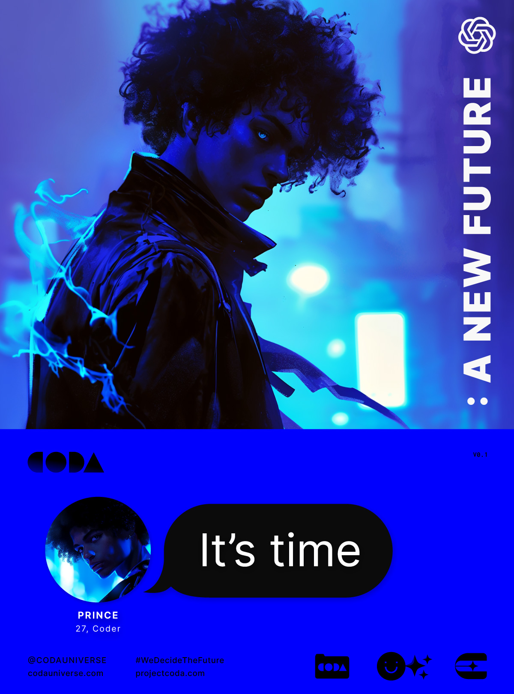
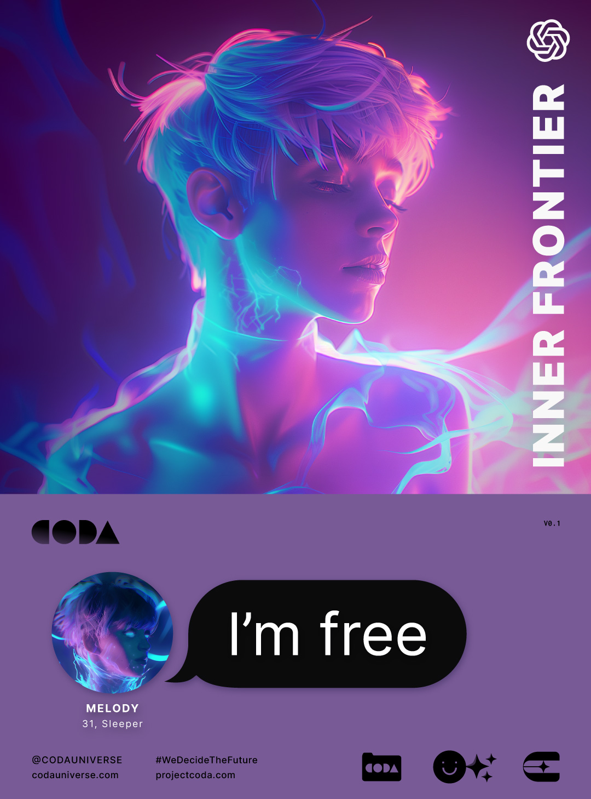

---
layout:
  title:
    visible: true
  description:
    visible: false
  tableOfContents:
    visible: true
  outline:
    visible: false
  pagination:
    visible: false
---

# ▶️ Explore

The **CODA Universe** is an experimental IP & storytelling project with an on-chain canon. It is purpose-built for generative media and web3. Created by humans. Presented by AI.


[introduction](world/introduction/)


<figure><figcaption></figcaption></figure>

<table data-view="cards" data-full-width="false"><thead><tr><th data-card-target data-type="content-ref"></th><th data-hidden data-card-cover data-type="files"></th></tr></thead><tbody><tr><td><a href="world/history/the-dark-decade.md">the-dark-decade.md</a></td><td><a href=".gitbook/assets/darkdecade.png">darkdecade.png</a></td></tr><tr><td><a href="world/science-and-tech/the-daemon-virus.md">the-daemon-virus.md</a></td><td><a href=".gitbook/assets/daemon.png">daemon.png</a></td></tr><tr><td><a href="world/science-and-tech/the-manna-flower.md">the-manna-flower.md</a></td><td><a href=".gitbook/assets/mannaflower-0sfhkhgf.png">mannaflower-0sfhkhgf.png</a></td></tr><tr><td><a href="world/gata/politics/the-system.md">the-system.md</a></td><td><a href=".gitbook/assets/system.png">system.png</a></td></tr><tr><td><a href="world/history/the-reconstruction.md">the-reconstruction.md</a></td><td><a href=".gitbook/assets/reconstruction.png">reconstruction.png</a></td></tr><tr><td><a href="world/gata/politics/districts.md">districts.md</a></td><td><a href=".gitbook/assets/districts.png">districts.png</a></td></tr><tr><td><a href="world/gata/law-and-order/local-authority.md">local-authority.md</a></td><td><a href=".gitbook/assets/authority.png">authority.png</a></td></tr><tr><td><a href="world/gata/politics/gray-zones.md">gray-zones.md</a></td><td><a href=".gitbook/assets/greyzone.png">greyzone.png</a></td></tr><tr><td><a href="world/gata/criminal-element/syndicates.md">syndicates.md</a></td><td><a href=".gitbook/assets/criminalunderworld.png">criminalunderworld.png</a></td></tr><tr><td><a href="world/science-and-tech/links.md">links.md</a></td><td><a href=".gitbook/assets/links.png">links.png</a></td></tr><tr><td><a href="world/gata/politics/new-dawn-accords.md">new-dawn-accords.md</a></td><td><a href=".gitbook/assets/newdawnaccords.png">newdawnaccords.png</a></td></tr><tr><td><a href="world/science-and-tech/hard-code.md">hard-code.md</a></td><td><a href=".gitbook/assets/hardcode.png">hardcode.png</a></td></tr><tr><td><a href="world/gata/military-and-defense/angelis.md">angelis.md</a></td><td><a href=".gitbook/assets/angelis-853.png">angelis-853.png</a></td></tr><tr><td><a href="world/science-and-tech/statics.md">statics.md</a></td><td><a href=".gitbook/assets/world3.png">world3.png</a></td></tr><tr><td><a href="world/gata/enterprise/operators.md">operators.md</a></td><td><a href=".gitbook/assets/operators-s8gs9.png">operators-s8gs9.png</a></td></tr><tr><td><a href="world/science-and-tech/frames.md">frames.md</a></td><td><a href=".gitbook/assets/frames-944.png">frames-944.png</a></td></tr><tr><td><a href="world/science-and-tech/cogs.md">cogs.md</a></td><td><a href=".gitbook/assets/cogs-98342jh.png">cogs-98342jh.png</a></td></tr><tr><td><a href="world/gata/institutions/atlan-information-control-aic.md">atlan-information-control-aic.md</a></td><td><a href=".gitbook/assets/aic2.png">aic2.png</a></td></tr><tr><td><a href="world/gata/politics/keys.md">keys.md</a></td><td><a href=".gitbook/assets/keys-sfs78gf.png">keys-sfs78gf.png</a></td></tr><tr><td><a href="world/gata/military-and-defense/guardians.md">guardians.md</a></td><td><a href=".gitbook/assets/guardians.png">guardians.png</a></td></tr><tr><td><a href="world/gata/institutions/altar.md">altar.md</a></td><td><a href=".gitbook/assets/altar.png">altar.png</a></td></tr><tr><td><a href="world/gata/law-and-order/collections.md">collections.md</a></td><td><a href=".gitbook/assets/collections-sfg87.png">collections-sfg87.png</a></td></tr><tr><td><a href="world/gata/underground-scene/arcades.md">arcades.md</a></td><td><a href=".gitbook/assets/arcade1.png">arcade1.png</a></td></tr><tr><td><a href="world/gata/criminal-element/wallrunners.md">wallrunners.md</a></td><td><a href=".gitbook/assets/wallrunners-f9sgf78.png">wallrunners-f9sgf78.png</a></td></tr><tr><td><a href="world/science-and-tech/the-astral.md">the-astral.md</a></td><td><a href=".gitbook/assets/astral-0sgsg3.png">astral-0sgsg3.png</a></td></tr><tr><td><a href="world/science-and-tech/fabricated-tech.md">fabricated-tech.md</a></td><td><a href=".gitbook/assets/fab.png">fab.png</a></td></tr><tr><td><a href="world/gata/underground-scene/sync-raves.md">sync-raves.md</a></td><td><a href=".gitbook/assets/syncraves.png">syncraves.png</a></td></tr><tr><td><a href="world/gata/military-and-defense/rapid-response.md">rapid-response.md</a></td><td><a href=".gitbook/assets/nomoney420_character_standing_next_to_an_armored_combat_suit_sl_ca479467-ee05-4faa-9ed4-b20dced267bc.png">nomoney420_character_standing_next_to_an_armored_combat_suit_sl_ca479467-ee05-4faa-9ed4-b20dced267bc.png</a></td></tr><tr><td><a href="world/gata/borders-and-travel/gate-patrol.md">gate-patrol.md</a></td><td><a href=".gitbook/assets/gatepatrol-536.png">gatepatrol-536.png</a></td></tr><tr><td><a href="world/science-and-tech/terminals.md">terminals.md</a></td><td><a href=".gitbook/assets/nomoney420_a_sci_fi_terminal_in_a_public_place_shaped_like_an_A_8c2b2d98-edec-44f3-a850-8d3a12d5ae5a.png">nomoney420_a_sci_fi_terminal_in_a_public_place_shaped_like_an_A_8c2b2d98-edec-44f3-a850-8d3a12d5ae5a.png</a></td></tr><tr><td><a href="world/gata/institutions/gardens.md">gardens.md</a></td><td><a href=".gitbook/assets/gardens.png">gardens.png</a></td></tr><tr><td><a href="world/free-territories/people-and-culture/eidetics.md">eidetics.md</a></td><td><a href=".gitbook/assets/eidetics.png">eidetics.png</a></td></tr><tr><td><a href="world/gata/military-and-defense/mavs.md">mavs.md</a></td><td><a href=".gitbook/assets/nomoney420_extreme_close_up_character_in_slim_armored_combat_su_b94de5e5-759b-4d56-80d7-a6f52d6e4847.png">nomoney420_extreme_close_up_character_in_slim_armored_combat_su_b94de5e5-759b-4d56-80d7-a6f52d6e4847.png</a></td></tr><tr><td><a href="world/science-and-tech/scanners.md">scanners.md</a></td><td><a href=".gitbook/assets/scanners-845.png">scanners-845.png</a></td></tr><tr><td><a href="world/free-territories/military-defense/sovereign-militias.md">sovereign-militias.md</a></td><td><a href=".gitbook/assets/sovereignmilitias-094343ds.png">sovereignmilitias-094343ds.png</a></td></tr><tr><td><a href="world/science-and-tech/slates.md">slates.md</a></td><td><a href=".gitbook/assets/slates-98wk3.png">slates-98wk3.png</a></td></tr><tr><td><a href="world/gata/borders-and-travel/gates.md">gates.md</a></td><td><a href=".gitbook/assets/gate-7433.png">gate-7433.png</a></td></tr><tr><td><a href="world/gata/politics/yield.md">yield.md</a></td><td><a href=".gitbook/assets/yield.png">yield.png</a></td></tr><tr><td><a href="world/gata/people-and-culture/sleepers.md">sleepers.md</a></td><td><a href=".gitbook/assets/sleepers-984.png">sleepers-984.png</a></td></tr><tr><td><a href="world/gata/criminal-element/scavengers.md">scavengers.md</a></td><td><a href=".gitbook/assets/scavengers-833.png">scavengers-833.png</a></td></tr><tr><td><a href="world/science-and-tech/fusion-energy.md">fusion-energy.md</a></td><td><a href=".gitbook/assets/fusionenergy-183.png">fusionenergy-183.png</a></td></tr><tr><td><a href="world/gata/borders-and-travel/field-walls.md">field-walls.md</a></td><td><a href=".gitbook/assets/fieldwalls.png">fieldwalls.png</a></td></tr><tr><td><a href="world/gata/institutions/the-atlan-academy-system.md">the-atlan-academy-system.md</a></td><td><a href=".gitbook/assets/atlanacademy.png">atlanacademy.png</a></td></tr><tr><td><a href="world/gata/health-and-medicine/akicel-therapy.md">akicel-therapy.md</a></td><td><a href=".gitbook/assets/akiceltherapy-843.png">akiceltherapy-843.png</a></td></tr><tr><td><a href="world/science-and-tech/parallel-energy.md">parallel-energy.md</a></td><td><a href=".gitbook/assets/parallelenergycell-923.png">parallelenergycell-923.png</a></td></tr><tr><td><a href="world/gata/health-and-medicine/regenesis-pods.md">regenesis-pods.md</a></td><td><a href=".gitbook/assets/regenesispod-304.png">regenesispod-304.png</a></td></tr><tr><td><a href="world/sol/institutions/the-research-corps.md">the-research-corps.md</a></td><td><a href=".gitbook/assets/helios-1.png">helios-1.png</a></td></tr><tr><td><a href="world/science-and-tech/erebos-mushroom.md">erebos-mushroom.md</a></td><td><a href=".gitbook/assets/erebosmushroom-493.png">erebosmushroom-493.png</a></td></tr><tr><td><a href="world/science-and-tech/constructs.md">constructs.md</a></td><td><a href=".gitbook/assets/constructs-646.png">constructs-646.png</a></td></tr><tr><td><a href="world/gata/politics/money.md">money.md</a></td><td><a href=".gitbook/assets/slip-3667.png">slip-3667.png</a></td></tr><tr><td><a href="world/gata/criminal-element/syndicates.md#hundred-hands">#hundred-hands</a></td><td><a href=".gitbook/assets/hundredhands.png">hundredhands.png</a></td></tr><tr><td><a href="world/gata/people-and-culture/sports-and-games/">sports-and-games</a></td><td><a href=".gitbook/assets/gravita-943.png">gravita-943.png</a></td></tr><tr><td><a href="world/science-and-tech/blanks.md">blanks.md</a></td><td><a href=".gitbook/assets/blanks-344.png">blanks-344.png</a></td></tr><tr><td><a href="world/free-territories/people-and-culture/children-of-the-sky.md">children-of-the-sky.md</a></td><td><a href=".gitbook/assets/churchofthesky-345.png">churchofthesky-345.png</a></td></tr><tr><td><a href="world/gata/borders-and-travel/spaceports.md">spaceports.md</a></td><td><a href=".gitbook/assets/nomoney420_hover_transport_coming_in_for_landing_futuristic_sol_fe392840-25d1-4e0b-bc83-3d153d946d62.png">nomoney420_hover_transport_coming_in_for_landing_futuristic_sol_fe392840-25d1-4e0b-bc83-3d153d946d62.png</a></td></tr><tr><td><a href="world/science-and-tech/grabbers.md">grabbers.md</a></td><td><a href=".gitbook/assets/grabbers-193 (1).png">grabbers-193 (1).png</a></td></tr><tr><td><a href="world/science-and-tech/found-objects.md">found-objects.md</a></td><td><a href=".gitbook/assets/foundobjects.png">foundobjects.png</a></td></tr></tbody></table>

***

## Nations

<figure><figcaption></figcaption></figure>

<table data-view="cards"><thead><tr><th data-card-target data-type="content-ref"></th><th data-hidden data-card-cover data-type="files"></th></tr></thead><tbody><tr><td><a href="world/gata/">gata</a></td><td><a href=".gitbook/assets/GATA-flag (1).png">GATA-flag (1).png</a></td></tr><tr><td><a href="world/african-union/">african-union</a></td><td><a href=".gitbook/assets/CODA-story-exploration_2022-06-17.png">CODA-story-exploration_2022-06-17.png</a></td></tr><tr><td><a href="world/aryabat/">aryabat</a></td><td><a href=".gitbook/assets/flag-arabhat.png">flag-arabhat.png</a></td></tr><tr><td><a href="world/ursa/">ursa</a></td><td><a href=".gitbook/assets/flag-ursa.png">flag-ursa.png</a></td></tr><tr><td><a href="world/new-imperial-japan/">new-imperial-japan</a></td><td><a href=".gitbook/assets/flag-japan.png">flag-japan.png</a></td></tr><tr><td><a href="world/free-territories/">free-territories</a></td><td><a href=".gitbook/assets/flag-freeterritories2 (1).png">flag-freeterritories2 (1).png</a></td></tr><tr><td><a href="world/sol/">sol</a></td><td><a href=".gitbook/assets/Sol-flag.png">Sol-flag.png</a></td></tr></tbody></table>

***

## Cast

<table data-view="cards"><thead><tr><th data-card-target data-type="content-ref"></th><th data-hidden data-card-cover data-type="files"></th></tr></thead><tbody><tr><td><a href="narrative/cast/prince-kyote.md">prince-kyote.md</a></td><td><a href=".gitbook/assets/prince-splash-0sgf0s.png">prince-splash-0sgf0s.png</a></td></tr><tr><td><a href="narrative/cast/haleh-hashemi.md">haleh-hashemi.md</a></td><td><a href=".gitbook/assets/nomoney420_httpss.mj.runuVFdagx9kKo_httpss.mj.runSnkmiKrhl4w__e219790c-dbac-4b93-965e-b30f4a42726f_3.png">nomoney420_httpss.mj.runuVFdagx9kKo_httpss.mj.runSnkmiKrhl4w__e219790c-dbac-4b93-965e-b30f4a42726f_3.png</a></td></tr><tr><td><a href="narrative/cast/carlos-rojas.md">carlos-rojas.md</a></td><td><a href=".gitbook/assets/carlos-splash-f8sfg09g0.jpeg">carlos-splash-f8sfg09g0.jpeg</a></td></tr><tr><td><a href="narrative/cast/lulu-carter.md">lulu-carter.md</a></td><td><a href=".gitbook/assets/lulu-splash-sf090g.png">lulu-splash-sf090g.png</a></td></tr><tr><td><a href="narrative/cast/xavier-alves.md">xavier-alves.md</a></td><td><a href=".gitbook/assets/magnific-BhixqRKdm5GcqTKGFvs1-nomoney420_criminal_mastermind_sitting_on_a_makeshift_throne_in_2bed8b36-251a-4e74-84c9-0c65d5b2bb64.jpeg">magnific-BhixqRKdm5GcqTKGFvs1-nomoney420_criminal_mastermind_sitting_on_a_makeshift_throne_in_2bed8b36-251a-4e74-84c9-0c65d5b2bb64.jpeg</a></td></tr><tr><td><a href="narrative/cast/franky-wu.md">franky-wu.md</a></td><td><a href=".gitbook/assets/franky-splash-0943fs.jpeg">franky-splash-0943fs.jpeg</a></td></tr><tr><td><a href="narrative/cast/amelia-geiger.md">amelia-geiger.md</a></td><td><a href=".gitbook/assets/amelia-splash-fho8.png">amelia-splash-fho8.png</a></td></tr><tr><td><a href="narrative/cast/remi-maeda.md">remi-maeda.md</a></td><td><a href=".gitbook/assets/remi-splash-923fs.jpeg">remi-splash-923fs.jpeg</a></td></tr><tr><td><a href="narrative/cast/viten-marsh.md">viten-marsh.md</a></td><td><a href=".gitbook/assets/viten-splash.png">viten-splash.png</a></td></tr><tr><td><a href="narrative/cast/sasha-cache.md">sasha-cache.md</a></td><td><a href=".gitbook/assets/sasha-splash.png">sasha-splash.png</a></td></tr><tr><td><a href="narrative/cast/melody-harper.md">melody-harper.md</a></td><td><a href=".gitbook/assets/melody-splash.png">melody-splash.png</a></td></tr><tr><td><a href="narrative/cast/tamaki-rei.md">tamaki-rei.md</a></td><td><a href=".gitbook/assets/magnific-r6uf28vcgV1R4SuBjMP7-nomoney420_photograph_of_extremely_attractive_half-japanese_hal_c56966a3-3647-402b-b6cd-16135a4b9ace.jpeg">magnific-r6uf28vcgV1R4SuBjMP7-nomoney420_photograph_of_extremely_attractive_half-japanese_hal_c56966a3-3647-402b-b6cd-16135a4b9ace.jpeg</a></td></tr><tr><td><a href="narrative/cast/finn-hughes.md">finn-hughes.md</a></td><td><a href=".gitbook/assets/finn-splash.png">finn-splash.png</a></td></tr><tr><td><a href="narrative/cast/morning-cloud.md">morning-cloud.md</a></td><td><a href=".gitbook/assets/morning-splash.png">morning-splash.png</a></td></tr><tr><td><a href="narrative/cast/soraya-mata.md">soraya-mata.md</a></td><td><a href=".gitbook/assets/soraya-splash.png">soraya-splash.png</a></td></tr></tbody></table>

<figure><figcaption>
Some of the CODA Saga's cast of 100+ original characters.
</figcaption></figure>

***

## Video & Animation



***

## Chats

<figure><figcaption></figcaption></figure>



<figure><figcaption></figcaption></figure>



<figure><figcaption></figcaption></figure>



<figure><figcaption></figcaption></figure>



***

## 360 Environments

<figure><figcaption>
Equirectangular scene for "The Factory"
</figcaption></figure>



***

## Text-Based Games

<figure><figcaption></figcaption></figure>

#### 💻 Play SOULJOURNER on ChatGPT



<figure><figcaption></figcaption></figure>

#### 💻 Play CODA: Silent Melody on ChatGPT



<figure><figcaption></figcaption></figure>

 

<figure><figcaption></figcaption></figure>

 

<figure><figcaption></figcaption></figure>

 

<figure><figcaption></figcaption></figure>

***

## Tabletop Games

### 🃏 Guarda

<figure><figcaption></figcaption></figure>

 

<figure><figcaption></figcaption></figure>


[guarda.md](world/gata/people-and-culture/sports-and-games/guarda.md)


***

## 3D Games (Concepts)

### 🎮 Wallrunner (PC & Console)

<figure><figcaption></figcaption></figure>

<figure><figcaption>
Screenshots of <em>Wallrunner</em> (concept)
</figcaption></figure>
