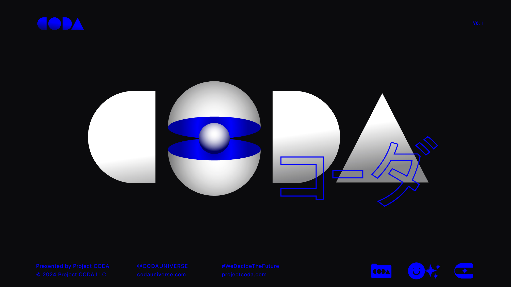
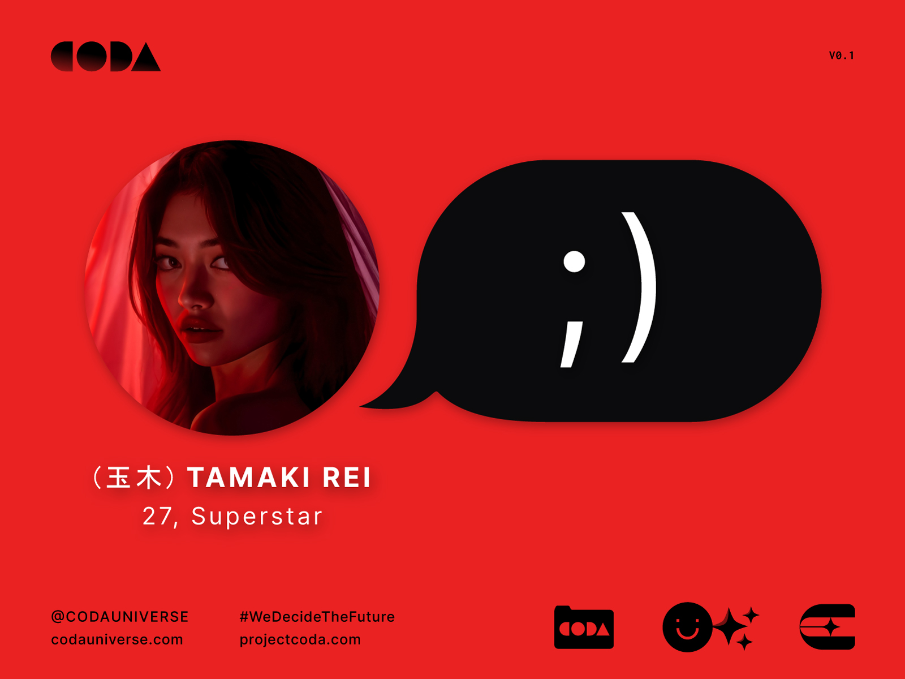

---
layout:
  title:
    visible: true
  description:
    visible: false
  tableOfContents:
    visible: true
  outline:
    visible: false
  pagination:
    visible: true
---

# ▶️ Explore

The **CODA Universe** is an experimental IP & storytelling project with an on-chain canon. It is purpose-built for generative media and web3, featuring a rich world with interrelated fragments of lore and themes that reflect and interrogate our world today. Made by humans. Presented by AI.


[introduction](overview/introduction/)


<figure><figcaption></figcaption></figure>

<table data-view="cards" data-full-width="false"><thead><tr><th data-card-target data-type="content-ref"></th><th data-hidden data-card-cover data-type="files"></th></tr></thead><tbody><tr><td><a href="overview/history/the-dark-decade.md">the-dark-decade.md</a></td><td><a href=".gitbook/assets/darkdecade.png">darkdecade.png</a></td></tr><tr><td><a href="overview/science-and-tech/the-daemon-virus.md">the-daemon-virus.md</a></td><td><a href=".gitbook/assets/daemon.png">daemon.png</a></td></tr><tr><td><a href="nations/gata/history/the-manna-flower.md">the-manna-flower.md</a></td><td><a href=".gitbook/assets/nomoney420_httpscdn.midjourney.comc8a44ea2-b9d2-4202-a51f-769_49deb770-290e-45c0-b693-20e28705092b_1.png">nomoney420_httpscdn.midjourney.comc8a44ea2-b9d2-4202-a51f-769_49deb770-290e-45c0-b693-20e28705092b_1.png</a></td></tr><tr><td><a href="nations/gata/politics/the-system.md">the-system.md</a></td><td><a href=".gitbook/assets/system.png">system.png</a></td></tr><tr><td><a href="overview/history/the-reconstruction.md">the-reconstruction.md</a></td><td><a href=".gitbook/assets/reconstruction.png">reconstruction.png</a></td></tr><tr><td><a href="nations/gata/politics/districts.md">districts.md</a></td><td><a href=".gitbook/assets/districts.png">districts.png</a></td></tr><tr><td><a href="nations/gata/military-and-defense/angelis.md">angelis.md</a></td><td><a href=".gitbook/assets/guardians.png">guardians.png</a></td></tr><tr><td><a href="nations/gata/politics/gray-zones.md">gray-zones.md</a></td><td><a href=".gitbook/assets/greyzone.png">greyzone.png</a></td></tr><tr><td><a href="nations/gata/criminal-element/syndicates.md">syndicates.md</a></td><td><a href=".gitbook/assets/criminalunderworld.png">criminalunderworld.png</a></td></tr><tr><td><a href="overview/science-and-tech/links.md">links.md</a></td><td><a href=".gitbook/assets/links.png">links.png</a></td></tr><tr><td><a href="nations/gata/underground-scene/sync-raves.md">sync-raves.md</a></td><td><a href=".gitbook/assets/syncraves.png">syncraves.png</a></td></tr><tr><td><a href="overview/science-and-tech/hard-code.md">hard-code.md</a></td><td><a href=".gitbook/assets/hardcode.png">hardcode.png</a></td></tr><tr><td><a href="nations/gata/institutions/altar.md">altar.md</a></td><td><a href=".gitbook/assets/altar.png">altar.png</a></td></tr><tr><td><a href="nations/gata/history/the-research-corps.md">the-research-corps.md</a></td><td><a href=".gitbook/assets/helios-1.png">helios-1.png</a></td></tr><tr><td><a href="nations/gata/law-and-order/local-authority.md">local-authority.md</a></td><td><a href=".gitbook/assets/authority.png">authority.png</a></td></tr><tr><td><a href="nations/gata/enterprise/operators.md">operators.md</a></td><td><a href=".gitbook/assets/nomoney420_group_shot_of_a_crew_of_bounty_hunters_still_from_an_6c9969a8-ecca-4342-9bfc-a0ed33ef08ac.png">nomoney420_group_shot_of_a_crew_of_bounty_hunters_still_from_an_6c9969a8-ecca-4342-9bfc-a0ed33ef08ac.png</a></td></tr><tr><td><a href="nations/gata/politics/keys.md">keys.md</a></td><td><a href=".gitbook/assets/nomoney420_photograph_of_a_translucent_LED_screen_that_is_displ_8d5ed6fd-a892-44bb-976b-6aff5e911790.png">nomoney420_photograph_of_a_translucent_LED_screen_that_is_displ_8d5ed6fd-a892-44bb-976b-6aff5e911790.png</a></td></tr><tr><td><a href="nations/gata/military-and-defense/angelis.md#rapid-response">#rapid-response</a></td><td><a href=".gitbook/assets/nomoney420_character_standing_next_to_an_armored_combat_suit_sl_ca479467-ee05-4faa-9ed4-b20dced267bc.png">nomoney420_character_standing_next_to_an_armored_combat_suit_sl_ca479467-ee05-4faa-9ed4-b20dced267bc.png</a></td></tr><tr><td><a href="nations/gata/military-and-defense/mavs.md">mavs.md</a></td><td><a href=".gitbook/assets/nomoney420_extreme_close_up_character_in_slim_armored_combat_su_b94de5e5-759b-4d56-80d7-a6f52d6e4847.png">nomoney420_extreme_close_up_character_in_slim_armored_combat_su_b94de5e5-759b-4d56-80d7-a6f52d6e4847.png</a></td></tr><tr><td><a href="overview/science-and-tech/cogs.md">cogs.md</a></td><td><a href=".gitbook/assets/nomoney420_a_sci-fi_future_open_concept_lab_floating_hover_chai_257ee262-37dd-49e2-9440-1d10744aa629.png">nomoney420_a_sci-fi_future_open_concept_lab_floating_hover_chai_257ee262-37dd-49e2-9440-1d10744aa629.png</a></td></tr><tr><td><a href="nations/gata/institutions/atlan-information-control.md">atlan-information-control.md</a></td><td><a href=".gitbook/assets/aic2.png">aic2.png</a></td></tr><tr><td><a href="nations/gata/law-and-order/collections.md">collections.md</a></td><td><a href=".gitbook/assets/nomoney420_armed_police_loading_up_sensitive_cargo_on_hovering__d114fca5-3f6e-473b-b31c-927a4ea1e6c4.png">nomoney420_armed_police_loading_up_sensitive_cargo_on_hovering__d114fca5-3f6e-473b-b31c-927a4ea1e6c4.png</a></td></tr><tr><td><a href="overview/science-and-tech/statics.md">statics.md</a></td><td><a href=".gitbook/assets/nomoney420_future_city_skyline_with_hover_transports_flying_in__2003b126-4c7a-4d7d-85ce-2accd550e2b5.png">nomoney420_future_city_skyline_with_hover_transports_flying_in__2003b126-4c7a-4d7d-85ce-2accd550e2b5.png</a></td></tr><tr><td><a href="overview/science-and-tech/terminals.md">terminals.md</a></td><td><a href=".gitbook/assets/nomoney420_a_sci_fi_terminal_in_a_public_place_shaped_like_an_A_8c2b2d98-edec-44f3-a850-8d3a12d5ae5a.png">nomoney420_a_sci_fi_terminal_in_a_public_place_shaped_like_an_A_8c2b2d98-edec-44f3-a850-8d3a12d5ae5a.png</a></td></tr><tr><td><a href="overview/science-and-tech/fabricated-tech.md">fabricated-tech.md</a></td><td><a href=".gitbook/assets/fab.png">fab.png</a></td></tr><tr><td><a href="nations/gata/politics/new-dawn-accords.md">new-dawn-accords.md</a></td><td><a href=".gitbook/assets/newdawnaccords.png">newdawnaccords.png</a></td></tr><tr><td><a href="nations/gata/criminal-element/wallrunners.md">wallrunners.md</a></td><td><a href=".gitbook/assets/nomoney420_extreme_closeup_of_a_man_with_advanced_leg_armor_in__9dcca6bd-1e24-4368-8ab1-59511e625eb4.png">nomoney420_extreme_closeup_of_a_man_with_advanced_leg_armor_in__9dcca6bd-1e24-4368-8ab1-59511e625eb4.png</a></td></tr><tr><td><a href="overview/science-and-tech/the-astral.md">the-astral.md</a></td><td><a href=".gitbook/assets/nomoney420_httpss.mj.runAZwlsVQVFh8_httpss.mj.runj9kprHGONt0__043d0552-c326-40c4-824a-c2646a01a922_2.png">nomoney420_httpss.mj.runAZwlsVQVFh8_httpss.mj.runj9kprHGONt0__043d0552-c326-40c4-824a-c2646a01a922_2.png</a></td></tr><tr><td><a href="nations/free-territories/people-and-culture/eidetics.md">eidetics.md</a></td><td><a href=".gitbook/assets/eidetics.png">eidetics.png</a></td></tr><tr><td><a href="overview/science-and-tech/slates.md">slates.md</a></td><td><a href=".gitbook/assets/nomoney420_close_up_of_a_portable_clear_slate_display_device_cl_66fa2f0e-2e40-4662-8720-33e2c494c5dc.png">nomoney420_close_up_of_a_portable_clear_slate_display_device_cl_66fa2f0e-2e40-4662-8720-33e2c494c5dc.png</a></td></tr><tr><td><a href="nations/gata/underground-scene/arcades.md">arcades.md</a></td><td><a href=".gitbook/assets/arcade1.png">arcade1.png</a></td></tr><tr><td><a href="nations/gata/history/found-objects.md">found-objects.md</a></td><td><a href=".gitbook/assets/foundobjects.png">foundobjects.png</a></td></tr><tr><td><a href="nations/gata/criminal-element/syndicates.md#hundred-hands">#hundred-hands</a></td><td><a href=".gitbook/assets/hundredhands.png">hundredhands.png</a></td></tr></tbody></table>

***

## Nations

<figure><figcaption></figcaption></figure>

<table data-view="cards"><thead><tr><th data-card-target data-type="content-ref"></th><th data-hidden data-card-cover data-type="files"></th></tr></thead><tbody><tr><td><a href="nations/gata/">gata</a></td><td><a href=".gitbook/assets/GATA-flag (1).png">GATA-flag (1).png</a></td></tr><tr><td><a href="nations/african-union/">african-union</a></td><td><a href=".gitbook/assets/CODA-story-exploration_2022-06-17.png">CODA-story-exploration_2022-06-17.png</a></td></tr><tr><td><a href="nations/aryabat/">aryabat</a></td><td><a href=".gitbook/assets/flag-arabhat.png">flag-arabhat.png</a></td></tr><tr><td><a href="nations/ursa/">ursa</a></td><td><a href=".gitbook/assets/flag-ursa.png">flag-ursa.png</a></td></tr><tr><td><a href="nations/new-imperial-japan/">new-imperial-japan</a></td><td><a href=".gitbook/assets/flag-japan.png">flag-japan.png</a></td></tr><tr><td><a href="nations/free-territories/">free-territories</a></td><td><a href=".gitbook/assets/flag-freeterritories2 (1).png">flag-freeterritories2 (1).png</a></td></tr><tr><td><a href="nations/sol/">sol</a></td><td><a href=".gitbook/assets/Sol-flag.png">Sol-flag.png</a></td></tr></tbody></table>

***

## Cast

<table data-view="cards"><thead><tr><th data-card-target data-type="content-ref"></th><th data-hidden data-card-cover data-type="files"></th></tr></thead><tbody><tr><td><a href="narrative/cast/haleh-hashemi.md">haleh-hashemi.md</a></td><td><a href=".gitbook/assets/nomoney420_long_shot_of_a_Persian_woman_in_her_late_20s.png">nomoney420_long_shot_of_a_Persian_woman_in_her_late_20s.png</a></td></tr><tr><td><a href="narrative/cast/prince-kyote.md">prince-kyote.md</a></td><td><a href=".gitbook/assets/nomoney420_long_shot_photograph_of_an_attractive_thin_mixed_rac_f36d28c5-3f69-40b2-bcbf-7da3bed8cfad.png">nomoney420_long_shot_photograph_of_an_attractive_thin_mixed_rac_f36d28c5-3f69-40b2-bcbf-7da3bed8cfad.png</a></td></tr><tr><td><a href="narrative/cast/lulu-carter.md">lulu-carter.md</a></td><td><a href=".gitbook/assets/nomoney420_stylish_crowd_in_a_future_underground_rave_with_gree_17322c09-302d-4712-b063-a9a41551b19b.png">nomoney420_stylish_crowd_in_a_future_underground_rave_with_gree_17322c09-302d-4712-b063-a9a41551b19b.png</a></td></tr><tr><td><a href="narrative/cast/franky-wu.md">franky-wu.md</a></td><td><a href=".gitbook/assets/magnific-xINQrUMQKfxlwBaz0J6V-nomoney420_young_chinese_teen_male_holding_a_chrome_ball_in_his_885e817b-3074-4c65-92ee-36e3246c31d0.jpeg">magnific-xINQrUMQKfxlwBaz0J6V-nomoney420_young_chinese_teen_male_holding_a_chrome_ball_in_his_885e817b-3074-4c65-92ee-36e3246c31d0.jpeg</a></td></tr><tr><td><a href="narrative/cast/xavier-alves.md">xavier-alves.md</a></td><td><a href=".gitbook/assets/magnific-BhixqRKdm5GcqTKGFvs1-nomoney420_criminal_mastermind_sitting_on_a_makeshift_throne_in_2bed8b36-251a-4e74-84c9-0c65d5b2bb64.jpeg">magnific-BhixqRKdm5GcqTKGFvs1-nomoney420_criminal_mastermind_sitting_on_a_makeshift_throne_in_2bed8b36-251a-4e74-84c9-0c65d5b2bb64.jpeg</a></td></tr><tr><td><a href="narrative/cast/carlos-rojas.md">carlos-rojas.md</a></td><td><a href=".gitbook/assets/magnific-JqRDYfxsuReGf5BTuxwn-nomoney420_extreme_close_up_photograph_of_a_30_year_old_latino__9c192fc6-cd92-4911-8e52-322f95159244 (1).jpeg">magnific-JqRDYfxsuReGf5BTuxwn-nomoney420_extreme_close_up_photograph_of_a_30_year_old_latino__9c192fc6-cd92-4911-8e52-322f95159244 (1).jpeg</a></td></tr><tr><td><a href="narrative/cast/amelia-geiger.md">amelia-geiger.md</a></td><td><a href=".gitbook/assets/nomoney420_extreme_close_up_of_a_geeky_redhead_with_blue_eyes_a_fcb37bd3-203a-4e03-a8e7-4407470b1d98.png">nomoney420_extreme_close_up_of_a_geeky_redhead_with_blue_eyes_a_fcb37bd3-203a-4e03-a8e7-4407470b1d98.png</a></td></tr><tr><td><a href="narrative/cast/tamaki-rei.md">tamaki-rei.md</a></td><td><a href=".gitbook/assets/magnific-r6uf28vcgV1R4SuBjMP7-nomoney420_photograph_of_extremely_attractive_half-japanese_hal_c56966a3-3647-402b-b6cd-16135a4b9ace.jpeg">magnific-r6uf28vcgV1R4SuBjMP7-nomoney420_photograph_of_extremely_attractive_half-japanese_hal_c56966a3-3647-402b-b6cd-16135a4b9ace.jpeg</a></td></tr><tr><td><a href="narrative/cast/keisuke-maeda.md">keisuke-maeda.md</a></td><td><a href=".gitbook/assets/magnific-poLmGyt14NeVZnei579W-nomoney420_mild_mannered_japanese_man_with_thin_rimmed_glasses__de85f27b-2c0e-4265-8c41-a801e177f307.jpeg">magnific-poLmGyt14NeVZnei579W-nomoney420_mild_mannered_japanese_man_with_thin_rimmed_glasses__de85f27b-2c0e-4265-8c41-a801e177f307.jpeg</a></td></tr></tbody></table>

<figure><figcaption>
Some of the CODA Saga's cast of 100+ original characters.
</figcaption></figure>

***

## Video & Animation



***

## Chats

<figure><figcaption></figcaption></figure>



<figure><figcaption></figcaption></figure>



<figure><figcaption></figcaption></figure>



<figure><figcaption></figcaption></figure>



***

## 360 Environments

<figure><figcaption>
Equirectangular scene for "The Factory"
</figcaption></figure>



***

## Text-Based Games

<figure><figcaption></figcaption></figure>

#### 💻 Play SOULJOURNER on ChatGPT



<figure><figcaption></figcaption></figure>

#### 💻 Play CODA: Silent Melody on ChatGPT



***

## 3D Games (Concepts)

### Wallrunner (PC & Console)

<figure><figcaption></figcaption></figure>

<figure><figcaption>
Screenshots of <em>Wallrunner</em> (concept)
</figcaption></figure>
