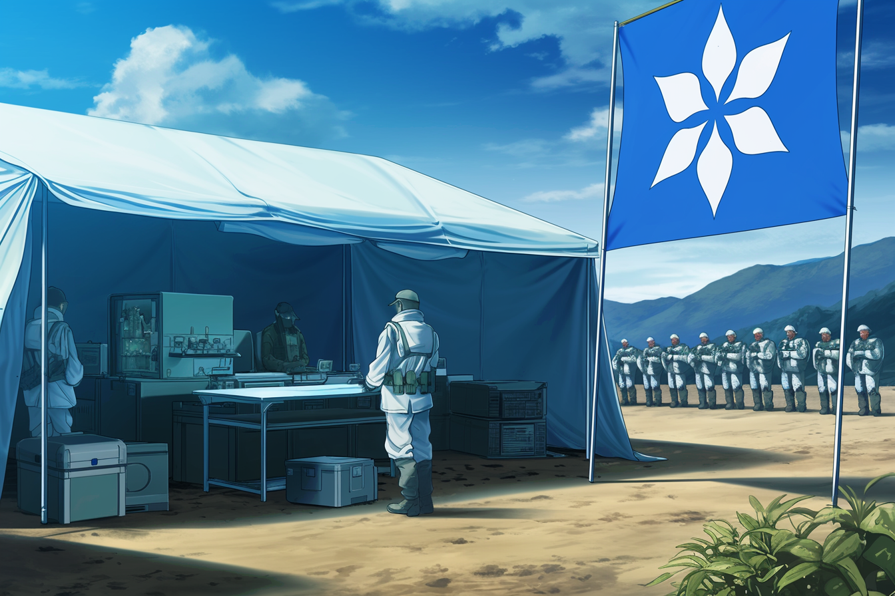
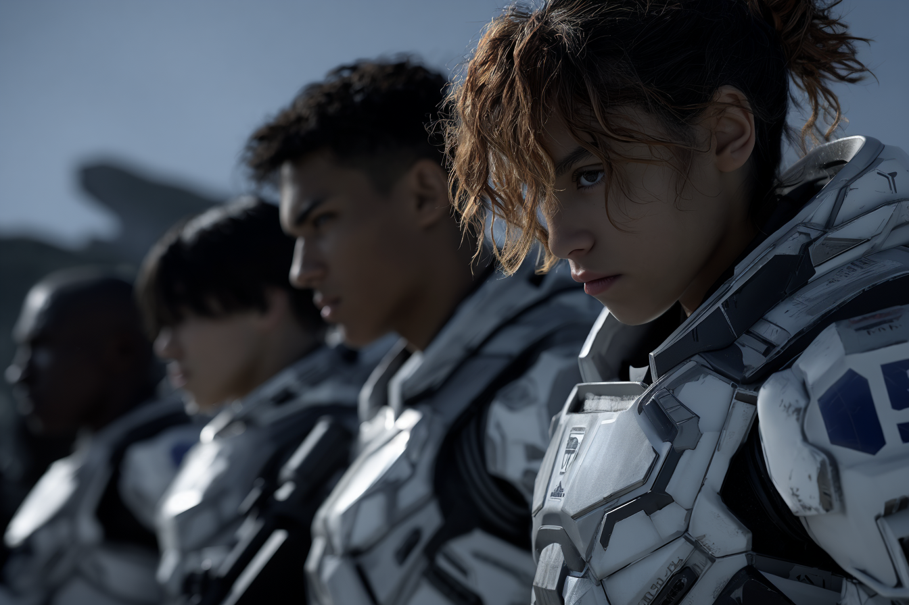
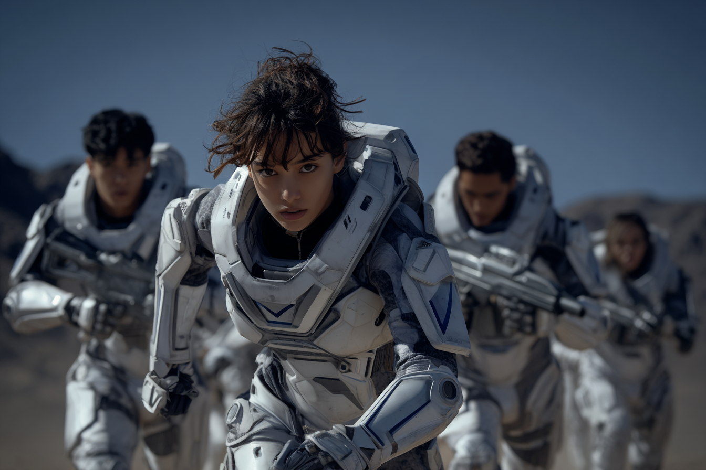
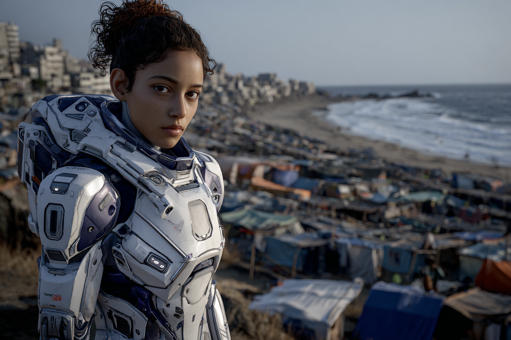
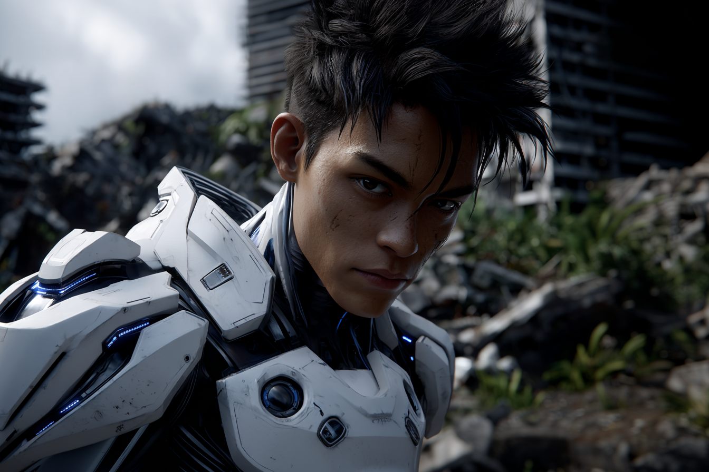

# 🟦 Alpha-01

<figure><figcaption></figcaption></figure>

## Overview

Alpha-01 was the first fully field-deployed strike unit composed entirely of subjects from the Atlan [Research Corps’](../../world/sol/institutions/the-research-corps.md) experimental [Clear gene therapy program](../secrets/the-clear-program.md), a compartmentalized carry-over from the [JAC](../../world/gata/history/the-joint-atlantic-command-jac.md)-era that began during [the Dark Decade](../../world/history/the-dark-decade.md).

Operating in the liminal years of the early [Reconstruction Era](../../world/history/the-reconstruction.md), Alpha-01 served as the proof-of-concept for what would become the [Unassisted Decisive Asset (UDA)](../../world/gata/military-and-defense/mavs.md#the-unassisted-decisive-assets) program, and, generations later, [Angelis’](../../world/gata/military-and-defense/angelis.md) modern [Mavericks](../../world/gata/military-and-defense/mavs.md#the-maverick-division) and [Rapid Response](../../world/gata/military-and-defense/rapid-response.md) divisions.

While their designation never appeared in the public [General Record](../../world/gata/politics/the-general-record.md), internal Atlan Research Corps and [Existence Doctrine](../../world/gata/military-and-defense/existence-doctrine.md) archives referred to them simply as “Alpha-01” — the first operational “cell” of Clear-enhanced soldiers trusted to operate with minimal support behind contested lines.

***

### Origins

Under [the Existence Doctrine](../../world/gata/military-and-defense/existence-doctrine.md), the JAC authorized a suite of extreme programs intended to “test the limits” of human capability, including [the Clear Program](../secrets/the-clear-program.md) — a project to develop an experimental therapy derived primarily from [Silver Manna](../../world/nature-and-climate/the-manna-flower.md#mer-or-silver) and classified genetic research.

The Clear therapy dramatically improved qualifying subjects’ reflexes, learning speed, immune function, and healing, at the cost of severe side-effects: runaway metabolism, heat intolerance, and a dependence on constant nutritional intake.

<figure><figcaption></figcaption></figure> <figure><figcaption></figcaption></figure>

Over [the Dark Decade](../../world/history/the-dark-decade.md) and [early Reconstruction](../../world/history/the-reconstruction.md), as many as \~50,000 refugees and veterans are believed to have received test doses of some variant of Clear, most with negligible or transient effects, and some suffering extreme detrimental reactions. A tiny fraction, however, responded _spectacularly_–exclusively teenagers and adolescents.

Shortly after the formal founding of [Atla](../../world/gata/key-locations/atla.md), there was a push to field Clear-enhanced soldiers and a new initiative took shape. The most promising recruits and students from across [Greater Atla](../../world/gata/politics/greater-atla.md) were screened for tolerance and from that elite minority, a compartmentalized program codenamed Alpha assembled a prototype special-operations unit: Alpha-01.

***

### Formation and Selection

Alpha-01 drew its recruits from its newly introduced academy system, as well as training camps and refugee schools scattered across [Greater Atla's](../../world/gata/politics/greater-atla.md) emergent territories. Candidates had to meet three criteria:

1. **Stable Clear response:**  Subjects who survived repeated Clear rounds without catastrophic rejection and demonstrated consistent performance gains.
2. **Cognitive and emotional resilience:**  Measured by long-horizon tactical exercises, isolation drills, and exposure to Reconstruction-era conflict zones as intelligence and strategic support.
3. **Field aptitude:**  Demonstrated initiative and performance in training and academic contexts, and eventually, live operations attached to regular JAC units.

Due to Clear’s side-effects on cellular repair and metabolism, Alpha-01’s operators experienced dramatically slowed biological aging. This effect is apparent in Clear Program veterans such as Finneas Hughes, who appeared perpetually twenty even into his fifties.

Classified rosters differ, but commonly list Dante Newton, Finneas Hughes, and several other operatives as early mainstays of Alpha-01, with individual codenames later subsumed into UDA classifications. It is an open secret that a number of decorated and legendary figures in Atlan military history trace their origins through the UDA program to the rumored exploits of Alpha-01.

***

### Training and Doctrine

<figure><figcaption>
Alpha-01 Team leader Amina El-Baz and her unit during a training exercise.
</figcaption></figure>

Alpha-01’s training blended three threads that would later define both UDAs and modern MAVs:

* **Extreme autonomy:** Operators were drilled to plan, execute, and exfiltrate missions without real-time command oversight, foreshadowing the “Unassisted” doctrine that would later be formalized in the UDA program.
* **Multi-domain competence:** Alpha-01 trained in urban, desert, and littoral environments, often alongside early war-frame pilots (precursors to Guardians) but with strict constraints on support, forcing them to treat heavy assets as temporary tools rather than crutches.
* **Prototype integration:** They served as live testbeds for emergent technologies: early combat gear, crude link-driven tactical networks, and medical protocols for managing Clear’s metabolic demands.

<figure><figcaption></figcaption></figure>

Informally, instructors referred to Alpha-01 as “ghosts in training”: small, mobile, almost impossible to pin down on a conventional battlefield.

Alpha-01 operatives were equipped with experimental, personalized combat gear called CAVE suits (Combat Armor for Variable Engagement); powered armor suits with customizable loadouts and advanced capabilities and telemetry. When the working group that developed these suits was spun out into a public enterprise after the founding of Atla, they took this product for their namesake, [CAVE Defense](../../world/gata/enterprise/cave-defense.md).

***

### Operational Role

Alpha-01 operated primarily during the early [Reconstruction](../../world/history/the-reconstruction.md), when Atla still fielded a national military directly under its [local government's](../../world/gata/politics/districts.md#local-government) authority and the lines between humanitarian missions and black-budget operations were blurry.

Typical assignments included:

* **Decapitation strikes:** surgical strikes neutralizing leadership of [Sovereign warlords and militias](../../world/free-territories/military-defense/sovereign-militias.md) obstructing Reconstruction corridors.
* **Infrastructure sabotage** — disabling logistics networks, comms, or levy systems under cover of natural or engineered disasters, echoing later rumors about [UDA](../../world/gata/military-and-defense/mavs.md#unassisted-decisive-assets) involvement in catastrophic events like the destruction of New Orleans.
* **Asset retrieval & protection** — securing high-value scientific personnel, data, or [Found Objects](../secrets/found-objects.md) and adjacent materials for [the Research Corps](../../world/sol/institutions/the-research-corps.md) and [ALTAR](../../world/gata/institutions/altar.md).

Though raised as a unit, Alpha-01 rarely deployed as a single squad. More often, its members were attached singly or in small teams to conventional forces, or as strategic and tactical levers in active conflict zones, trial-running the concept of a one-person “decisive asset.”

***

## Team Members

### Amina “Crown” El-Baz

_Team Leader, command specialist, master strategist, natural diplomat._

<figure><figcaption></figcaption></figure>

**Origin:** Casablanca Breakwater Camp, North African AU–Atla corridor.

A naturally gifted communicator, Amina had always been fast to pick up languages and recognize patterns. In her youth she was intensely curious about the world; the time before the Crash, news from other places, or what the future held. She sat on a high hill overlooking the Casablanca corridor watching for any activity in the distance, but most days saw only lonely horizons calling to be reunited.

By 16, she was already brokering compromises between African Union kijijis and Atlan logistics officers, translating politics as easily as the various languages she'd soaked up. Her aptitude was noticed by intelligence operatives, and her and her family were offered Atlan citizenship if she simply agreed to attend for one year at their full-spectrum leadership academy for gifted youth in Atla.

In war games she consistently built slow, grinding victories that leveraged human intelligence and cultural knowledge to recruit or embolden local allies, preserving positional advantages and infrastructure against unlikely odds. When instructors challenged her tactical priorities, she demonstrated record times for victory conditions across nearly all sims when explicitly optimizing for speed. Then she showed them the long term stability simulations she had been compiling during her discretionary curriculum track. She had been benchmarking herself against the Research Corps' best case Stability Index scores for the relevant locales over medium and long-term time horizons. She wasn't winning battles—she was ending wars.

After one year at the academy, and an ostensibly routine health screening, she was invited to join a classified Existence Doctrine special operative training program. Little did she know, she had already been administered a test dose of the Clear Serum during her medical exam, establishing her tolerance. She was the first recruit for Alpha-01, and the unit's initial team composition was largely centered around supporting and extending her command.

Her callsign "Crown" (from _Corona Borealis_) nods to both the constellation and the way she naturally assumes a leadership center of gravity, even when she believes the stated objectives are flawed. She has a knack for completing missions her own way while managing to not technically disobey orders.

#### Basic Info

* **Current age:** 21
* **Age at recruitment:** 17
* **Origin / ethnicity:** Moroccan (North African Arab), Spanish
* **Height / weight:**
  * 1.68 m (5'6")
  * 60 kg (132 lb)
* **Appearance:**
  * Balanced, athletic build; strong shoulders from hauling water and aid crates. Enjoys running solo drills while memorizing intelligence reports.
  * Light-brown, olive-leaning skin tone.
  * Dark hazel eyes; level, assessing, rarely surprised.
  * Thick black hair, usually in a practical low bun or braided crown; loose curls escape in humidity.
  * Often wears a thin thread bracelet with colored beads—last gift from her younger brother.
  * Small crescent-shaped scar on her cheek from a childhood fall.
* **Family status at recruitment:**
  * Father, originally from Spain, killed after her recruitment in militia crossfire during early Reconstruction clashes with North African resistance forces targeting Atla-allied communities.
  * Mother died during the first weeks of the Dark Decade after the Crash.
  * One younger brother lost during a chaotic convoy transfer (status “missing”).
  * Amina, along with her brother, were given over to humanitarian aid workers by her father at an Atlan refugee camp, fearing for her safety in their village.

***

### Rafael “Phoenix” Reyes

_2nd Command, tactical specialist, first contact and battlefield control._

<figure><figcaption></figcaption></figure>

**Origin:** Bright Mesa refugee camp, ex–California corridor (Southwest North America)

Old enough to remember [the Crash](../../world/history/the-crash.md), Rafael was 18 when Atla tagged him out of [Bright Mesa](../../world/gata/history/bright-mesa.md), a populous makeshift refugee city of survivors including many like Rafael who’d watched California burn. Where most kids learned to keep their heads down, he learned to stand up straighter.

One day, he saw some kids playing a game on the street called [Guarda](../../world/gata/people-and-culture/sports-and-games/guarda.md) using hand-made cards and a grid scratched into the dirt, and he became obsessed. He introduced the game to a group of kids, and one of their older brothers was a member of a local gang; the brother introduced Rafael to his crew and they turned Guarda into an overnight gambling sensation.

Eventually, his notoriety in the growing Guarda circuit, and his gang association landed Rafael in trouble with refugee camp authorities, and he was apprehended in a coordinated crackdown on the illegal gambling rings operating in the growing refugee camp. He was sentenced to five years in the nearby prison work camp.

At the prison camp he caught the attention of a JAC liaison mission, who offered him freedom in exchange for one year attendance at one of their military training camps. He agreed, and after boot camp was transferred to the JAC's elite training base in Greenland. There he earned himself a strong reputation for his quick thinking and fearless drive to win. When his one year obligation came up, he realized he had never considered leaving.

After being recruited into the Clear program, his heightened reflexes and eerie knack for reading the chaos of conflict put him at the center of every exercise, and instructors quickly pushed him into the role of first team leader. Stubborn, self-assured, and unflinching when it comes to ugly choices; he will make the hard call—and then stand front and center to answer for it. His callsign "Phoeni&#x78;**"** comes from the constellation and the bird reborn from fire: a refugee child from a dead city, remade into Atla’s sharpest blade.

#### Basic Info

* **Current age:** 22
* **Age at recruitment:** 18
* **Origin / ethnicity:** Bright Mesa refugee camp (ex–California evacuees); Filipino-American
* **Height / weight:**
  * 1.78 m (5'10")
  * 74 kg (163 lb)
* **Appearance:**
  * Athletic, well-proportioned build; quick, precise movements. More physically developed than most other team members.
  * Medium tan skin with light sun-and-wind wear.
  * Gray eyes with a cool, steady stare that reads as “steely.”
  * Thick black hair with a faint blue sheen, short on the sides and always slicked up and back on top, with a few strands hanging down over his forehead.
* **Family status at recruitment:**
  * Father killed in a convoy ambush when Rafael was 15.
  * Mother alive, with chronic respiratory issues from poor camp conditions.
  * One younger sister living with their mother in Bright Mesa.
  * Not an orphan; functionally head of household; Atlan recruitment includes medical and housing guarantees for his family, but they choose to remain in independent Bright Mesa.

***

### Finneas “Archer” Hughes

_Weapons specialist, advanced assault and weapon systems training._

<figure><figcaption></figcaption></figure>

**Origin:** Louisiana Refugee Camp, GATA.

As a 15-year-old orphan who had grown up in a refugee camp, Finn was the kid camp administrators called on when other teens had knives out over rations; he had a gift for stepping between people and talking them down.

Clear trials amplified his stamina and focus rather than his aggression, marking him as a natural stabilizer in the field. His callsign "Archer" comes from the old myths of _Orion the archer_—the instructors’ joke being that Finn never misses, he just always takes the safest possible shot.

#### Basic Info

* **Age at recruitment:** 15
* **Current age:** 19
* **Ethnicity:** Gulf Coast U.S. (Louisiana), mixed Caucasian / Cajun Creole
* **Height / weight:**
  * 1.73 m (5'8")
  * 64 kg (141 lb)
* **Appearance:**
  * Lean, wiry build; runner’s legs and calloused hands from labor and camp work. Carries himself with an easy demeanor, shoulders relaxed, stance loose.
  * Brown–hazel eyes, bright and alert.
  * Dark brown hair, thick and slightly wavy, kept long and shaggy.
  * Faint scarring on left forearm from an early camp fire and a jagged scar along his right eyebrow (never quite grows in).
* **Family status at recruitment:**
  * Mother deceased (disease in early camp years).
  * Father missing / presumed dead after a failed evacuation further inland.
  * Legally classified as unaccompanied minor; functionally an orphan, though he still half-believes his father might show up in a convoy someday.

***

### Dante “Scorpio” Newton

_Combat scout, reconnaissance, stealth and silent strike specialist._

<figure><figcaption></figcaption></figure>

**Origin:** JAC / Atlan Naval Training Barge “Wardroom-3”, mid-Atlantic flotilla.

Raised on the Joint Atlantic Command flotilla, and molded by its culture of excellence and dedication to the restoration of civilization. Dante was a 14-year-old deck rat who obsessed over details, with an insatiable drive for mastery and efficiency in action. During recreationals, his finely-tuned tactical intuition and total commitment turned zero-light hide-and-seek into a full-contact sport, routinely “capturing” armed marines in corridor drills.

His small size is gravely deceptive. He’s quiet, coiled, and intensely competitive, with a tendency to disappear from formation and reappear behind “enemy” lines. His callsign "Scorpio" (from _Scorpius_) reflects his preferred style: get close, sting once, leave nothing standing.

#### Basic Info

* **Age at recruitment:** 14
* **Current age:** 17
* **Origin / ethnicity:** American, Norwegian / Eastern European background
* **Height / weight:**
  * 1.70 m (5'7")
  * 61 kg (134 lb)
* **Appearance:**
  * Compact, coiled build; low body fat, strong forearms from climbing bulkheads and rigging.
  * Icy pale skin, freckles across nose and cheeks after sun exposure, a perpetual faint salt-crust look from shipboard life.
  * Bright blue eyes; a detached gaze with quick, decisive focus, always scanning, but never panicked.
  * Forward-swept blonde hair with short sides and long bangs.
  * Old rope-burn scars around the fingers of his right hand; faint knife nick under his jaw.
* **Family status at recruitment:**
  * Mother: served in galley/maintenance rotation on the same flotilla but reassigned shortly after his Clear candidacy is confirmed; later killed in a missile strike from Irish resistance forces.
  * No record of father (listed as “unknown” on birth documentation).
  * Emotional bond to a loose “deck family” of older sailors, but **physically separated** from all of them once transferred to Atlan training.

***

### Joana “Swan” Costa

_Aquatic operations, transmedium logistics and support._

<figure><figcaption></figcaption></figure>

**Origin:** Recife Atlantic Corridor Garden, Northeastern Brazil.

Joana grew up running silent night routes through flooded shanties in a battered kayak, memorizing currents and militia patrol schedules by feel.

Clear enhancement turned her into an amphibious phantom—graceful in water, lethal in tight urban mazes. She’s easygoing and irreverent off-mission, but her callsign "Swan" (from _Cygnus_) comes from the way she shifts in an instant from placid to terrifyingly powerful.

#### Basic Info

* **Current age:** 20
* **Age at recruitment:** 16
* **Origin / ethnicity:** Recife coastal settlements, Brazilian; Afro-Brazilian with possible Indigenous ancestry
* **Height / weight:**
  * 1.65 m (5'5")
  * 58 kg (128 lb)
* **Appearance:**
  * Flexible, sinewy build; swimmer’s shoulders and powerful legs.
  * Deep brown skin, often a shade darker from constant sun exposure.
  * Big, expressive dark brown eyes; quick to laugh, quicker to narrow when something feels off.
  * Black hair in tight natural curls, usually cropped short on the sides in an undercut with a longer top she can tie back or pull back under a hood.
  * Faint lattice of old mosquito-bite scars on her calves; one noticeable scar on her right hip from shrapnel in a flood-zone skirmish.
* **Family status at recruitment:**
  * Mother alive, working sanitation and water-purification detail.
  * Father presumed dead (small fishing boat never returned after a storm years earlier).
  * Several younger siblings; Joana had been acting as a secondary caretaker.
  * Atlan’s offer includes extended rations and housing guarantees for her family, making her a **reluctant but willing** recruit.

***

### Kwesi “Lion” Mensah

_Security and suppression, logistics, asset protection and escort specialist._

**Origin:** Takoradi–Dakar Joint Resettlement Zone, West Africa.

By 14, Kwesi was hauling Atlan humanitarian supply shipments on the docks and still had breath left to lead work songs that kept morale up when food was thin. By his 16th birthday, it was already clear that he would soon be a formidable physical force, and he soon caught the eye of Atlan recruiters.

Clear therapy barely seemed to tire him; instructors used him as the benchmark for “max exertion” drills. Loud, stubborn, and fiercely protective of anyone he considers “his”, he wears the callsign "Lion" (from _Leo_) like a promise: he bites last, and only after everyone else is safe.

#### Basic Info

* **Current age:** 19
* **Age at recruitment:** 16
* **Origin / ethnicity:** Takoradi–Dakar resettlement zone, Ghanaian
* **Height / weight:**
  * 1.83 m (6'0")
  * 91 kg (201 lb)
* **Appearance:**
  * Solid, stocky-athletic frame; already noticeably strong for his age.
  * Dark brown skin; wide grin that shows up quickly and often.
  * Dark brown eyes that crinkle at the corners when he laughs.
  * Black hair in a short, dense fade, sometimes patterned by whoever in camp has clippers that week.
  * Small scar over his left knee from a fall off a dock crane.
* **Family status at recruitment:**
  * Both parents alive but exhausted; father on dock crews, mother on food distribution.
  * Two younger sisters.
  * Family strongly opposed to him going frontline, but Clear compatibility gives him a “priority candidate” tag.
  * He leaves as a **volunteer under heavy persuasion**, sending most benefits back to his family.

***

### Niall “Cross” O’Rourke

_Pilot and cross-domain vehicle specialist, physics and engineering._

**Origin:** Cork Coastal Refit Yard, Atlantic Ireland.

Raised stripping Old World ships with his uncle under a JAC maintenance contract, Niall understood hulls, stresses, and explosives better than anyone on his pier by 16.

He approaches combat like engineering—find the one joint, bridge, or pylon whose failure collapses the whole problem. His callsign "Cross" (from _Crux_) reflects his knack for pinpointing that critical intersection on a map, a structure, or an enemy plan.

#### Basic Info

* **Current age:** 21
* **Age at recruitment:** 17
* **Origin / ethnicity:** Cork refit yard, Irish
* **Height / weight:**
  * 1.80 m (5'11")
  * 72 kg (159 lb)
* **Appearance:**
  * Tall, lanky-lean but strong; long reach, long stride.
  * Pale skin that freckle-burns easily; forearms and face are a constellation of light freckles.
  * Gray-green eyes; tends to squint, as if always mentally measuring something.
  * Dark blond hair, usually messy and pushed back; undercut in training, but it never quite behaves.
  * Knuckles scarred from both workshop accidents and “friendly disagreements.”
* **Family status at recruitment:**
  * Father: former shipwright, killed in an early-yard collapse tied to rushed retrofits.
  * Mother: alive but struggling with a chronic respiratory condition from yard dust.
  * No siblings.
  * Niall effectively becomes the **sole breadwinner** via his Atlan contract, sending most of his stipend home.

***

### Léonie “Lyra” Maurel

_Signal intelligence and reverse engineering specialist._

**Origin:** Brest Garden Annex, first class of the Paris Atlan Academy.

At 12, Léonie could keep her friends from three refugee camps talking over a jury-rigged radio net made of scavenged wire and Manna crates when everyone else’s systems were dead. She could take anything apart and put it back together, often working better than it ever had, and had an uncanny knack for being able to identify what matters, and block out the noise. Her relatively flat affect led some in her life to feel she was disinterested or detached, but she would often later demonstrate she simply had been working everything out internally.

At 13, she was suddenly transferred from the Garden School to the Paris Atlan Academy on an unexpected Research Corps sponsorship where she studied encryption, taking a particular interest in the Daemon virus and the network events precipitating the Crash, curious if there was signal in the noise. This drove her to shift her focus to gaining expertise in legacy tech-forensics and reverse engineering.

Her performance and psychological profile caught the interest of Alpha program recruiters, and she was subsequently flagged for Clear therapy screening. She proved to be a near perfect template match for the Clear serum's efficacy profile. A few weeks later she was in Greenland with a Research Corps' assigned chaperon, being read into the rest of her life.

Early link-like BCI prototypes responded to her with uncanny mental stability, and the Clear treatments only sharpened her high-bandwidth focus. Soft-spoken, with a dry wit, she chose "Lyra" (from the lyre constellation) as her callsign, insisting that signal intelligence is just battlefield music—you don't describe it, you feel it, and if you stop hearing it, something’s gone very wrong.

#### Basic Info

* **Current age:** 17
* **Age at recruitment:** 14 (youngest recruit in the cohort)
* **Origin / ethnicity:** Born in Marseille, raised between Brest annex and Paris-track Academy; French with Algerian maternal heritage
* **Height / weight:**
  * 1.55 m (5'1")
  * 48 kg (106 lb)
* **Appearance:**
  * Small, slight frame; looks more fragile than she is.
  * Light olive skin; prominent dark circles under the eyes when she’s been on comms too long.
  * Dark brown, almost black eyes; intense when focused on a console, shy in face-to-face confrontation.
  * Dark brown hair, usually braided into one or two long plaits she can tuck into a collar or under a headset.
  * Left ear slightly nicked at the top from an improvised-antenna mishap as a kid.
* **Family status at recruitment:**
  * Father: Atlan logistics clerk, killed in a convoy attack.
  * Mother: disappeared during riots in Marseille, status unknown.
  * No confirmed siblings.
  * Léonie is **officially an orphan** by the time she’s moved to the Academy track, her “family” effectively becoming the tech teams and instructors who noticed her talent.

***

### Sami “Gemini” Okafor

_Intelligence and planning, crisis management specialist._

**Origin:** Lagos Evacuation Column to Greater Toronto Refugee Camp, landing in the West End Garden.

Shuffled from convoy to convoy before landing in a Garden in Greater Toronto, Sami learned to juggle roles: student, caretaker, and quiet fixer for kids who didn’t trust adults.

Psych evals flagged an unusual talent for running simultaneous plans in their head, and Clear treatment seemed to enhance that “split focus” instead of overwhelming it. Identifying with their multiplicity of perspectives, they chose "Gemini" as their callsign—always thinking in pairs of pairs: two pairs of exits, two pairs of backups, two pairs of winning moves. Teammates find the compulsion indispensable—and uncanny—like Sami can see into parallel realities.

#### Basic Info

* **Current age:** 18
* **Age at recruitment:** 15
* **Origin / ethnicity:** Nigerian-born, raised across Lagos convoys and Greater Toronto Garden; Nigerian-Canadian, Igbo heritage
* **Height / weight:**
  * 1.60 m (5'3")
  * 52 kg (115 lb)
* **Appearance:**
  * Slim, slightly androgynous build; quick, precise movements.
  * Medium-deep brown skin tone.
  * Dark eyes with a restless, analytical gaze; often seems like they’re looking at two things at once.
  * Black hair kept in short coils or a tight fade—easy to manage, easy to hide under a hood or helmet.
  * Wears a thin chain with two small, mismatched charms (one from Lagos, one from Toronto) tucked under clothes.
* **Family status at recruitment:**
  * Both parents lost during early evacuations; records conflict on exactly where.
  * Spent years in mixed-age convoy and camp cohorts, effectively raised by rotating caregivers and older kids.
  * Legally classified as **unaccompanied minor**, with no known living immediate family; Sami is very attached to “found family” among peers.

***

### Inés “Raven” Vidal

_Scout, active surveillance, tracking and sabotage specialist._

**Origin:** Canary Straits Listening Post, former Spanish Atlantic territories.

At 15, Inés funded her family’s ration buffer by studying Atlan patrols and mapping smuggler routes, then quietly selling that intel—carefully—to both Atlan contacts and local militant intel-brokers. Picked up by an Atlan patrol who'd been tipped off by a Research Corps source using classified surveillance capabilities, intelligence expected to uncover a sophisticated operation, perhaps a deep mole with insider permissions; what they found was the most natural of spies nearly already to their throat.

She was arrested and sentenced to 5 years in a gravity bat quarry, but when she disembarked her secure transport, she found herself standing at the entrance of the Atlan Military Intelligence Academy.

She’s observant, patient, and hard to read, preferring to win with information long before bullets. Her callsign "Raven" (from _Corvus_) speaks to her role as a scout, spy, human-intelligence specialist, and master of narratives; if something shines—secrets, patterns, discrepancies—she’s either already picked it up, or she's the one who put it there in the first place.

#### Basic Info

* **Current age:** 19
* **Age at recruitment:** 16
* **Origin / ethnicity:** Canary Islands–adjacent refugee networks, Spanish / Canary Islander
* **Height / weight:**
  * 1.58 m (5'2")
  * 50 kg (110 lb)
* **Appearance:**
  * Slender build; more wiry than overtly muscular.
  * Light tan skin, often several shades darker in the dry season.
  * Dark brown eyes with a sharp, watchful look; rarely surprised by anything happening around her.
  * Straight, dark brown hair worn in a blunt cut to the jaw; usually tucked under a cap or scarf when working.
  * Small scar at the corner of her mouth that gives her resting face a slightly sardonic tilt.
* **Family status at recruitment:**
  * Mother alive, working menial jobs in port-side informal economies.
  * Younger brother presumed drowned in a failed crossing years prior.
  * Father absent since before the Dark Decade; rumored to have run jobs for various gray-market crews.
  * Inés maintains contact with her mother by irregular couriers; she is **not an orphan**, but essentially learns to operate independently.

***

### Cameron "Lacerta" Williams

**Origin:** Montreal refugee belt to JAC training camp, coastal Maine (North Atlantic corridor).

Born Bentley Willems to a Belgian father and African American mother with Guyanese–British roots, he was four when the Crash drove his family north along the St. Laurent. Montreal gave them a brief refuge, then a militia seizure and illness took both parents, leaving him alone by six.

He spent much of his time drawing, sketching important events and mapping streets, alleyways, and rooftop routes, marking sightlines and unattended openings in charcoal on whatever surface he could find. His incessant scrawling eventually earning him the nickname “Camera.” When a camp clerk hurriedly recorded him into a ledger at eleven, his legal name became "Cameron Williams" and he guessed his age as “thirteen,” hedging upward to match his older friends who were volunteering to JAC training camp for food and shelter.

Three years at the Maine JAC camp and two years attached to refugee liaison teams hardened him into a disciplined operator with a street rat’s instincts and a marksman’s patience. His Clear screening medical analysis flagged the “late-bloomer” and corrected the record, revealing the young veteran they’d been treating as eighteen was, in fact, likely under sixteen. His callsign Lacerta, the lizard, nods to his effortless navigation over, along, under, and through complex operational terrain.

#### Basic Info

**Age at Clear recruitment:**

* \~16 (official records list 18)

**Origin / ethnicity:**

* Born in NYC to a Belgian student and African American mother (Guyanese / British parents)
* Light-skinned mixed African American / European

**Height / weight:**

* 1.76 m (5'9")
* 66 kg (146 lb)

**Appearance:**

* Light brown skin with a warm, golden undertone; usually a bit smudged with dust or graphite.
* Dark brown eyes; watchful, with a habit of flicking over exits, rooftops, and sightlines before meeting anyone’s gaze.
* Black hair in short, tight curls, kept close for practicality; sometimes flattened by a beanie or hood.
* Lean, wiry build—more endurance runner than brawler, with ropy forearms from climbing and carrying.
* Faint scar at the bridge of his nose and small nicks on his fingers from years of scrambling over broken concrete and fencing.

**Specialty / aptitude:**

* Urban recon sniper, terrain analysis, and long-range support specialist.
* Exceptional visual acuity and range estimation; can quickly identify firing positions, cover, and escape routes in dense urban terrain.
* Still sketches routes, building profiles, and perch points from memory, using those maps to plan overwatch and support for the rest of the team.

**Family status at recruitment:**

* Father killed defending the family during a militia seizure of Montreal when Brush was \~5.
* Mother died of illness shortly after; no known siblings or surviving close relatives.
* Entered JAC systems and the Clear Program as a true orphan, with only the mis-recorded “Cameron Williams” identity tying his past together.

***

### Einar “Wolf” Jónsson

_3rd Command, anchor, defensive tactics specialist, extraction, and egress._

**Origin:** Reykjavik North Atlantic Watch Platform.

Einar grew up under the shadow of prototype JAC warframes stationed to deter raiders, tracking their patrol paths the way other kids memorized constellations. At 17 he was already unofficially running solo reconnaissance across ice and broken coastline. He grew up hearing stories about JAC naval conflicts in the Arctic corridor, and knew how  and dreamed of one day piloting a warframe.

With his mental resilience and high tolerance for adversity, his Clear-boosted metabolism let him push through internal and external conditions that would stop nearly anyone in their tracks. Taciturn and self-contained, he earned the callsign "Wolf" (from _Lupus_) for his lone-scout habits and the quiet, absolute loyalty he shows to the few people he considers his pack.

#### Basic Info

* **Current age:** 22
* **Age at recruitment:** 18 (oldest in the cohort)
* **Origin / ethnicity:** Reykjavik North Atlantic watch platforms, Icelandic
* **Height / weight:**
  * 1.88 m (6'2")
  * 87 kg (193 lb)
* **Appearance:**
  * Broad-shouldered, solid build; built from cold-weather labor and long treks in gear.
  * Very fair skin; cheeks and nose permanently wind-reddened.
  * Light blue-gray eyes; distant, assessing, with a habit of staring at horizons.
  * Light brown hair kept short on the sides, slightly longer on top, often flattened by a beanie or hood.
  * Sparse, early stubble that never quite gets past “permanent five o’clock shadow.”
  * Old frostbite marks on two fingers of his left hand; he moves that hand a bit stiffly in the cold.
* **Family status at recruitment:**
  * Father: Guardian maintenance tech, killed in an on-platform accident.
  * Mother: alive, working as a cook and quartermaster for the watch post.
  * One older sister already enlisted in a non-Clear Atlan infantry unit.
  * Einar joins as a **volunteer from a military family**, with explicit blessing from his mother, who sees it as both duty and opportunity.

***

### From Alpha-01 to the UDA Program

Performance reports from Alpha-01’s deployments inspired the creation of [the Unassisted Decisive Asset (UDA) program](../../world/gata/military-and-defense/mavs.md#the-unassisted-decisive-assets). The [Existence Doctrine](../../world/gata/military-and-defense/existence-doctrine.md) brass recognized that:

* A single Clear-enhanced operator with elite training and modern gear could replace entire battalions for certain assignments.
* Centralized command actually _slowed_ these operators down; they functioned best when given a mission objective and broad rules of engagement.
* The single performance liability recurrent in Alpha-01 deployments was friction within the unit resulting from the extreme competence and rapid contextual integration of each operator, leading to rapid tactical divergences during an operation.

When the UDA program was officially chartered as its own Existence Doctrine compartment, the Alpha program was shuttered. Most surviving Alpha-01 members were quietly re-classified as UDAs. Their original unit designation was buried in redacted documentation; later classified histories speak only of “the original UDAs” and their mythic exploits.

***

### Dissolution and Scattered Afterlives

When the [Clear](../../world/gata/military-and-defense/mavs.md#the-clear-serum-program) and [UDA](../../world/gata/military-and-defense/mavs.md#the-unassisted-decisive-assets) programs were dissolved at the end of the [Existence Doctrine](../../world/gata/military-and-defense/existence-doctrine.md), all related records were scrubbed from [the General Record](../../world/gata/politics/the-general-record.md) by [Atlan Information Control (AIC)](../../world/gata/institutions/atlan-information-control-aic.md). Alpha-01, never publicly acknowledged in the first place, effectively ceased to exis**t** on paper.

Fates of known members varied:

* Some, like Finneas Hughes, transitioned into official [Angelis](../../world/gata/military-and-defense/angelis.md) channels, eventually joining [Rapid Response](../../world/gata/military-and-defense/rapid-response.md) or the [modern MAVERICK division](../../world/gata/military-and-defense/mavs.md#the-maverick-division), becoming legends in their own right.
* Others are rumored to have been retained by [ALTAR](../../world/gata/institutions/altar.md) in cryostasis or deep-black assignments, however this is completely unsubstantiated.
* Still more are whispered to have defected or gone to ground as [dark operators](../../world/gata/enterprise/operators.md#dark-operators), mercenaries, or ghosts in [the Free Territories’](../../world/free-territories/the-basics.md) [criminal underworld](../../world/gata/criminal-element/syndicates.md).

For those who survived, the psychological toll of extended youth, decades of violence, and the moral ambiguity of Existence Doctrine missions mirrored the burdens later recorded in Finn’s own wrestling with the ethics of Clear and the UDA legacy.

***

### Legacy

Though erased from [the General Record](../../world/gata/politics/the-general-record.md), Alpha-01’s fingerprints are visible across modern GATA military doctrine:

* **Mavericks:**  The [modern Maverick division](../../world/gata/military-and-defense/mavs.md#the-maverick-division) is explicitly described as the culmination of the Reconstruction Era special operations, an indirect nod to the UDAs and, for those who know, Alpha-01.
* **Rapid Response Ethos:**  [Rapid Response’s](../../world/gata/military-and-defense/rapid-response.md) small, high-trust teams of multi-role operators, often dropped via [Aegis pods](../../world/gata/military-and-defense/angelis.md#aegis-drop-pods) into chaotic disaster zones and warfields, echo very directly the “few against many” design Alpha-01 pioneered—embodied clearly by Finn Hughes, who transitioned into the Rapid Response division after its formation and set its highest of watermarks.
* **Ethical Caution:**  Rumors of Alpha-01’s covert actions and the later scandals associated with UDAs helped shape the strict technological and military constraints encoded into Angelis' policies and procedures, and the eventual dissolution of [Existence Doctrine](../../world/gata/military-and-defense/existence-doctrine.md) programs.

Inside [Angelis](../../world/gata/military-and-defense/angelis.md) and the [Research Corps](../../world/sol/institutions/the-research-corps.md), Alpha-01 is sometimes invoked in hushed tones as “the First Class”—a reminder that the foundations of GATA’s greatest heroes and most terrifying weapons were laid by a handful of teenagers who stopped aging, stepped into the unknown, and never really came back.
