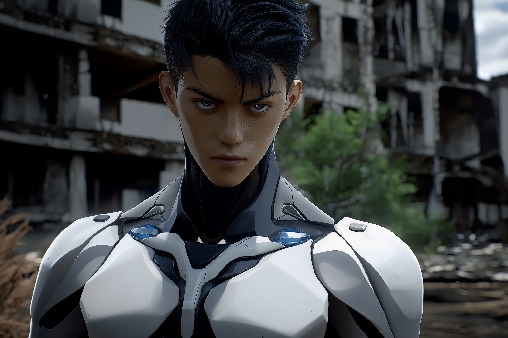
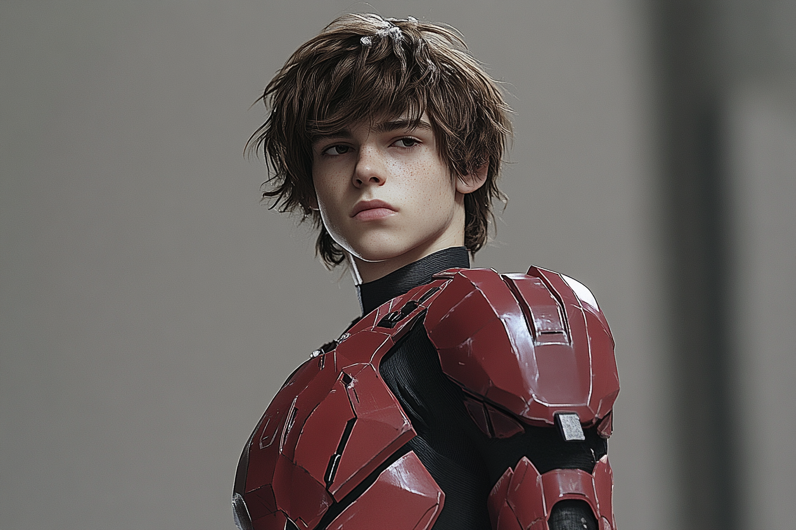
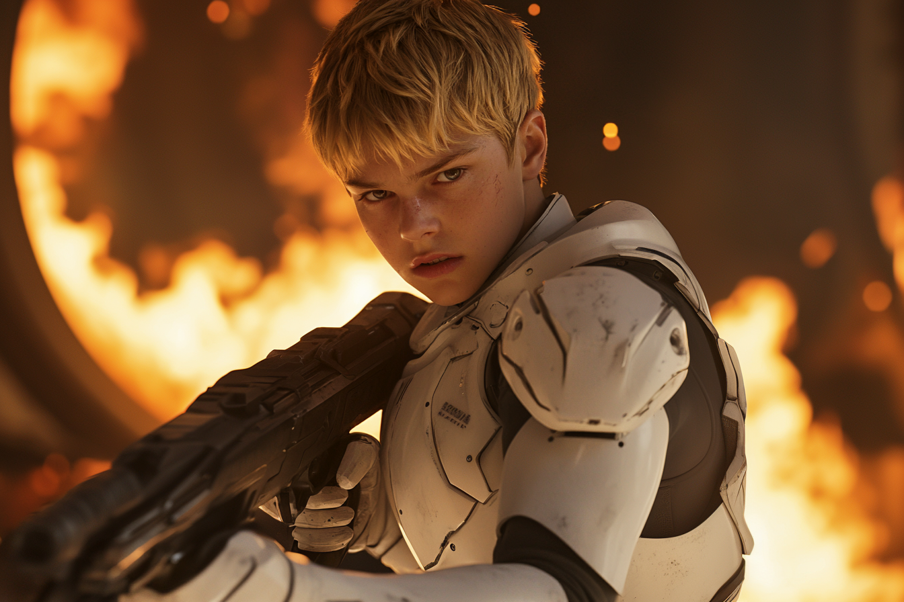

---
layout:
  width: default
  title:
    visible: true
  description:
    visible: false
  tableOfContents:
    visible: true
  outline:
    visible: false
  pagination:
    visible: true
  metadata:
    visible: true
---

# 🟦 Alpha-01

## Overview

Alpha-01 was the first fully field-deployed strike unit composed entirely of subjects from the Atlan [Research Corps’](../../world/sol/institutions/the-research-corps.md) experimental [Clear gene therapy program](../../world/gata/military-and-defense/mavs.md#the-clear-serum-program). Operating in the liminal years between the late [Dark Decade](../../world/history/the-dark-decade.md) and the early [Reconstruction Era](../../world/history/the-reconstruction.md), Alpha-01 served as the proof-of-concept for what would become the [Unassisted Decisive Asset (UDA)](../../world/gata/military-and-defense/mavs.md#unassisted-decisive-assets) program, and, generations later, [Angelis’](../../world/gata/military-and-defense/angelis.md) modern [Mavericks](../../world/gata/military-and-defense/mavs.md#the-new-mavericks) and [Rapid Response](../../world/gata/military-and-defense/rapid-response.md) divisions.

While their designation never appeared in the public [General Record](../../world/gata/politics/the-general-record.md), internal Atlan Research Corps and [Existence Doctrine](../../world/gata/military-and-defense/existence-doctrine.md) archives referred to them simply as “Alpha-01” — the first operational “cell” of Clear-enhanced soldiers trusted to operate with minimal support behind contested lines.

***

### Origins

Under [the Existence Doctrine](../../world/gata/military-and-defense/existence-doctrine.md), Atla authorized a suite of extreme programs intended to “test the limits” of human capability, including [the Clear Serum project](../../world/gata/military-and-defense/mavs.md#the-clear-serum-program) — an experimental gene therapy derived primarily from [Silver Manna](../../world/nature-and-climate/the-manna-flower.md#mer-or-silver) and classified genetic research.

The Clear program dramatically improved qualifying subjects’ reflexes, learning speed, immune function, and healing, at the cost of severe side-effects: runaway metabolism, heat intolerance, and a dependence on constant nutritional intake. Over the Dark Decade and early Reconstruction, as many as \~50,000 refugees and veterans are believed to have received some variant of Clear, most with negligible or transient effects, and some suffering extreme detrimental reactions. A tiny fraction, however, responded _spectacularly_.

From that elite minority, [JAC](../../world/gata/history/the-joint-atlantic-command-jac.md)-era research groups (which would later be folded into the Research Corps and [ALTAR](../../world/gata/institutions/altar.md)) assembled a prototype special-operations unit: Alpha-01.

***

### Formation and Selection

Alpha-01 drew its recruits from [Joint Atlantic Command](../../world/gata/history/the-joint-atlantic-command-jac.md) training camps and refugee-camp academies scattered across [GATA’s](../../world/gata/the-basics.md) emergent territories. Candidates had to meet three criteria:

1. **Stable Clear response** – Subjects who survived repeated Clear rounds without catastrophic rejection and demonstrated consistent performance gains.
2. **Cognitive and emotional resilience** – Measured by long-horizon tactical exercises, isolation drills, and exposure to Reconstruction-era conflict zones as intelligence and strategic support.
3. **Field aptitude** – Demonstrated initiative and performance in live operations attached to regular JAC units.

Due to Clear’s side-effects on cellular repair and metabolism, Alpha-01’s operators experienced dramatically slowed biological aging. As evidenced much later with Clear Program veterans such as Finneas “Finn” Hughes, who appeared perpetually twenty even into his fifties, Alpha-01’s members retained the appearance of late adolescents despite being between young adults when the unit was formally stood up.

Classified rosters differ, but commonly list Dante Newton, Finneas Hughes, and several other operatives as early mainstays of Alpha-01, with individual codenames later subsumed into UDA classifications. It is an open secret that a number of decorated and legendary figures in Atlan military history trace their origins through the unacknowledged UDA program to the rumored exploits of Alpha-01.

***

### Training and Doctrine

Alpha-01’s training blended three threads that would later define both UDAs and MAVs:

* **Extreme autonomy** – Operators were drilled to plan, execute, and exfiltrate missions without real-time command oversight, foreshadowing the “Unassisted” doctrine that would later be formalized in the UDA program.
* **Multi-domain competence** – Alpha-01 trained in urban, desert, and littoral environments, often alongside early war-frame pilots (precursors to Guardians) but with strict constraints on support, forcing them to treat heavy assets as temporary tools rather than crutches.
* **Prototype integration** – They served as live testbeds for emergent tech: early combat gear, crude link-driven tactical networks, and medical protocols for managing Clear’s metabolic demands.

Informally, instructors referred to Alpha-01 as “ghosts in training”: small, mobile, almost impossible to pin down on a conventional battlefield.

***

### Operational Role

Alpha-01 operated primarily during early [Reconstruction](../../world/history/the-reconstruction.md), when GATA still fielded a national military directly under Atla’s authority and the lines between humanitarian missions and black-budget operations were blurry.

Typical assignments included:

* **Decapitation strikes** against [Sovereign warlords and militias](../../world/free-territories/military-defense/sovereign-militias.md) obstructing Reconstruction corridors.
* **Infrastructure sabotage** — disabling logistics networks, comms, or levy systems under cover of natural or engineered disasters, echoing later rumors about [UDA](../../world/gata/military-and-defense/mavs.md#unassisted-decisive-assets) involvement in catastrophic events like the destruction of New Orleans.
* **Asset retrieval & protection** — securing high-value scientific personnel, data, or [Found Objects](../../world/science-and-tech/found-objects.md) and adjacent materials for [the Research Corps](../../world/sol/institutions/the-research-corps.md) and [ALTAR](../../world/gata/institutions/altar.md).

Though raised as a **unit**, Alpha-01 rarely deployed as a single squad. More often, its members were attached singly or in pairs to conventional forces, trial-running the very concept of a one-person “decisive asset.”

***

### From Alpha-01 to the UDA Program

Performance reports from Alpha-01’s deployments formed the backbone of the formal **Unassisted Decisive Asset (UDA)** program. The Existence Doctrine brass recognized that:

* A single Clear-enhanced operator with elite training and modern gear could **replace entire battalions** for certain assignments.
* Centralized command actually _slowed_ these operators down; they functioned best when given a mission objective and broad rules of engagement.
* The single performance liability recurrent in Alpha-01 deployments was friction within the unit resulting from the extreme competence and rapid contextual integration of each operator, leading to rapid tactical divergences during an operation.

When the UDA program was officially chartered as its own Existence Doctrine compartment, most surviving Alpha-01 members were quietly re-classified as UDAs. Their original unit designation was buried in redacted documentation; later classified histories speak only of “the original UDAs” and their mythic exploits.

Finn Hughes’ later bio explicitly places him in the original UDA program, benefiting from Clear therapy and super-soldier training; Alpha-01 represents the **prototype phase** of that same path.

***

## Team Members

### Rafael “Phoenix” Reyes

<figure><figcaption></figcaption></figure>

**Origin:** Bright Mesa refugee camp, ex–California corridor (Southwest North America)

Rafael was 18 when Atlan tagged him out of [Bright Mesa](../../world/gata/history/bright-mesa.md), a populous makeshift city of survivors including many refugees like Rafael who’d watched California burn. Where most kids learned to keep their heads down, he learned to stand up straighter. After joining the program, his Clear-boosted reflexes and eerie knack for reading the chaos of conflict put him at the center of every exercise, and instructors quickly pushed him into the role of first team leader. Stubborn, self-assured, and unflinching when it comes to hard choices, he will make the hard call—and then stand front and center to answer for it. His callsign "Phoeni&#x78;**"** comes from the constellation and the bird reborn from fire: a refugee child of a dead coast, remade into Atla’s sharpest blade.

#### Basic Info

* **Age at recruitment:** 18
* **Origin / ethnicity:** Bright Mesa refugee camp (ex–California evacuees); Filipino-American
* **Height / weight:**
  * 1.78 m (5'10")
  * 74 kg (163 lb)
* **Appearance:**
  * Athletic, well-proportioned build; quick, precise movements.
  * Medium tan skin with light sun-and-wind wear.
  * Gray eyes with a cool, steady stare that reads as “steely.”
  * Thick black hair with a faint blue sheen, short on the sides and always slicked up and back on top.
  * Thin scar at his right eyebrow and a small burn mark on his left forearm.
* **Family status at recruitment:**
  * Father killed in a convoy ambush when Rafael was 15.
  * Mother alive, with chronic respiratory issues from wildfire and camp conditions.
  * One younger sister living with their mother in Bright Mesa.
  * Not an orphan, but functionally head of household; Atlan recruitment includes medical and housing guarantees for his family.

***

<figure><figcaption></figcaption></figure>

### Finneas “Archer” Hughes

**Origin:** Louisiana Refugee Camp, GATA.

As a 16-year-old camp mediator, Finn was the kid camp administrators called on when other teens had knives out over rations; he had a gift for stepping between people and talking them down. Clear trials amplified his stamina and focus rather than his aggression, marking him as a natural stabilizer in the field. His callsign "Archer" comes from the old myths of _Orion the archer_—the instructors’ joke being that Finn never misses, he just always takes the safest possible shot.

#### Basic Info

* **Age at recruitment:** 16
* **Ethnicity:** Gulf Coast U.S. (Louisiana), mixed Caucasian / Cajun Creole
* **Height / weight:**
  * 1.73 m (5'8")
  * 64 kg (141 lb)
* **Appearance:**
  * Lean, wiry build; runner’s legs and calloused hands from labor and camp work. Carries himself with an easy demeanor, shoulders relaxed, stance loose.
  * Brown–hazel eyes, bright and alert.
  * Dark brown hair, thick and slightly wavy, kept long and shaggy.
  * Faint scarring on left forearm from an early camp fire and a jagged scar along his right eyebrow (never quite grows in).
* **Family status at recruitment:**
  * Mother deceased (disease in early camp years).
  * Father missing / presumed dead after a failed evacuation further inland.
  * Legally classified as **unaccompanied minor**; functionally an orphan, though he still half-believes his father might show up in a convoy someday.

***

#### Amina “Crown” El-Baz

**Origin:** Casablanca Breakwater Camp, North African AU–Atla corridor.

At 17, Amina was already brokering compromises between African Union organizers and Atlan logistics officers, translating politics as easily as language. In war games she consistently built slow, grinding victories that preserved civilians and infrastructure. Her callsign "Crown" (from _Corona Borealis_) nods to both the constellation and the way she naturally assumes a leadership center of gravity, even when she doesn’t want command.

* **Age at recruitment:** 17
* **Origin / ethnicity:** Casablanca corridor, Moroccan (North African Arab)
* **Height / weight:**
  * 1.68 m (5'6")
  * 60 kg (132 lb)
* **Appearance:**
  * Balanced, athletic build; strong shoulders from hauling water and aid crates.
  * Light-brown, olive-leaning skin tone.
  * Dark hazel eyes; level, assessing, rarely surprised.
  * Thick black hair, usually in a practical low bun or braided crown; loose curls escape in humidity.
  * Often wears a thin thread bracelet with colored beads—last gift from her younger brother.
  * Small crescent-shaped scar on her chin from a childhood fall.
* **Family status at recruitment:**
  * Father killed in militia crossfire during early Reconstruction clashes.
  * Mother alive but chronically ill and unable to leave the camp’s medical ward.
  * One younger brother lost during a chaotic convoy transfer (status “missing”).
  * Amina **technically has living family**, but she’s the only functional adult, and Atlan effectively recruits her as if she were on her own.

***

#### Dante “Scorpio” Newton

<figure><figcaption></figcaption></figure>

**Origin:** JAC / Atlan Naval Training Barge “Wardroom-3”, mid-Atlantic flotilla.

Dante was a 14-year-old deck rat who turned zero-light hide-and-seek into a full-contact sport, routinely “capturing” armed marines in corridor drills. He’s quiet, coiled, and intensely competitive, with a tendency to disappear from formation and reappear behind “enemy” lines. His callsign "Scorpio" (from _Scorpius_) reflects his preferred style: get close, sting once, leave nothing standing.

* **Age at recruitment:** 15
* **Origin / ethnicity:** American, Norwegian / Eastern European background
* **Height / weight:**
  * 1.70 m (5'7")
  * 61 kg (134 lb)
* **Appearance:**
  * Compact, coiled build; low body fat, strong forearms from climbing bulkheads and rigging.
  * Icy pale skin, freckles across nose and cheeks after sun exposure, a perpetual faint salt-crust look from shipboard life.
  * Bright blue eyes; a detached gaze with quick, decisive focus, always scanning, but never panicked.
  * Forward-swept blonde hair with short sides and long bangs.
  * Old rope-burn scars around the fingers of his right hand; faint knife nick under his jaw.
* **Family status at recruitment:**
  * Mother: served in galley/maintenance rotation on the same flotilla but reassigned shortly after his Clear candidacy is confirmed, killed in a missile strike from Irish resistance forces.
  * No record of father (listed as “unknown” on birth documentation).
  * Emotional bond to a loose “deck family” of older sailors, but **physically separated** from all of them once transferred to Atlan training.

***

#### Joana “Swan” Costa

**Origin:** Recife Atlantic Corridor Garden, Northeastern Brazil.

Joana grew up running silent night routes through flooded shanties in a battered kayak, memorizing currents and militia patrol schedules by feel. Clear enhancement turned her into an amphibious phantom—graceful in water, lethal in tight urban mazes. She’s easygoing and irreverent off-mission, but her callsign "Swan" (from _Cygnus_) comes from the way she shifts in an instant from placid to terrifyingly powerful.

* **Age at recruitment:** 16
* **Origin / ethnicity:** Recife coastal settlements, Brazilian; Afro-Brazilian with possible Indigenous ancestry
* **Height / weight:**
  * 1.65 m (5'5")
  * 58 kg (128 lb)
* **Appearance:**
  * Flexible, sinewy build; swimmer’s shoulders and powerful legs.
  * Deep brown skin, often a shade darker from constant sun exposure.
  * Big, expressive dark brown eyes; quick to laugh, quicker to narrow when something feels off.
  * Black hair in tight curls, usually cropped short on the sides with a slightly longer top she can tie back or shove under a hood.
  * Faint lattice of old mosquito-bite scars on her calves; one noticeable scar on her right hip from shrapnel in a flood-zone skirmish.
* **Family status at recruitment:**
  * Mother alive, working sanitation and water-purification detail.
  * Father presumed dead (small fishing boat never returned after a storm years earlier).
  * Several younger siblings; Joana had been acting as a secondary caretaker.
  * Atlan’s offer includes extended rations and housing guarantees for her family, making her a **reluctant but willing** recruit.

***

#### Kwesi “Lion” Mensah

**Origin:** Takoradi–Dakar Joint Resettlement Zone, West Africa.

By 14, Kwesi was hauling Atlan humanitarian supply shipments on the docks and still had breath left to lead work songs that kept morale up when food was thin. Clear therapy barely seemed to tire him; instructors used him as the benchmark for “max exertion” drills. Loud, stubborn, and fiercely protective of anyone he considers “his”, he wears the callsign "Lion" (from _Leo_) like a promise: he bites last, and only after everyone else is safe.

* **Age at recruitment:** 14
* **Origin / ethnicity:** Takoradi–Dakar resettlement zone, Ghanaian
* **Height / weight:**
  * 1.72 m (5'8")
  * 70 kg (154 lb)
* **Appearance:**
  * Solid, stocky-athletic frame; already noticeably strong for his age.
  * Dark brown skin; wide grin that shows up quickly and often.
  * Dark brown eyes that crinkle at the corners when he laughs.
  * Black hair in a short, dense fade, sometimes patterned by whoever in camp has clippers that week.
  * Small scar over his left knee from a fall off a dock crane.
* **Family status at recruitment:**
  * Both parents alive but exhausted; father on dock crews, mother on food distribution.
  * Two younger sisters.
  * Family strongly opposed to him going frontline, but Clear compatibility gives him a “priority candidate” tag.
  * He leaves as a **volunteer under heavy persuasion**, sending most benefits back to his family.

***

#### Niall “Cross” O’Rourke

**Origin:** Cork Coastal Refit Yard, Atlantic Ireland.

Raised stripping Old World ships with his uncle under a JAC maintenance contract, Niall understood hulls, stresses, and explosives better than anyone on his pier by 16. He approaches combat like engineering—find the one joint, bridge, or pylon whose failure collapses the whole problem. His callsign "Cross" (from _Crux_) reflects his knack for pinpointing that critical intersection on a map, a structure, or an enemy plan.

* **Age at recruitment:** 17
* **Origin / ethnicity:** Cork refit yard, Irish
* **Height / weight:**
  * 1.80 m (5'11")
  * 72 kg (159 lb)
* **Appearance:**
  * Tall, lanky-lean but strong; long reach, long stride.
  * Pale skin that freckle-burns easily; forearms and face are a constellation of light freckles.
  * Gray-green eyes; tends to squint, as if always mentally measuring something.
  * Dark blond hair, usually messy and pushed back; undercut in training, but it never quite behaves.
  * Knuckles scarred from both workshop accidents and “friendly disagreements.”
* **Family status at recruitment:**
  * Father: former shipwright, killed in an early-yard collapse tied to rushed retrofits.
  * Mother: alive but struggling with a chronic respiratory condition from yard dust.
  * No siblings.
  * Niall effectively becomes the **sole breadwinner** via his Atlan contract, sending most of his stipend home.

***

#### Léonie “Lyra” Maurel

**Origin:** Brest Garden Annex, first class of the Paris Atlan Academy.

At 13, Léonie could keep three refugee camps talking over a jury-rigged radio net made of scavenged wire and Manna crates when everyone else’s systems were dead. Early link prototypes responded to her with uncanny stability, and Clear only sharpened her multi-channel focus. Soft-spoken, with a dry wit, she chose "Lyra" (from the lyre constellation) as her callsign, insisting that good comms work is just battlefield music—if you stop hearing it, something’s gone very wrong.

* **Age at recruitment:** 13 (youngest recruit in the cohort)
* **Origin / ethnicity:** Born in Marseille, raised between Brest annex and Paris-track Academy; French with Algerian maternal heritage
* **Height / weight:**
  * 1.55 m (5'1")
  * 48 kg (106 lb)
* **Appearance:**
  * Small, slight frame; looks more fragile than she is.
  * Light olive skin; prominent dark circles under the eyes when she’s been on comms too long.
  * Dark brown, almost black eyes; intense when focused on a console, shy in face-to-face confrontation.
  * Dark brown hair, usually braided into one or two long plaits she can tuck into a collar or under a headset.
  * Left ear slightly nicked at the top from an improvised-antenna mishap as a kid.
* **Family status at recruitment:**
  * Father: Atlan logistics clerk, killed in a convoy attack.
  * Mother: disappeared during riots in Marseille, status unknown.
  * No confirmed siblings.
  * Léonie is **officially an orphan** by the time she’s moved to the Academy track, her “family” effectively becoming the tech teams and instructors who noticed her talent.

***

#### Sami “Gemini” Okafor

**Origin:** Lagos Evacuation Column to Greater Toronto Refugee Camp, landing in the West End Garden.

Shuffled from convoy to convoy before landing in a Garden in Greater Toronto, Sami learned to juggle roles: student, caretaker, and quiet fixer for kids who didn’t trust adults. Psych evals flagged an unusual talent for running simultaneous plans in their head, and Clear treatment seemed to enhance that “split focus” instead of overwhelming it. Identifying as non-binary, they leaned into the duality and chose "Gemini" as their callsign—always thinking in pairs: two exits, two backups, two ways to win.

* **Age at recruitment:** 15
* **Origin / ethnicity:** Nigerian-born, raised across Lagos convoys and Greater Toronto Garden; Nigerian-Canadian, Igbo heritage
* **Height / weight:**
  * 1.60 m (5'3")
  * 52 kg (115 lb)
* **Appearance:**
  * Slim, slightly androgynous build; quick, precise movements.
  * Medium-deep brown skin tone.
  * Dark eyes with a restless, analytical gaze; often seems like they’re looking at two things at once.
  * Black hair kept in short coils or a tight fade—easy to manage, easy to hide under a hood or helmet.
  * Wears a thin chain with two small, mismatched charms (one from Lagos, one from Toronto) tucked under clothes.
* **Family status at recruitment:**
  * Both parents lost during early evacuations; records conflict on exactly where.
  * Spent years in mixed-age convoy and camp cohorts, effectively raised by rotating caregivers and older kids.
  * Legally classified as **unaccompanied minor**, with no known living immediate family; Sami is very attached to “found family” among peers.

***

#### Inés “Raven” Vidal

**Origin:** Canary Straits Listening Post, former Spanish Atlantic territories.

At 14, Inés funded her family’s ration buffer by mapping smuggler routes and quietly selling that intel—carefully—to both Atlan officers and local militant intel-brokers. She’s observant, patient, and hard to read, preferring to win with information long before bullets. Her callsign "Raven" (from _Corvus_) speaks to her role as a scout and gossip-collector; if something shines—secrets, patterns, discrepancies—she’s already picked it up.

* **Age at recruitment:** 14
* **Origin / ethnicity:** Canary Islands–adjacent refugee networks, Spanish / Canary Islander
* **Height / weight:**
  * 1.58 m (5'2")
  * 50 kg (110 lb)
* **Appearance:**
  * Slender build; more wiry than overtly muscular.
  * Light tan skin, often several shades darker in the dry season.
  * Dark brown eyes with a sharp, watchful look; rarely surprised by anything happening around her.
  * Straight, dark brown hair worn in a blunt cut to the jaw; usually tucked under a cap or scarf when working.
  * Small scar at the corner of her mouth that gives her resting face a slightly sardonic tilt.
* **Family status at recruitment:**
  * Mother alive, working menial jobs in port-side informal economies.
  * Younger brother presumed drowned in a failed crossing years prior.
  * Father absent since before the Dark Decade; rumored to have run jobs for various gray-market crews.
  * Inés maintains contact with her mother by irregular couriers; she is **not an orphan**, but essentially learns to operate independently.

***

#### Einar “Wolf” Jónsson

**Origin:** Reykjavik North Atlantic Watch Platform.

Einar grew up under the shadow of Guardian frames stationed to deter raiders, tracking their patrol paths the way other kids memorized constellations. At 18 he was already running solo reconnaissance across ice and broken coastline, his Clear-boosted metabolism letting him function in conditions that would drop normal soldiers. Taciturn and self-contained, he earned the callsign "Wolf" (from _Lupus_) for his lone-scout habits and the quiet, absolute loyalty he shows to the few people he considers his pack.

* **Age at recruitment:** 18 (oldest in the cohort)
* **Origin / ethnicity:** Reykjavik North Atlantic watch platforms, Icelandic
* **Height / weight:**
  * 1.83 m (6'0")
  * 80 kg (176 lb)
* **Appearance:**
  * Broad-shouldered, solid build; built from cold-weather labor and long treks in gear.
  * Very fair skin; cheeks and nose permanently wind-reddened.
  * Light blue-gray eyes; distant, assessing, with a habit of staring at horizons.
  * Light brown hair kept short on the sides, slightly longer on top, often flattened by a beanie or hood.
  * Sparse, early stubble that never quite gets past “permanent five o’clock shadow.”
  * Old frostbite marks on two fingers of his left hand; he moves that hand a bit stiffly in the cold.
* **Family status at recruitment:**
  * Father: Guardian maintenance tech, killed in an on-platform accident.
  * Mother: alive, working as a cook and quartermaster for the watch post.
  * One older sister already enlisted in a non-Clear Atlan infantry unit.
  * Einar joins as a **volunteer from a military family**, with explicit blessing from his mother, who sees it as both duty and opportunity.

***

### Dissolution and Scattered Afterlives

When the Clear and UDA programs were dissolved at the end of the Existence Doctrine, all related records were scrubbed from the General Record by Atlan Information Control (AIC). Alpha-01, never publicly acknowledged in the first place, effectively **ceased to exist** on paper.

Fates of known members varied:

* Some, like **Finneas Hughes**, transitioned into official Angelis channels, eventually joining **Rapid Response** and becoming legends in their own right.
* Others are rumored to have been retained by ALTAR or Research Corps in cryostasis or deep-black assignments.
* Still more are whispered to have defected or gone to ground as independent operators, mercenaries, or ghosts in the Free Territories’ criminal underworld.

For those who survived, the psychological toll of extended youth, decades of violence, and the moral ambiguity of Existence Doctrine missions mirrored the burdens later recorded in Finn’s own wrestling with the ethics of Clear and the UDA legacy.
