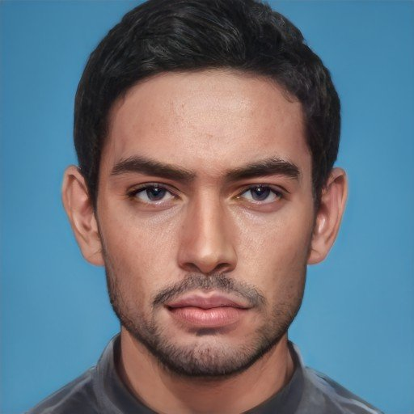
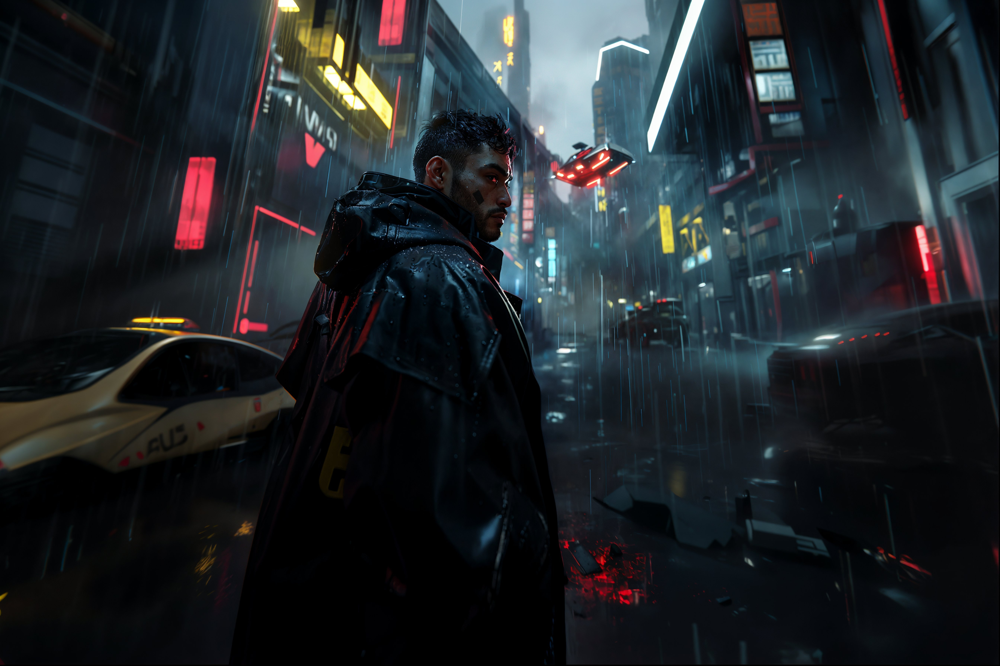
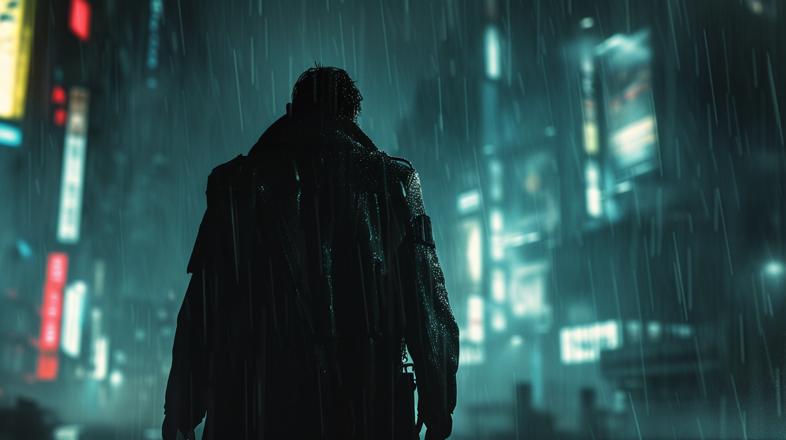

---
layout:
  title:
    visible: true
  description:
    visible: false
  tableOfContents:
    visible: true
  outline:
    visible: true
  pagination:
    visible: true
---

# 👤 Carlos Rojas

<figure><figcaption></figcaption></figure>

### Play _CODA: Silent Melody_ starring Carlos



<table data-card-size="large" data-view="cards"><thead><tr><th></th></tr></thead><tbody><tr><td><h3>Identity</h3>
Age: 34

Occupation: Collector

First Impression: Weary but determined

Self-Image: Soldier in a war against humanity's self-destructive nature

True Self: Almost given up on humanity. 
</td></tr><tr><td><h3>Background</h3>
Birthdate: December 23, 2092

Location: Atla

Citizenship: GATA

Ethnicity: Columbian

Born: Bogotá, Columbia
</td></tr></tbody></table>

* Height: 5'11"
* Weight: 175lbs
* Hair Color: Black
* Hair style:&#x20;
* Eye Color: Brown
* Skin Type: Tan
* Face Shape: Square
* Body Type:&#x20;
* Accessories:&#x20;
* Description:&#x20;

***

<figure><figcaption>
Carlos standing outside a Class 1 bust.
</figcaption></figure>

## Bio

Carlos was born in Mexico City, the de facto Capital City of the Texan Empire. His parents ran afoul of a local gang and, fearing for their lives, they fled to LA when he was young. He was awed by the fruits of the Reconstruction in rebuilding that vast metropolis, its shimmering towers, its vast underground complexes, and its geo-engineered oasis.

At the age of 12 Carlos had decided he wanted to grow up to be an Operator, navigating The System for clients. His parents had instilled in him an idealized image of GATA. As soon as he turned 16, Carlos began working as an operator. It wouldn't be accurate to say he was a natural, since he had been going through the motions for years already, but he was very good. His work earned him many keys and clients, but he worked strictly legit jobs, which did occasionally cause him issues. Over the years, his work took him to many districts.

When he was 24, the Northern Cascadia district's System node was destroyed by a sovereign militia. Their attack was made possible by taking advantage of the growing prevalence of legacy technology use within the district, allowing them to intentionally corrupt the networks with the Daemon virus. This was devastating for his home. The experience inspired him to pursue a career in law enforcement investigating and preventing the illegal use of dangerous AIs. He joined the Intelligence Academy specifically to study the types of 21st century systems used predominately by the Free Territories.

He would go on to graduate with full honors. Carlos took naturally to on-the-ground investigation, possessing a sixth sense for the presence of contraband technology, noticing every tell-tale sign. With his restrained but decisive style, Carlos has gone on to contribute to a number of successful high profile investigations for the AIC’s Emergency Special Committee. He now primarily works multi-district investigations at the direct disposal of the AIC’s high council.

Wherever he goes, he brings his Manna plant, grown in the soil of his childhood home, a reminder of a place to which he can never return. He’s remarkably detail oriented and observant. Polite, but not very sociable. When he has to talk, he always keeps his cards close to his chest. While he’s not long for conversation, he does occasionally quip to himself under his breath, and talks openly to his plant.

***

<figure><figcaption></figcaption></figure>

## Motivations

* Track and destroy 21st century tech.
* Care for his plant.
* Avoid the politics of the AIC.
* Personal vendetta against the Hundred Hands.

***

## Trivia

***

## **Personality & Quirks**

***

## Secrets

***

## Skills

***

## Family & Associates

***

## Comparative Stats

| Attribute    | Stat |
| ------------ | ---- |
| Strength     | 7    |
| Defense      | 7    |
| Dexterity    | 8    |
| Intelligence | 6    |
| Wisdom       | 9    |
| Charisma     | 5    |

***

## Quotes

> "I don't make the rules." - Carlos

> “Some code is better left unrun, like some things are better left unsaid." - Carlos

