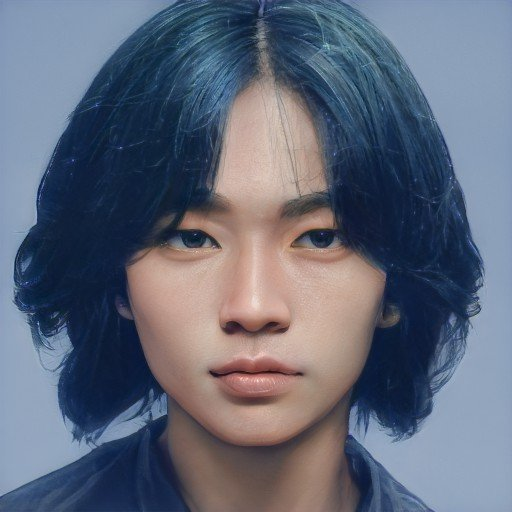
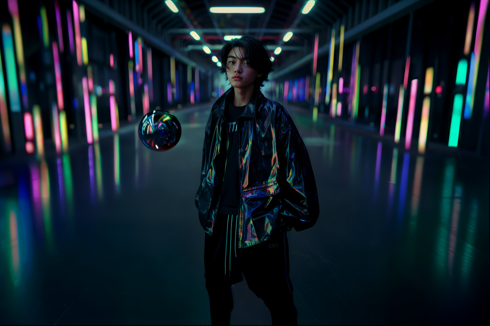

---
layout:
  title:
    visible: true
  description:
    visible: false
  tableOfContents:
    visible: true
  outline:
    visible: true
  pagination:
    visible: true
---

# 👤 Franky Wu

<figure><figcaption></figcaption></figure>

<table data-card-size="large" data-view="cards"><thead><tr><th></th></tr></thead><tbody><tr><td><h3>Identity</h3>
Age: 17

Occupation: Experience designer

First Impression: Hyperactive and overeager.

Self-Image: Visionary experience designer.

True Self: A speedy ship with no compass. 
</td></tr><tr><td><h3>Background</h3>
Birthdate: May 29, 2108

Location: Greater Toronto

Citizenship: GATA

Ethnicity: Chinese

Born: Greater Toronto, GATA
</td></tr></tbody></table>

* Height: 5'10"
* Weight: 158 lbs
* Hair Color: Dark teal color
* Hair style: Bro Flow
* Eye Color: Brown
* Skin Type: Shell skin tone
* Face Shape: Round
* Body Type: Slim
* Accessories: Link on his temple, an emitter or two often floating nearby
* Description: Franky’s appearance is as dynamic as his personality. With his striking dark teal hair and slim frame draping his savvy street style, he makes an effort to stand out. His link is prominently displayed on his temple, often accompanied by floating emitters that project his light displays wherever he goes.

***

<figure><figcaption>
Franky setting up for a show.
</figcaption></figure>

## Bio

Franky is the energetic, self-assured lovechild of two successful engineers. He was born and raised in the Greater Toronto district, and he’s never left.

From a very young age, Franky was fascinated by the incredible feats of conduits throughout the district, erecting megastructures and transforming the environment with only their minds.

A natural conduit, Franky had hoped to follow in his parents footsteps but he was never as gifted with the technical details, and has always had a great deal of difficulty staying focused. However, after his first time seeing the sights and sounds of an arcade, he found a singular focus for the first time in his life: his calling was experience design.

At 16 he developed his own DIY emitter setup and would dazzle and annoy everyone in his life with his overwhelming displays of reactive light, form and color. Of course, he didn't need the emitters to make his presence known; Franky has always been rambunctious, opinionated, and outspoken.

Ambitious and entrepreneurial, he has started working with local small enterprises to level up their storefronts and interior spaces; he'd gladly work for anyone who will let him do what he loves most—as long as he can do it his way.

But it's all just been practice so far. As far as Franky's concerned, he's just biding his time until he turns 18 and he can get a job at the arcade where finally he'll be able to do his thing for an audience that is ready, willing, and able, to have their minds blown.

***

## Motivations

* Prove his talent—to his parents and the world.
* Always hungry with a bottom-less stomach.
* Kind of wants a girlfriend, or even just a girl friend.

***

## Trivia

* Built his first DIY emitter setup at 16.
* Parents are successful engineers in Greater Toronto.
* Never left the Greater Toronto district.
* Fascinated by conduits since a young age.
* Known for his outspoken and opinionated nature.
* His light displays are both mesmerizing and occasionally overwhelming.
* Always carries a notebook to jot down new design ideas.

***

## **Personality & Quirks**

* Energetic and self-assured.
* Rambunctious and opinionated.
* Outspoken and not afraid to share his thoughts.
* Loves to experiment with light and color.
* Can be overly ambitious, often biting off more than he can chew.
* Highly creative, always thinking of new ideas and projects.
* Sometimes struggles with focus and technical details.
* Has a tendency to annoy people with his constant need for attention.
* Deeply passionate about his work, often losing track of time while designing.
* Always looking for validation and recognition.

***

## Secrets

* Fears that he might never achieve the recognition he craves.
* Sometimes doubts his abilities despite his confident exterior.
* Struggles with the pressure of living up to his parents' success.
* Has a secret sketchbook where he draws his more personal and experimental designs.

***

## Skills

* Natural conduit with a talent for dazzling the crowd.
* Proficient with emitters and creating reactive light displays.
* Strong creative vision and innovative thinking.
* Scrappy and pragmatic.
* Entrepreneurial mindset, always looking for opportunities.
* Good at networking and making connections, if a bit naïve and inexperienced.

***

## Family & Associates

* **Parents:** Both successful engineers in Greater Toronto.
* **Mentor:** Local arcade owner who sees potential in Franky’s designs.
* **Friends:** A small group of like-minded creatives who share his passion for experience design.

***

## Comparative Stats

| Attribute    | Stat |
| ------------ | ---- |
| Strength     | 5    |
| Defense      | 5    |
| Dexterity    | 7    |
| Intelligence | 8    |
| Wisdom       | 4    |
| Charisma     | 8    |

***

## Quotes

> "I don’t just make lights; I create memories." - Franky&#x20;
>
> "I’m just waiting for the world to catch up." - Franky

***

## Meta Self-Description

