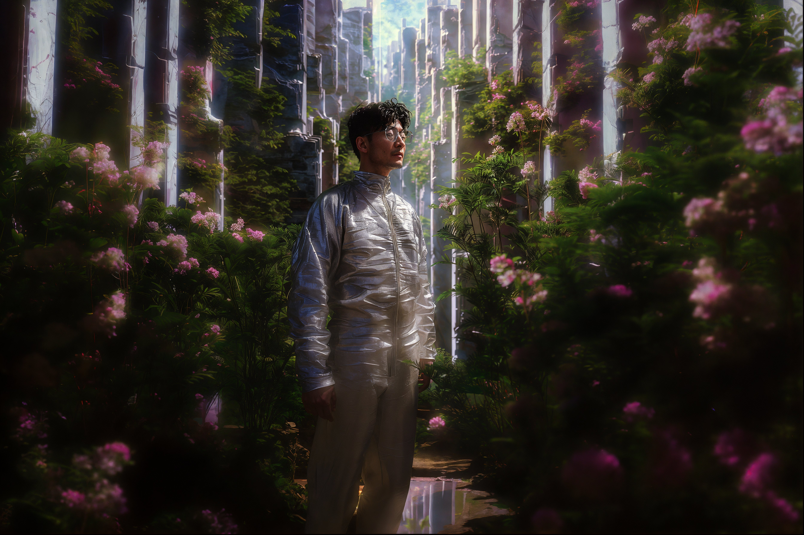

---
layout:
  title:
    visible: true
  description:
    visible: false
  tableOfContents:
    visible: true
  outline:
    visible: true
  pagination:
    visible: true
---

# 👤 Keisuke Maeda

<figure><figcaption></figcaption></figure>

<table data-card-size="large" data-view="cards"><thead><tr><th></th></tr></thead><tbody><tr><td><h3>Identity</h3>
Age: 51

Occupation: Programmer

First Impression: Intense, but absent-minded.

Self-Image: The calm in the storm.

True Self: The unwitting adult in the room. 
</td></tr><tr><td><h3>Background</h3>
Birthdate: Oct 15, 2074

Location: Greater Toronto

Citizenship: GATA

Ethnicity: Japanese/French

Born: Detroit, GATA
</td></tr></tbody></table>

## Appearance

* Height:
* Weight:&#x20;
* Hair Color:&#x20;
* Hair style:&#x20;
* Eye Color:&#x20;
* Skin Type:&#x20;
* Face Shape:&#x20;
* Body Type:&#x20;
* Accessories: Slate Glasses
* Description:&#x20;

<figure><figcaption>
Keisuke taking a moment in New Imperial Japan's Walled Garden prison.
</figcaption></figure>

## Bio

## Motivations

*

## Trivia

*

## **Personality & Quirks**

*

## Secrets

*

## Skills

*

## Family & Associates

## Comparative Stats

| Attribute    | Stat |
| ------------ | ---- |
| Strength     | 5    |
| Defense      | 5    |
| Dexterity    | 5    |
| Intelligence | 10   |
| Wisdom       | 8    |
| Charisma     | 6    |

## Quotes
