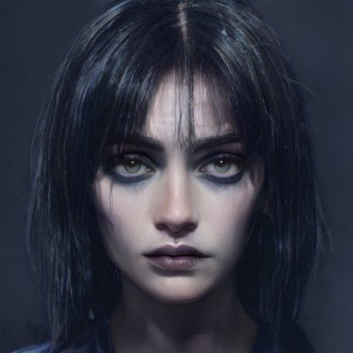
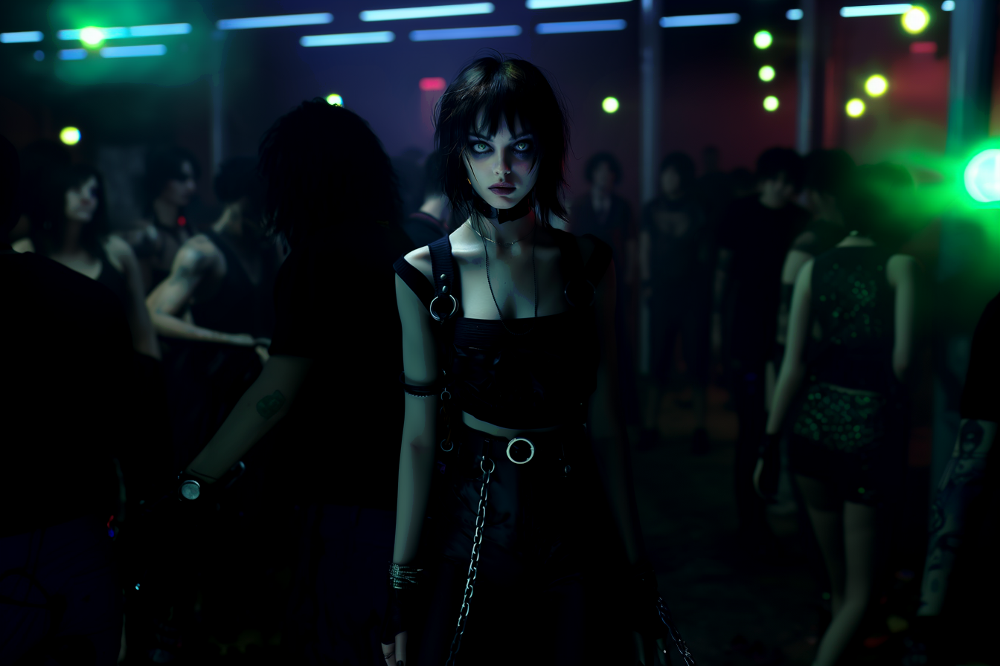

---
layout:
  title:
    visible: true
  description:
    visible: false
  tableOfContents:
    visible: true
  outline:
    visible: true
  pagination:
    visible: true
---

# 👤 Lulu Carter

<figure><figcaption></figcaption></figure>

<table data-card-size="large" data-view="cards"><thead><tr><th></th></tr></thead><tbody><tr><td><h3>Identity</h3>
Age: 25

Occupation: Sync Jockey

First Impression: Gutter punk

Self-Image: Gutter punk

True Self: Fallen angel 
</td></tr><tr><td><h3>Background</h3>
Birthdate: Sept 19, 2099

Location: Greater Toronto

Citizenship: GATA

Ethnicity: American

Born: Detroit, GATA
</td></tr></tbody></table>

## Appearance

* Height: 5'7"
* Weight: 122 lbs
* Hair Color: Black
* Hair style: Chin-length choppy hair
* Eye Color: Light green
* Skin Type: Pale
* Face Shape: Diamond
* Body Type: Thin
* Accessories: Collar necklace, assorted jewelry
* Make-up: Smoky eyeshadow and Black Cherry lipstick
* Description: Her silhouette is thin and angular, and elegant. Intense and captivating light a flame tenuously flickering.

***

<figure><figcaption>
Lulu in some dark corner of the West End Gray Zone.
</figcaption></figure>

## Bio

Born to highly religious parents and raised in a homestead outside of Detroit. While her parents were loving, they were also overbearing, and from a very early age Lulu had learned that if she wanted to have any fun she needed to break the rules—and not get caught doing it.

Her little brother, Fitz, 6 years her junior, always looked up to her, so he could be relied upon to cover for her. He was like her little minion, and without much social awareness of his own, she was his only real friend. However, despite their efforts, Lulu was caught—repeatedly.

When she was 14, in a bid to give her a better future, her parents sent her to the Greater Toronto district for school. She was able to move there thanks to her father's transferrable Gate Keys that he had earned as a Gate worker there during Reconstruction. While they had hoped that the Academy setting would give Lulu structure, the thumping allure of the district's underground night life was impossible for Lulu to resist.

Before long, Lulu had lots of friends. She knew how to make things happen. Wherever the action was, she was there, and she was on point. She was drawn to the edge. And that’s where she found Xavier dying in the street. She was 17 and he was 19. Over the following years, their fateful meeting developed into a tumultuous on-and-off 'romance' spanning the next six years.

During that time, Lulu watched Xavier transform from a broken, hopeless young man to a feared and respected gang boss with control over a key stretch of the West End Gray Zone's old docks. The materialization of his illicit empire was so incremental and engrossing, that she could barely feel it corrupting her life. Before she knew it, she was playing her own small role in his expanding enterprise, and hardly noticed herself growing fearful of the man she loved, and the woman she was becoming.

But then her brother Fitz, the now 17-year-old coding prodigy, was hired by an enterprise in the district, and she snapped out of her daze. She could sense Xavier calculating the possibilities presented by a talent like Fitz right at his fingertips. And Fitz was the same as he always was; aloof, trusting, naïve. For the sake of her little brother, Lulu found the strength to end her relationship with Xavier, and when he tried to physically stop her from leaving, she stabbed him through the hand. After that, he let her go, and she hasn't heard from him since.

Though she was happy to be reunited with her brother, her dramatic break with Xavier and the added responsibility of caring for her disorganized little brother caused her to slip into a long, foggy depression. Then, nearly a year after moving out of the Gray Zone, Lulu ran into Haleh, a sync jockey whom she had met briefly back in the scene, and the two sparked a friendship. Thanks to Haleh's influence, Lulu has re-discovered her childhood passion for singing, now growing into a capable sync jockey herself.&#x20;

She lives in a nice place with her little brother, paid for by his cushy enterprise job, and she does her best to look out for him. During the day, she takes on small operator gigs doing word-of-mouth marketing for local enterprise. By night, she's becoming one of the most successful promoters in the East end—in part because the headliner is always SOULJOURNER, aka Haleh. But even though she has found something like contentment in her life, she still has a dark cloud hanging over her.

Sometimes, she catches herself thinking about Xavier. She worries for him. She worries about him. She imagines him as a boy dying in the gutter. She imagines him as a shadow, watching her through the cracks. Despite this, she wakes up every day and does it all again.

***

## Motivations

* Escape Xavier's dark influence.
* Still loves Xavier.
* "Don't be a drag"
* Try to match up to Haleh's talent.
* Protect her little brother.

***

<figure><figcaption>
Lulu's gaze piercing through the crowd at a sync rave.
</figcaption></figure>

***

## Trivia

* Raised in a highly religious homestead outside of Detroit.
* Sent to Greater Toronto at 14 for a better future.
* Developed a tumultuous relationship with Xavier after saving his life.
* Escaped Xavier’s influence to protect her brother.
* Reconnected with her passion for singing thanks to Haleh's influence.
* Promotes all of Haleh's SOULJOURNER shows.
* Has recently begun performing as a sync jockey.

***

## **Personality & Quirks**

* Hates to feel like she’s a bother.
* Keeps her struggles private, sometimes even to Haleh.
* Intense and stormy presence.
* Reflexively wants to hide from attention, but fears being invisible.
* Struggles with feelings of inadequacy.
* Can be self-destructive in her pursuit of happiness.
* Puts the needs of her loved ones over her own.
* Deeply protective of her little brother, Fitz.
* Has a soft spot for lost causes and underdogs.
* She isn't afraid to defend herself when she has to.
* After the trauma of leaving Xavier, she was slow to put herself back out there.=

***

## Secrets

* Still harbors feelings for Xavier despite his toxic influence.
* Struggles with feelings of guilt and inadequacy.
* Hides the depth of her emotional struggles from everyone but Haleh.
* Feels overshadowed by Haleh’s talent and success.

***

<figure><figcaption></figcaption></figure>

## Skills

* Talented singer with a unique voice.
* Capable sync jockey, known for her energetic and captivating shows.
* Skilled at navigating the underground scene.
* Good at making connections and networking.
* Strong protective instincts, especially towards her brother.

***

## Family & Associates

* **Fitz Carter:** Younger brother, her "minion" growing up, now a coder in Greater Toronto.
* **Haleh Hashemi:** Best friend and fellow sync jockey, helped her reconnect with her passion for singing.
* **Xavier Alves:** Ex-boyfriend and gang boss, a toxic influence she’s trying to escape.

***

## Comparative Stats

| Attribute    | Stat |
| ------------ | ---- |
| Strength     | 4    |
| Defense      | 5    |
| Dexterity    | 7    |
| Intelligence | 5    |
| Wisdom       | 7    |
| Charisma     | 9    |

***

## Quotes

> "I’m doing my best. I’ve always done my best. It's just... it’s never enough.” - Lulu
>
> "Sometimes, you have to break the rules to feel alive." - Lulu

