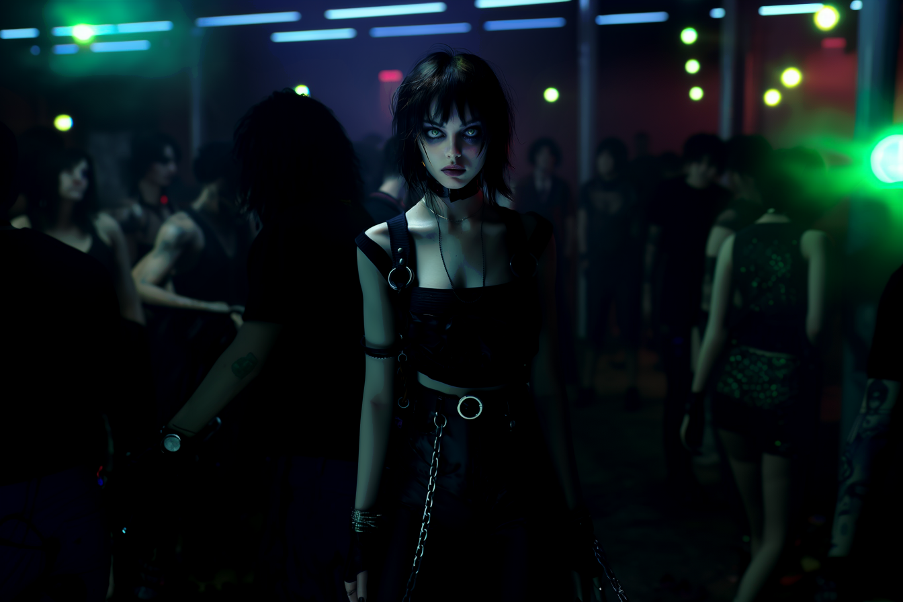

---
layout:
  title:
    visible: true
  description:
    visible: false
  tableOfContents:
    visible: true
  outline:
    visible: true
  pagination:
    visible: true
---

# 👤 Lulu Carter

<figure><figcaption></figcaption></figure>

> "I’m doing my best. I’ve always done my best. It's just... it’s never enough.” - Lulu

<table data-card-size="large" data-view="cards"><thead><tr><th></th></tr></thead><tbody><tr><td><h3>Identity</h3>
Age: 25

Occupation: Sync Jockey

First Impression: Gutter punk

Self-Image: Gutter punk

True Self: Fallen angel 
</td></tr><tr><td><h3>Background</h3>
Birthdate: Sept 19, 2099

Location: Greater Toronto

Citizenship: GATA

Ethnicity: American

Born: Detroit, GATA
</td></tr></tbody></table>

## Appearance

* Height: 5'7"
* Weight: 122 lbs
* Hair Color: Black
* Hair style: Chin-length choppy hair
* Eye Color: Light green
* Skin Type: Pale
* Face Shape: Diamond
* Body Type: Thin
* Accessories: Collar necklace
* Make-up: Smoky eyeshadow and Black Cherry lipstick
* Description: Her silhouette is thin and angular, and elegant. Intense and captivating light a flame tenuously flickering.

<figure><figcaption>
Lulu in some dark corner of the West End Gray Zone.
</figcaption></figure>

## Bio

Born to highly religious parents and raised in a homestead outside of Detroit. While her parents were loving, they were also overbearing, and from a very early age Lulu had learned that if she wanted to have any fun she needed to break the rules—and not get caught doing it.

Her little brother, Fitz, always looked up to her, so he could be relied upon to cover for her. He was like her little minion, and without much social awareness of his own, she was his only real friend. However, despite her efforts, she was caught—repeatedly.

When she was 14, in a bid to give her a better future, her parents sent her to the Greater Toronto district for school. She was able to move there thanks to her father's transferrable Gate Keys that he had earned as a Gate worker there during Reconstruction. While they had hoped that the Academy setting would give Lulu structure, district life it was set in was impossible for Lulu to resist.

Before long, Lulu had lots of friends. She was cool. She knew how to make things happen. Wherever the action was, she was there. She was always drawn to the edge. And that’s where she found Xavier dying in the street. She was 17 and he was 20. Their fateful connection eventually developed into a tumultuous on and off 'romance' spanning the next six years.

During that time, with Lulu's help, Xavier transformed from a broken, hopeless young man to a feared and respected gang boss with control over a key stretch of the West End Gray Zone's old docks. The materialization of his illicit empire was so incremental and engrossing she could barely feel it corrupting her life. She finally escaped his toxic influence for the sake of her little brother, who had earned himself a Gate Key thanks to a coding job he'd accepted in the district in order to be closer to her.

Though she was happy to be reunited with her brother, her break with Xavier and the added responsibility of caring for her brother caused her to slip into a long, depressing funk. After moving out of the Gray Zone, Lulu ran into Haleh, a sync jockey who she had met briefly in the underground scene and the two sparked a friendship.

Through their friendship, Haleh helped Lulu re-discover her childhood passion for singing, with Lulu eventually becoming a capable sync jockey herself. Even though she is much more behaved these days, and still has a dark cloud hanging over her, Lulu's shows are always big parties. And the featured performer is always Haleh aka SOULJOURNER.

## Motivations

* Escape Xavier's dark influence.
* Still loves Xavier.
* "Don't be a drag"
* Try to match up to Haleh's talent.
* Protect her little brother.

<figure><figcaption>
Lulu gaze piercing through the crowd at a sync rave.
</figcaption></figure>

## Trivia

*

## **Personality & Quirks**

* She hates to feel like she’s a bother.
* Keeps her struggles private, except _maybe_ to Haleh.

## Secrets

*

## Skills

*

## Family & Associates

## Comparative Stats

| Attribute    | Stat |
| ------------ | ---- |
| Strength     | 4    |
| Defense      | 5    |
| Dexterity    | 7    |
| Intelligence | 5    |
| Wisdom       | 7    |
| Charisma     | 9    |

## Quotes
