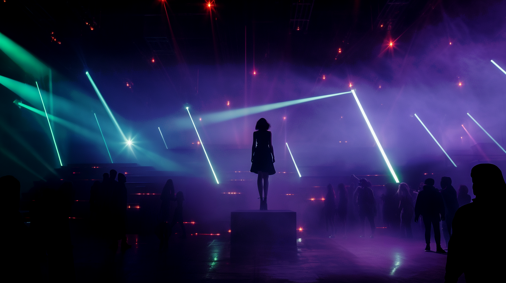

---
layout:
  title:
    visible: true
  description:
    visible: false
  tableOfContents:
    visible: true
  outline:
    visible: true
  pagination:
    visible: true
---

# 👤 Lulu Carter

<figure><figcaption></figcaption></figure>

> "I’m doing my best. I’ve always done my best. It's just... it’s never enough.” - Lulu

<table data-card-size="large" data-view="cards"><thead><tr><th></th></tr></thead><tbody><tr><td><h3>Identity</h3>
Age: 25

Occupation: Sync Jockey

First Impression: Gutter punk

Self-Image: Gutter punk

True Self: Fallen angel 
</td></tr><tr><td><h3>Background</h3>
Birthdate: Sept 19, 2099

Location: Greater Toronto

Citizenship: GATA

Ethnicity: American

Born: Detroit, GATA
</td></tr></tbody></table>

## Appearance

* Height: 5'7"
* Weight: 122 lbs
* Hair Color: Black
* Hair style: Chin-length choppy hair
* Eye Color: Light green
* Skin Type: Pale
* Face Shape: Diamond
* Body Type: Thin
* Accessories: Collar necklace
* Make-up: Smoky eyeshadow and Black Cherry lipstick
* Description: Her silhouette is thin and angular, and elegant. Intense and captivating light a flame tenuously flickering.

<figure><figcaption>
Lulu in some dark corner of the West End Gray Zone.
</figcaption></figure>

## Bio

Born in Tehran, Haleh’s family worked in the provisional government during URSA's failed signing of the New Dawn Accords (NDA) and the subsequent [Pulling of the Weeds](../../nations/ursa/history/the-pulling-of-the-weeds.md). Accusations of corruption spurred political violence against families with certain political ties, driving her parents to attempt to flee for asylum in GATA when she was 2. Her father was executed the morning they fled, and her mother did not survive the journey to the GATA refugee camp in Istanbul. The infant Haleh was rescued by Angelis.

She was placed in the East Garden, a community-run campus for orphaned children on the east side of the Bosphorus Strait, and was primarily looked over by an older woman who worked in the Garden. When she was 5, she was enrolled in the Atlan Academy. While she was in Istanbul, there was heavy Aryabat industrial presence due to ongoing Reconstruction efforts, and she was surrounded by conduits using a state of the art technology called links to control massive machines with their mind. After showing an interest, the woman who cared for her encouraged Haleh to join in on a link workshop session for students.

Her aptitude with the link was immediately apparent. Because the district of Istanbul didn’t have links in their paradigm, Haleh was recommended for transfer to the Greater Toronto district, where links were recently paradigmed. After six years in Istanbul, 8 year-old Haleh was relocated across the world, and away from the only family she had known.

She had a lonely childhood in Greater Toronto, having difficulty relating to the other children. She enjoyed playing alone in the Manna gardens and dancing to the music in the square, but she struggled making friends. By the age of 10, Haleh had taken to escaping into 21st century art and fiction and especially music, which helped her discover her synesthesia–her strong sense of form and color and motion when she listens intently to music.

By the age of 13 she was already making music of her own, inspired heavily by the electronic synth sounds of the early and mid 2000s, loving granular synths and rich, layered sounds. It was only natural that she would learn how to use her talents with a link to enhance her music over the following years, and later, when syncraves appeared, she was perfectly positioned to break onto the scene under the stage name SOULJOURNER.

Since then, she’s become a sensation in Toronto’s underground syncrave scene, a syncjockey known for her uncanny ability to sense and guide ‘the vibe’. Her childhood habit of dancing while she plays her instruments has evolved into a striking stage presence.

Find her hunting antique 21st century music and hardware, planning and practicing for her next show, or tending to the Manna flowers in Greater Toronto's waterfront Garden.

## Motivations

* Temper Xavier's dark impulses
* "Don't be a drag"
* Keep up with Haleh.
* Protect her little brother.

<figure><figcaption>
Haleh preparing to perform at a sync rave.
</figcaption></figure>

## Trivia

* Her mother was a refugee that fled URSA to GATA.
* Never knew her parents; her single mother died when she was young, leaving her a ward of GATA.
* At a young age Haleh was transferred from the Atlan Academy in Istanbul to Toronto for her aptitude with a link.
* Has been using a link since she was 8.
* She likes to draw, and she often draws birds, or patterns inspired by wings and feathers.
* She moves and dances when she sync jockeys because she used to take dance classes in the Garden growing up and the sense memory helps her get over her nerves and loosen up.
* Smokes green Manna, but has never used street drugs.
* A white Manna flower in a woman’s hair is one of her first memories.
* She remembers a room, a woman’s face, but she doesn’t know if it’s her mother.
* She isn’t a natural green thumb, she just likes the solitude of tending the Manna gardens.
* Lulu’s her only friend because Lulu is enough of a handful already.
* She has a strong audio-visual synesthesia.
* She can typically be found in her apartment

## **Personality & Quirks**

* Sweet and friendly by nature.
* The first to help someone in need.
* Loves to people watch.
* Avid collector of ‘blue’ legacy musical tech like synths and music players.
* A wallflower in crowded spaces.
* Prefers to be unseen, except when she's performing.
* Transforms while performing, exuding bold confidence.
* Always climbing things.
* Overwhelmed by the world’s problems.
* Emotionally self-aware.
* Dark sense of humor.
* Can be a bit naive about people with darker intentions.
* Has some street smarts from dealing with underground drama.
* Good bullshit detector.
* Can be a bit too sarcastic when she’s upset.
* When she has to stay still, she often holds her own hand, with one hand in the other, to keep herself from fidgeting.
* Tries not to break the rules, but she will if she has to.

## Secrets

* Doesn’t even have to try to sync.
* Has started to give up on her dreams.
* Can’t carry a tune with her singing voice.

## Skills

* Extremely talented conduit with mastery of her link, especially with respect to syncing.
* An experienced gardener with specialized knowledge about cultivating Manna flowers.
* Very creative and empathetic.

## Family & Associates

Lulu (Best Friend)

## Comparative Stats

| Attribute    | Stat |
| ------------ | ---- |
| Strength     | 4    |
| Defense      | 5    |
| Dexterity    | 8    |
| Intelligence | 8    |
| Wisdom       | 7    |
| Charisma     | 8    |

Quotes

> "I used to fall asleep fantasizing about travelling the world, you know? Playing music for cheering crowds. Now I pass out when my head hits the pillow, and I wake up wondering if I ever had a dream at all." - Haleh
