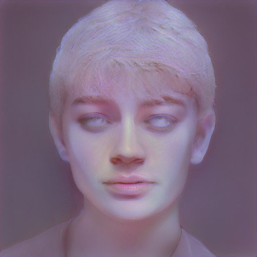
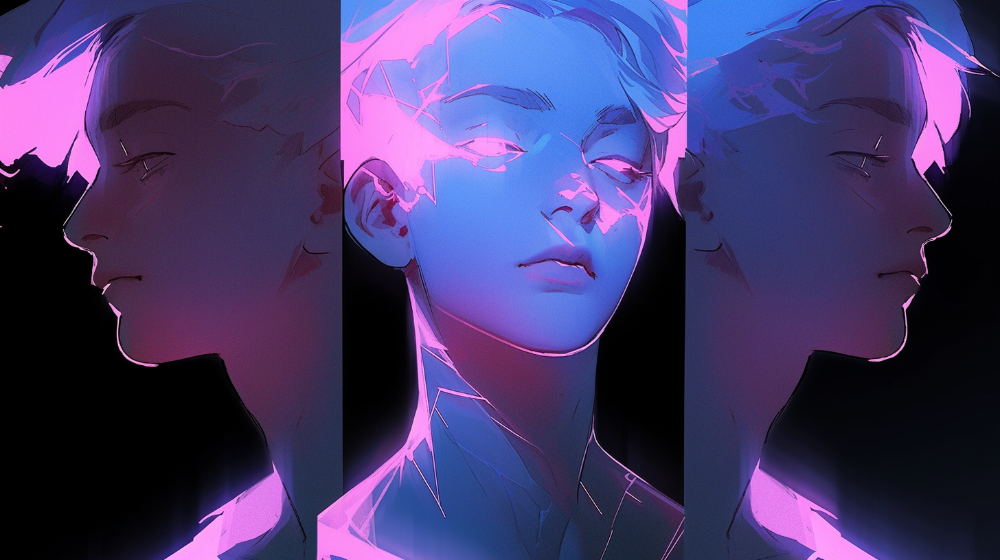

---
layout:
  title:
    visible: true
  description:
    visible: false
  tableOfContents:
    visible: true
  outline:
    visible: true
  pagination:
    visible: true
---

# 👤 Melody Harper

<figure><figcaption></figcaption></figure>

<table data-card-size="large" data-view="cards"><thead><tr><th></th></tr></thead><tbody><tr><td><h3>Identity</h3>
Age: 29 (Deceased)

Occupation: Astral power user

First Impression: Graceful and awe-inspiring

Self-Image: A scout into the human soul

True Self: The first angel 
</td></tr><tr><td><h3>Background</h3>
Birthdate: October 12, 2095

Location: Occupied LA, Greater Atlantic Territorial Alliance (GATA)

Citizenship: GATA

Ethnicity: American

Born: Gaia, California (Cascadia, Free Territory)
</td></tr></tbody></table>

## **Appearance**

* **Height:** 5'6"
* **Weight:** 115 lbs (at time of death)
* **Hair Color:** Silvery pink-white
* **Hair Style:** Short pixie cut with shaved sides
* **Eye Color:** Hazel
* **Skin Type:** Pale
* **Face Shape:** Oval
* **Body Type:** Frail, delicate
* **Accessories:** Empatherapy link headset, full-body sleepsuit
* **Description:** Kind and serene, Melody's presence both in the Astral and the real world was defined by the calming peace that radiated from her. In life, her frailty was evident, but in the astral, she was a powerful and graceful force of patience and will.

***

<figure><figcaption>
Melody manifesting a construct in the astral.
</figcaption></figure>

## **Bio**

Melody, born in Cascadia, a Free Territory, came into the world afflicted with a congenital genetic disease that was not treatable by Manna-based medicines. By the age of three, Melody had begun suffering from increasingly violent spasms and seizures, driving her mother, a GATA citizen, to seek treatment for her daughter in GATA's LA district.

Unfortunately, young Melody's condition continued to deteriorate and the only hope to stem its progression was to carefully monitor and control her metabolism and plasma. As a result, she spent much of her life as a “sleeper,” bedridden and engrossed in virtual constructs for stimulation.

Despite her physical limitations, Melody had a loving upbringing and excelled academically, particularly in history, and possessed a beautiful singing voice, a gift she inherited from her musical mother. Meanwhile, "on the other side", she had formed many deep friendships with other sleepers across the district, and it was from them that she learned about the Astral.

With the help of her mother, Melody acquired the newly paradigmed empatherapy machine using her disability assistance keys. Demonstrating her ingenuity and determination, she secretly jailbroke the unit herself, learning just enough LMNL to get the job done. Within a week of obtaining the template from an unknown source, she had a functioning astral node.

In short order Melody became one of the earliest power users of the Astral, finally freed to experience the many sensations of life that had eluded her, and many more beyond the imagination of the waking world. She spent significant time orienting new astral travelers and helping them navigate the ever-transforming expanse. Her most notable creation was the Crystal Tower, a beacon that to this day guides lost travelers and serves as a popular meeting point. The Tower remains one of the astral's most iconic constructs.

It was only a matter of time before her disease reached her brainstem. Melody succumbed to complications from her condition, and the impact of her loss was deeply felt across the Astral community. A funeral was held in the astral in her honor, attended by many friends and followers.

Some claim to still see her in the astral on occasion, a spectral figure on the balcony of the Crystal Tower, but whenever they investigate, she is nowhere to be found.

***

<figure><figcaption></figcaption></figure>

## **Motivations**

* Nurture the fledgling astral into something more
* Create a sanctuary for those seeking connection
* Preserve the history and stories of her friends

***

## **Trivia**

* Melody's mother was a well-known singer in the Free Territories.
* Melody's disease was in her spine and resistant to all known treatments, making her one of an increasingly rare few among GATA citizens unable to benefit from Akicel therapies.
* Jailbroke her empatherapy machine at the age of 14.
* Her Crystal Tower became a symbolic landmark in the Astral.
* Known for her soothing voice and calming presence, both in life and in the Astral.
* Despite her physical limitations, she had a keen intellect and a deep understanding of her own mind.
* Melody's funeral in the Astral was the largest single gathering in the Astral to date.

***

<figure><figcaption></figcaption></figure>

## **Personality & Quirks**

* Empathetic and nurturing, always ready to help new travelers.
* Possessed a quiet strength and resilience.
* Had a habit of humming softly while she worked on her virtual projects.
* Found joy in simple pleasures in the real world, like the sound of rain or the sight of flowers blooming.
* Despite her isolation, she had a vast network of friends and followers in the virtual and later, the astral.
* A bit of a perfectionist, often revisiting and refining her creations.
* Known for her thoughtful and reflective nature, often pondering deep questions about what it means to be alive versus to live.

***

## **Secrets**

* Melody's mother was her sole caretaker and her biggest supporter.
* The Astral gave her a sense of limitless potential she never knew in the physical world.
* She felt like she was only her true self in the Astral.

***

## **Skills**

* Somewhat capable with LMNL coding.
* Talented singer with a soothing voice.
* Extremely capable manipulating virtual constructs with her mind.
* Skilled at creating intricate and functional virtual constructs.
* One of the most experienced astral users.
* Deep understanding of history and storytelling.

***

## Family & Associates

* **Mother:** A singer and Melody's primary caregiver.
* **Friends:** Numerous, many of whom still visit the Crystal Tower in her memory.

***

## **Comparative Stats**

| Attribute    | Stat |
| ------------ | ---- |
| Strength     | 2    |
| Defense      | 3    |
| Dexterity    | 5    |
| Intelligence | 9    |
| Wisdom       | 8    |
| Charisma     | 7    |

***

## Keys & Assets

* ◖2,400 CRED
* 550 Sats
* GATA Citizenship
* Los Angeles District Key
* Astral Quantum Seed
* 399 Encrypted Keys

***

## **Quotes**

> "I'm free." - Melody

> "The Crystal Tower isn't just a construct; it's a promise. That no one has to be lost forever." - Melody
