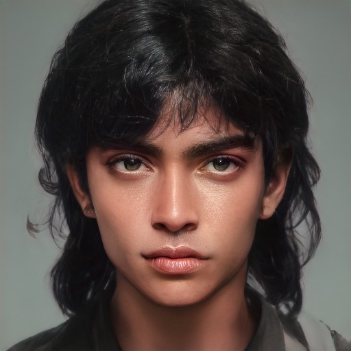

---
layout:
  title:
    visible: true
  description:
    visible: false
  tableOfContents:
    visible: true
  outline:
    visible: true
  pagination:
    visible: true
---

# 👤 Morning Cloud

<figure><figcaption></figcaption></figure>

<table data-card-size="large" data-view="cards"><thead><tr><th></th></tr></thead><tbody><tr><td><h3>Identity</h3>
<strong>Age:</strong> 28

<strong>Occupation:</strong> Heir to the Church of the Sky

<strong>First Impression:</strong> Charismatic and unpredictable.

<strong>Self-Image:</strong> A student of human nature.

<strong>True Self:</strong> Disillusioned by faith, driven by pragmatism. 
</td></tr><tr><td><h3>Background</h3>
<strong>Birthdate:</strong> August 15, 2096

<strong>Location:</strong> Free Territory

<strong>Citizenship:</strong> Sovereign

<strong>Ethnicity:</strong> First Nations, Lakota

<strong>Born:</strong> South Dakota, Free Territory
</td></tr></tbody></table>

## Appearance

* **Height:** 5'10"
* **Weight:** 158 lbs
* **Hair Color:** Black
* **Hair Style:** Feathered mullet with bangs
* **Eye Color:** Amber
* **Skin Type:** Warm tan
* **Face Shape:** Oval
* **Body Type:** Lean and athletic
* **Accessories:** Traditional tattoos.
* **Description:** A commanding presence with a grace that conceals their strategic mind. Moves with a fluidity that hints at hidden depths.

***

<figure><figcaption>
Morning's gaze piercing into hidden truths.
</figcaption></figure>

## Bio

Morning was born into a prominent Lakota family within the Church of the Sky, a powerful religious organization formed during the Dark Decade. Their father, a revered preacher, and their mother, a devout follower, expected Morning to uphold the family's legacy.

From a young age, the winkte Morning was deeply involved in the Church's activities, displaying a devout faith, and showing an deep understanding of both traditional Lakota teachings and the blended doctrines of the Church of the Sky. This early dedication won them many admirers within the congregation.

This changed at age 13, when they witnessed their father making a corrupt arrangement with a GATA representative, diverting church funds for personal gain and political advantage.

The realization that their father, a revered spiritual leader, could be so easily corrupted by greed and power deeply affected Morning. This disillusionment shattered Morning's faith, replacing it with a belief in human greed as the true driving force, and led to a gradual withdrawal from active participation in the Church’s communal life.

As their faith in the Church's teachings waned, Morning's belief in human greed and manipulation grew. They began to see the Church not as a spiritual sanctuary but as a tool for power and influence. This shift in perspective drove them to build a network of informants across the Free Territories, collecting secrets and compromising material to use as leverage.

Morning has several siblings, each with distinct personalities and more devout involvement in the Church's day-to-day functioning. They have a particular soft spot for their youngest sister, who shared in Morning’s games and mischief growing up. However, since her marriage to another prominent figure in the Church, their relationship has become strained. This isolation has exacerbated Morning's antipathy towards others.

Despite being poised to inherit the Church's leadership, Morning remains detached from its doctrines. They focus instead on building a network of informants across GATA and the Free Territories, collecting secrets and compromising material to use as leverage when leadership of the Church falls to them.

***

## Motivations

* Exploit human greed for personal gain.
* Maintain power within the Church of the Sky.
* Navigate and manipulate GATA's political landscape.

***

## Trivia

* Winkte. Two-spirit, using gender neutral pronouns.
* Enjoys playing a skin drum to calm their mind and aid in contemplation.
* Has a soft spot for their youngest sister, despite a strained relationship due to her marriage.
* Prefers to keep people at arm's length, making few genuine connections.
* Deeply curious about people's secret selves, seeing them as the true currency of power, and the key to animating their greed.

***

## Personality & Quirks

* Trusts no one, with the exception of their youngest half-sister.
* Thrives in scheming and manipulation.
* Enjoys playing mind games.
* Intrigued by people’s secret selves.
* Often ponders big-picture thoughts but keeps them to themselves.
* Snaps fingers when realizing something important.
* Collects secrets as a hobby.
* Not particularly interested in sex or sexuality.

***

## Secrets

* Knows about the Church's hidden scandals and manipulations.
* Has a network of paid informants for gathering compromising material.
* Lacks a grand scheme, instead waits to catch vulnerable prey in their web.
* Harbors unrequited and repressed feelings for his half-sister.
* Sympathizes with the eidetic cause, despite believing their ideological defeat inevitable.

***

## Skills

* Expert in diplomacy and negotiation.
* Proficient in deception.
* Nearly impossible to read.
* Charismatic and eloquent public speaker when required.
* Talented percussionist.
* Well-trained hunter, capable with the bow and arrow.
* Survivalist skills.
* Can accurately predict the weather.
* Can deduce surprising truths from the behavior of animals.

***

## Family & Associates

* **Father:** Gravely ill leader of the Church of the Sky.
* **Youngest Sister:** His half-sister. Once a close confidante, now distanced due to her marriage.
* **Siblings:** Various, more devout and involved in the Church's functions.

***

## Comparative Stats

| Strength     | 5 |
| ------------ | - |
| Defense      | 5 |
| Dexterity    | 6 |
| Intelligence | 9 |
| Wisdom       | 6 |
| Charisma     | 9 |

***

## Quotes

* "Faith is just another tool for those who know how to use it."
* "People's true selves are secrets, opaque even to themselves."
* "Greed is their God."

***

## Meta Self-Description

I’m not here to lead with faith or inspire with doctrine. My world is built on secrets and leverage. The Church may see me as their future, but I see myself as the master of their greed. Growing up in a family of devout leaders, I learned early on that belief is a façade. What drives people is much simpler – and far more exploitable.
