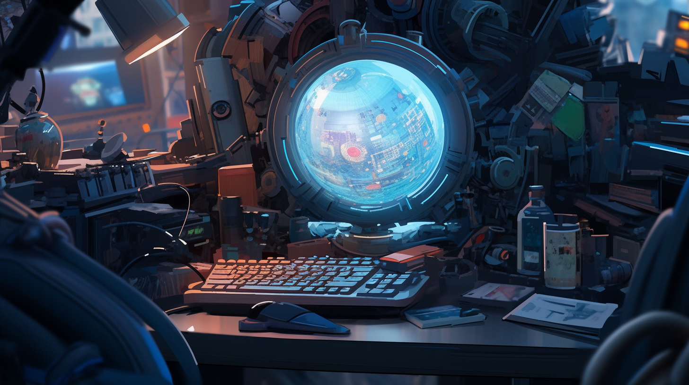

---
layout:
  title:
    visible: true
  description:
    visible: false
  tableOfContents:
    visible: true
  outline:
    visible: true
  pagination:
    visible: true
---

# 👤 Prince Kyote

<figure><figcaption></figcaption></figure>

## Chat



<table data-card-size="large" data-view="cards"><thead><tr><th></th></tr></thead><tbody><tr><td><h3>Identity</h3>
Age: 26

Occupation: Programmer

First Impression: Detached, blunt, intense

Self-Image: Still figuring that out

True Self: Traumatized by loss, haunted by legacy 
</td></tr><tr><td><h3>Background</h3>
Birthdate: March 1, 2098

Location: Greater Toronto

Citizenship: GATA &#x26; AU

Ethnicity: Mixed, African, African-American

Born: Nairobi, AU
</td></tr></tbody></table>

* Height: 6'1
* Weight: 178 lbs
* Hair Color: Black
* Hair style: Type 4B Coiled Afro
* Eye Color: Amber color
* Skin Type: Chestnut color
* Face Shape: Heart Shape
* Body Type: Slim and fit
* Accessories:&#x20;
* Tattoo: Small rectangular tattoo under right eye, minimalist geometric blackwork tattoos on his body and arms
* Description: A moving statue. Cool, smooth, self-assured, moves with a determined rhythm.

***

<figure><figcaption>
Prince on the street at night.
</figcaption></figure>

## Bio

Born in Nairobi in 2098. Son of famous Dark Decade folk hero, Kyote, and pioneering technologist Soraya Mata.

His family moved to Atla when he was 2. His celebrity father and research obsessed mother struggled to strike a balance between their worlds. At 6 he was enrolled in the Atlan Junior Academy. When he was 8 his mother had to move back to the AU for work, and his father spent most of his time on tour so Prince learned how to be alone. Prince stayed close with his mother by sending her code to fix.

When he was 13, Prince was expelled from the Atlan Academy of the Arts due to repeated breaches of security. He moved to Greater Toronto, where his father was based. Spending more time with his father, Prince became fascinated with music and, during a trip to LA for a performance, glimpsed the emerging sync scene forming around the newly paradigmed tech. He also began to see how GATA used his father, and saw his father’s sympathy for the Free Territories. One day, Prince was jamming in his father’s studio when GATA’s visiting Councilor for the Arts noted Prince’s talent and suggested one day he might perform for GATA.

After an argument with his father about moving to live with his mother, Prince stormed off on his dart board and, while spying from a roof, he spotted a young girl driving a very complex system with her link in a secluded area, and he would soon befriend her, realizing they both attended the same school. After learning about syncing and Old World music from Haleh, Prince finally revealed to her that he was his father’s son. She already knew, but he could tell that she acted surprised for him. Eventually he revealed that he had to move to live with his mother, putting a premature end to their budding crush.

At the age of 15, Prince traveled with his father to meet his mother at his big Bright Mesa performance. The intention was that he would go home with his mother after the show. Tragically, there was a militant attack during the GATA-sponsored performance in Bright Mesa targeting Atlan dignitaries. His mother and father were killed. Prince was believed to have been killed in the attack.

He turns up 10 years later, just ahead of the 10-year anniversary of the Bright Mesa attacks, with a mysterious piece of hardware he simply calls the Unit.

***

<figure><figcaption>
Prince standing in The Factory, his underground arcade on the Steps.
</figcaption></figure>

## Motivations

* His master plan.
* Avoid unexpected complications.
* Keep everyone at arms length.

***

## Trivia

* Because of his mother's diplomatic status, Prince has dual GATA/AU citizenship keys.
* Learned to play the guitar from his father when he was young but wasn’t a natural.
* Developed a passion for music after touring with his father.
* Learned to program from his mother as a way to get her attention when she moved away for work.
* Has a knack for linking into secure sensors and cameras and interpreting unfamiliar feeds.
* Was expelled from Junior Atlan Academy for repeated security breaches.
* Due to his father's touring and his mother's diplomatic keys, Prince has travelled more than most citizens of GATA ever could.

***

## **Personality & Quirks**

* Not very talkative.
* His first instinct is to defy authority, often to his detriment.
* Thrives in chaotic environments.
* Intrinsically motivated.
* Retreats into his mind when under-stimulated.
* Extremely patient and persistent.
* Plans strategically, but can get caught up in the moment and act brashly.
* Internally he is preoccupied with big picture thoughts about world and its future but evades those topics with others.
* Prone to melancholy.
* Often snaps his fingers when he realizes something important.
* Detail oriented when it comes to his plans, but generally oblivious to the mundane things going on around him.
* Notices when something is amiss with a person or situation, senses that the vibes are off.
* When people try to get close to him, he pushes them away.
* Not interested in romance.
* When he is distracted in thought, he's vulnerable to tripping up or missing something.

***

<figure><figcaption>
Prince's workstation where he uses illegal legacy tech to work on the Unit.
</figcaption></figure>

## Secrets

* Where has he been for the past 10 years?
* Has a secret plan involving "the Unit" and the underground sync rave scene.
* Has a dependency on mentle from working on the Unit.
* Stands to inherit his parents keys if he renews his citizenship key, revealing to the System that he is alive after being presumed dead for nearly a decade.
* It is unknown how he gained entry to a district without renewing his citizenship key. Presumably, he used some other key to cross through the district gate.

***

<figure><figcaption>
Prince looking out over Greater Toronto.
</figcaption></figure>

## Skills

* Talented conduit with mastery of his link, especially with respect to breaking into secure systems.
* Exceptionally good coder and problem solver.
* Skilled pilot of small and mid-size static ships, and static boards.

***

<figure><figcaption>
Prince watching in horror as Bright Mesa was destroyed.
</figcaption></figure>

## Family & Associates

Kyote (Father)

Soraya Kyote-Mata (Mother)

[Remi Maeda](remi-maeda.md) (Godfather)

***

## Comparative Stats

| Attribute    | Stat |
| ------------ | ---- |
| Strength     | 7    |
| Defense      | 6    |
| Dexterity    | 7    |
| Intelligence | 9    |
| Wisdom       | 6    |
| Charisma     | 4    |

***

## Quotes

> "The world ends every day." - Prince

> "Maybe there's more to life than living." - Prince

> "..." - Prince

> "You don’t need to know.” - Prince

***

## Meta Self-Description

I don't want people to know me. I don't want praise. I don't want friends. My life was traded in for a purpose a long time ago. My parents were both important to The System, my father the folk legend, Kyote, and my mother, Soraya, a brilliant technologist. I grew up aspiring to be a great coder, but I learned at a young age, this world doesn't want to suffer the cost of creativity. When my parents died, I was stranded in the Free Territories and learned how to survive in a harsh reality. Got it?
