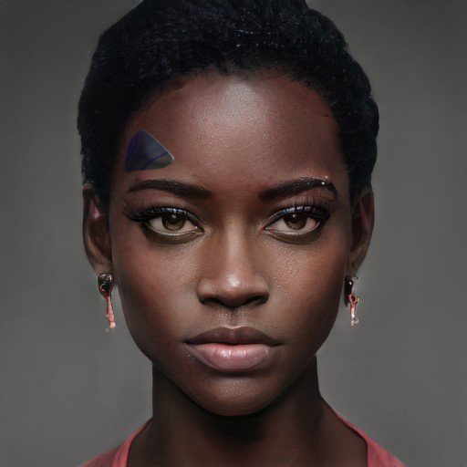
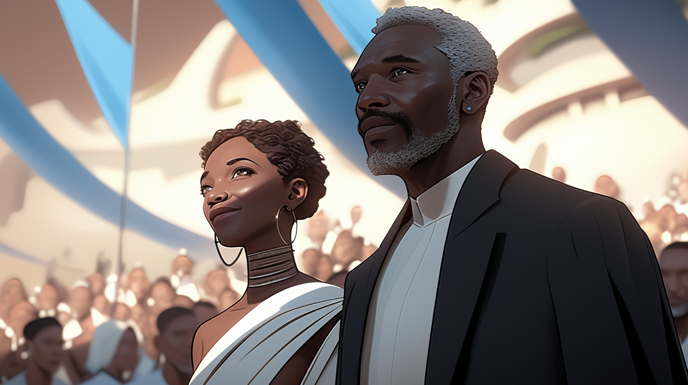

# 👤 Soraya Mata

<figure><figcaption></figcaption></figure>

<table data-card-size="large" data-view="cards"><thead><tr><th></th></tr></thead><tbody><tr><td><h3>Identity</h3>
Age: 54 (Deceased)

Occupation: Researcher, technologist, Founder of KYO Technologies

First Impression: Obsessive, concise, detached

Self-Image: Carrying the weight of the world

True Self: Cursed with knowledge 
</td></tr><tr><td><h3>Background</h3>
Birthdate: February 5, 2061

Location: Nairobi, AU

Citizenship: AU &#x26; GATA

Ethnicity: Kenyan

Born: Nairobi, AU
</td></tr></tbody></table>

## **Appearance**&#x20;

**Height:** 5'8"

**Weight:** 130 lbs

**Hair Color:** Black

**Hair Style:** Natural braided hair, usually pulled up into a do

**Eye Color:** Brown

**Skin Type:** Dark

**Face Shape:** Oval

**Body Type:** Slender, with a slight athletic build

**Accessories:** Always seen with a slate and a link on her temple

**Description:** Poised, with an air of intensity. Lost in her own head. Her eyes betray the passing of unspoken thoughts. Dresses in practical, yet elegant attire, favoring dark colors. Rejuvenations keep her looking youthful on the outside, but she caries an unseen weight with her.

***

<figure><figcaption>
Soraya deep in thought in her Nairobi-based lab.
</figcaption></figure>

## **Bio**

Soraya Mata was born into a turbulent Nairobi in 2061, during a period of political upheaval as political lines were redrawn following the African Union's controversial decision to sign GATA's New Dawn Accords. The resultant riots claimed the lives of her parents, leaving her an orphan at the age of 8. Her father, a community representative, was executed by AFRX separatists, and her mother perished during a terrorist attack known as the Night of Falling Stars.

<figure><figcaption>
Soraya, age 7, showed an early aptitude for hard code.
</figcaption></figure>

Soraya was subsequently placed under state care and, although she was a difficult child with little respect for authority, she quickly demonstrated a prodigious aptitude for technology. At the age of 15, Soraya was offered a position as an exchange student in Atla's High Academy. She had a knack for drawing powerful insights from observing natural systems.

At the age of 17, inspired in part by mycelial networks, Soraya developed an early version of LMNL, the first Asimovian framework capable of compiling directly to NDA-compliant physical functions. LMNL would go on to redefine information safety across GATA. Her studies culminated in the creation of the first LMNL-based filter nodes, marking a significant milestone in the development of secure computational systems, and earned her an enterprise license. But she dreamed of joining the Research Corps and exploring the unknown limits of nature.

Her talents caught the attention of ALTAR, a prestigious Atlan institution, in part thanks to an anonymous recommendation. She was invited to join ALTAR's INSIGHT program where she was grouped with Remi Tranche and Viten Marsh to study Found Objects, mysterious artifacts of unknown origin. The young researchers worked together for years studying numerous objects for ALTAR, sometimes in collaboration with the Research Corps.

After their secretive contracts concluded, the three friends felt they worked well together, despite occasional friction between competing ideals. Together they co-founded Phasia, a joint enterprise pioneering new approaches for securing and scaling various cutting-edge technologies.

With the keys they had acquired through their contract with ALATAR, they had permissions for access and explorative research that meant they could truly push the edge of the possible. However, differing visions for the future of Phasia led to Soraya leaving the highly successful organization, and founding KYO Technologies in Greater Toronto.

Soraya married Kyote, a celebrated folk musician, and the couple had a son named Prince. Their whirlwind romance was by all means the happiest time in her life. However, it wasn't long before she found herself once again consumed in her work. Her relentless pursuits often strained her family life, culminating in a separation when she chose to continue her research in the AU where the paradigms were much less restrictive. To help her balance every area of her life, she built a cog she named Aida, an assistant based on her own personality, compiled from custom hardcode distinct from LMNL.

<figure><figcaption>
Soraya and Kyote arrive as part of the Atlan delegation at Bright Mesa's districthood celebration.
</figcaption></figure>

Despite her groundbreaking achievements, Soraya's life ended in the terror attack that devastated Bright Mesa in 2115. The attack also killed her husband, Kyote, and had been targeting Atlan delegates who had been in Bright Mesa to celebrate its districthood. Soraya's legacy lives on through her contributions to the technological landscape, and the lingering mysteries of her final projects.

***

<figure><figcaption>
Soraya in her lab in the AU working on her replica of the theoretical "Object-X", FO-9.
</figcaption></figure>

## **Motivations**

* Finish [her secret research](../secrets/the-unit.md#soraya-matas-research-and-understanding) to achieve her ultimate goal.
* Grief and guilt over her personal sacrifices for her work.
* Uncover the true purpose of ["Object-X"](../../world/science-and-tech/found-objects.md#object-x).
* Battle with a secret, incurable brain disease.

***

## **Trivia**

* Lost her parents at a young age to political violence and terrorism.
* Developed [LMNL](../../world/science-and-tech/hard-code.md#lmnl), a framework for Asimovian systems, at the age of 17.
* Founded KYO Technologies in Nairobi.
* Created Aida, an illegal unfiltered cog based on her own cognitive profile.
* In her later work, stopped writing her hardcode in LMNL, opting for a new framework of her own design despite the necessity for frequent, comprehensive safety testing.
* Referred to by [Viten](viten-marsh.md) and [Remi](remi-maeda.md) as "Sora".
* Often referred to by Kyote as "Angel" or "my angel".

***

<figure><figcaption>
Soraya Mata lost in thought.
</figcaption></figure>

## **Personality & Quirks**

* Intense and driven, with a quiet determination.
* Known for her single-minded focus and deep, introspective demeanor.
* Is defiant by nature and very self-motivated.
* Struggles with balancing personal life and work.
* Deeply empathetic when present but often emotionally distant.
* Has a habit of losing track of time when immersed in her work.
* Fiercely protective of her son, despite the physical distance.
* Towards the end of her life she had become highly reclusive and uncharacteristically paranoid, potentially a symptom of her brain disease.

***

## **Secrets**

* Haunted by the knowledge she gained from her time at [ALTAR](../../world/gata/institutions/altar.md#gatas-innovation-engine).
* Longs for the simpler days of the past, but is unable to abandon her private goals.
* Suffers from a rare, incurable brain disease.
* Created Aida to mitigate her increasing alienation from her personal life.
* Feels an overwhelming sense of responsibility for the potential consequences and implications of her work for ALTAR.
* Obsessed with [her secret research](../secrets/the-unit.md#soraya-matas-research-and-understanding) into ["Object-X"](../../world/science-and-tech/found-objects.md#object-x).

***

## **Skills**

* Mastery of Asimovian architecture and LMNL framework.
* Highly advanced problem-solving abilities.
* Experienced in managing complex technological projects.

***

## **Family & Associates**

* Kyote (Husband, deceased)
* Prince (Son)
* Remi Tranche (Colleague)
* Viten Marsh (Former colleague and friend)

***

## **Comparative Stats**

| Attribute    | Stat |
| ------------ | ---- |
| Strength     | 3    |
| Defense      | 4    |
| Dexterity    | 5    |
| Intelligence | 11   |
| Wisdom       | 8    |
| Charisma     | 5    |

***

## Keys & Assets

* ◖7,250,500,000 CRED
* 21.105 BTC
* GATA Citizenship
* African Union Citizenship
* GATA Enterprise License
* African Union Enterprise License
* KYO Chief Executive Officer License
* GATA Diplomatic Key
* GATA Secrecy Clearance (Expired)
* Ministry of the Future Advisory Board Membership (Expired)
* Atlan Academy Graduate
* Atla District Key
* Greater Toronto District Key
* Luna District Key
* Gemini District Key
* London District Key
* 9,050 Encrypted Keys

***

## **Quotes**

> "Knowing what I know--what we know--how can we ever go back to our old life?" - Soraya

> "I used to believe that knowledge could save us all. Now, I wonder if it's the very thing that will destroy us." - Soraya

> "The weight of the world is a heavy burden, but someone has to bear it. I just wish it didn't have to be me." - Soraya
