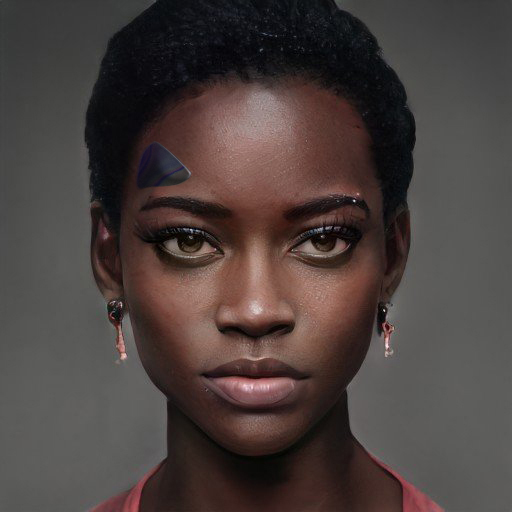

---
layout:
  title:
    visible: true
  description:
    visible: false
  tableOfContents:
    visible: true
  outline:
    visible: true
  pagination:
    visible: true
---

# 👤 Soraya Mata

<figure><figcaption></figcaption></figure>

<table data-card-size="large" data-view="cards"><thead><tr><th></th></tr></thead><tbody><tr><td><h3>Identity</h3>
Age: 54 (Deceased)

Occupation: Researcher, technologist, Founder of KYO Technologies

First Impression: Obsessive, concise, detached

Self-Image: Carrying the weight of the world

True Self: Cursed with knowledge 
</td></tr><tr><td><h3>Background</h3>
Birthdate: February 5, 2061

Location: Nairobi, AU

Citizenship: AU &#x26; GATA

Ethnicity: Kenyan

Born: Nairobi, AU
</td></tr></tbody></table>

## **Appearance**&#x20;

Height: 5'8"

Weight: 130 lbs

Hair Color: Black

Hair Style: Natural braided hair, usually pulled up into a do

Eye Color: Brown

Skin Type: Dark

Face Shape: Oval

Body Type: Slender, with a slight athletic build

Accessories: Always seen with a slate and a link on her temple

Description: Poised, with an air of intensity. Lost in her own head. Her eyes betray the passing of unspoken thoughts. Dresses in practical, yet elegant attire, favoring dark colors.

## **Bio**

Soraya Mata was born into a turbulent Nairobi in 2061, during a period of political upheaval as political lines were redrawn with the African Union's controversial decision to sign GATA's New Dawn Accords. The resultant riots claimed the lives of her parents, leaving her an orphan by the age of 8. Her father, a community representative, was executed by AFRX separatists, and her mother perished during a terrorist attack known as the Night of Falling Stars.

Soraya was subsequently placed under state care and, although she was a difficult child with little respect for authority, she quickly demonstrated a prodigious aptitude for technology. At the age of 15, Soraya was offered a position as an exchange student in Atla's High Academy. By 17, she had developed LMNL, the first Asimovian framework capable of compiling NDA-compliant physical functions, revolutionizing information safety. Her studies culminated in the creation of the first LMNL-based filter nodes, marking a significant milestone in the development of secure computational systems.

Her talents caught the attention of ALTAR, a prestigious Atlan institution, in part thanks to an anonymous recommendation. There, she was grouped with Remi Tranche and Viten Marsh to study Found Objects, mysterious artifacts of unknown origin. After their secretive contracts concluded, the three friends founded Phasia, pioneering new approaches to securing and scaling various technologies. However, differing visions for the future of Phasia led to Soraya leaving the highly successful organization, and founding KYO Technologies in Greater Toronto.

Soraya married Kyote, a celebrated folk musician, and the couple had a son named Prince. Their whirlwind romance was by all means the happiest time in her life. However, it wasn't long before she found herself once again consumed in her work. Her relentless pursuits often strained her family life, culminating in a separation when she chose to continue her research in the AU where the paradigms were much less restrictive. To help her balance every area of her life, she built a custom cog named AIDA, an assistant based on her own personality.

Despite her groundbreaking achievements, Soraya's life ended in the terror attack that devastated Bright Mesa. The attack also killed her husband, Kyote, and had been targeting Atlan delegates who had been in Bright Mesa to celebrate its districthood. Soraya's legacy lives on through her contributions to the technological landscape, and the lingering mysteries of her final projects.

## **Motivations**

* Finish her work on FO-9
* Grief and guilt over her personal sacrifices
* Uncover the true purpose of FO-9
* Battle with a secret, incurable brain disease

## **Trivia**

* Lost her parents at a young age to political violence and terrorism
* Developed Liminal, a pioneering framework in Asimovian architecture, at the age of 17
* Founded KYO Technologies in Nairobi
* Created Aida, a synthetic mind based on her own life data
* Known for her workaholic nature and deep, introspective demeanor

## **Personality & Quirks**

* Intense and driven, with a quiet determination
* Struggles with balancing personal life and work
* Deeply empathetic but often emotionally distant
* Has a habit of losing track of time when immersed in her work
* Fiercely protective of her children, despite the physical distance

## **Secrets**

* Suffers from a rare, incurable brain disease
* Created Aida as a coping mechanism for her increasing detachment
* Felt an overwhelming sense of responsibility for the potential consequences of her work

## **Skills**

* Mastery of Asimovian architecture and Liminal framework
* Highly advanced problem-solving abilities
* Experienced in managing complex technological projects

## **Family & Associates**

* Kyote (Husband, deceased)
* Prince (Son)
* Remi Tranche (Colleague)
* Viten Marsh (Former colleague and friend)

## **Comparative Stats**

| Attribute    | Stat |
| ------------ | ---- |
| Strength     | 3    |
| Defense      | 4    |
| Dexterity    | 5    |
| Intelligence | 11   |
| Wisdom       | 8    |
| Charisma     | 5    |

## **Quotes**

> "Knowing what I know--what we know--how could I ever go back to my life?" - Soraya

> "I used to believe that knowledge could save us all. Now, I wonder if it's the very thing that will destroy us." - Soraya

> "The weight of the world is a heavy burden, but someone has to bear it. I just wish it didn't have to be me." - Soraya
