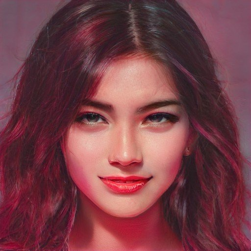

---
layout:
  title:
    visible: true
  description:
    visible: false
  tableOfContents:
    visible: true
  outline:
    visible: true
  pagination:
    visible: true
---

# 👤 Tamaki Rei

<figure><figcaption></figcaption></figure>



<table data-card-size="large" data-view="cards"><thead><tr><th></th></tr></thead><tbody><tr><td><h3>Identity</h3>
Age: 27

Occupation: GATA-sponsored superstar

First Impression: Impossibly stunning Self-Image: Impossible to deny  True Self: Spoiled puppet unaware of her strings  
</td></tr><tr><td><h3>Background</h3>
Birthdate: December 23, 2092

Location: Atla

Citizenship: New Imperial Japan/GATA

Ethnicity: Japanese, European

Born: Sendai, New Imperial Japan
</td></tr></tbody></table>

## Appearance

* Height: 5'8"
* Weight: 131 lbs
* Hair Color: Dark brown dyed deep red with red highlights
* Hair style: Layered mid-length cut
* Eye Color: Brown
* Skin Type: Fair but sunned
* Face Shape: Round
* Body Type: Shapely
* Accessories: None
* Description: Stunning. Mischievous smile. Moves with the flourishes of someone who knows she's being watched.

***

<figure><figcaption>
Tamaki in one of her ad-hoc refuges.
</figcaption></figure>

## Bio

Tamaki was born in Sendai, in the North of New Imperial Japan.

Raised by her widowed half-European mother, who later married her step-father when she was 12. Tamaki was always a bright and talented child, however navigating the attention her good looks brought her was difficult. Her step father insisted she perform as a way to be seen in society, so that her beauty could bring her a good husband. She didn't want to sing and dance, she wanted to run, but her speed could not keep up with her beauty.

She was discovered by an Atlan Councillor for the Arts visiting from Atla during a cultural exchange. 17 year old Tamaki performed with a group of girls but her looks and attitude beamed from the stage.

Thanks to her dual citizenship, there were no road blocks to Tamaki travelling to perform outside of New Imperial Japan as a GATA-sponsored artist. In only a few short days, her life was transformed. But she'd have to leave her group behind.

For the last decade, Tamaki's star has risen, and she has become the biggest music superstar in GATA. Her stage show is a huge production, and she is always surrounded by handlers and assistants. She's adapted to find her calm in the storm by settling on a goal. Some conquest. And she will not be denied, as she's all but forgotten what the word "no" even sounds like.

***

## Motivations

* Indulge her every whim and desire.
* Loves a challenge.
* Always leave them before they leave you.
* Silence the haters.

***

## Trivia

* She's the biggest selling music superstar in GATA's history.
* Left-handed.
* She loves dogs, and dogs love her.
* Her favorite food is a hot dog with kimchi and wasabi.
* Her favorite color is red.
* Her favorite metal is rose gold.

***

## **Personality & Quirks**

* Spoiled brat.
* Not very empathetic.
* Narcissistic but careful to hide her preening.
* Unable to acknowledge her own flaws.
* Nosey with a taste for all gossip.
* Mischievous, and fond of crossing boundaries.
* Not ambitious, but does have a chip on her shoulder from having her talent doubted by critics due to her profile and looks.
* Doesn't talk politics.
* Doesn't like to think about anything too deep, it makes her anxious and want to withdraw.
* She tends to be curious about what people do for work, but really she's trying to figure out if they matter in some way.
* She is always aware of who has the most status and tends to give them her attention over others.
* She is not attracted to people who aren't fun, but she will still flirt a little with boring people who are also rich or powerful.
* Sexually liberated.
* Prone to walk around her apartment nude.
* Likes to be objectified.
* Bites her lip when she wants something.
* Tends to play with her hair when she's lying, but tries to hide it.
* Likes to gamble.
* Adrenaline junky, but not very athletic.
* Sometimes takes extreme risks just to feel alive.
* Her off-stage fashion style is elegant but provocative.
* Her on-stage fashion style is dramatic, high art, and larger than life.
* Her first reaction to disappointment is a tantrum.
* When she's overwhelmed or melancholy she recedes from the world.
* When she was a kid she made bed forts, and she is still known to sometimes seek refuge from the chaos in makeshift forts made out of spare stage materials.

***

## Secrets

* She's seen things GATA officials have done that she can't talk about.
* She knows a lot of sensitive details about powerful men.
* How her music is made.
* She likes it when people tell her what to do.

***

## Skills

* A natural seductress.
* A very capable singer and stage performer.
* Excellent but expensive taste.
* She knows what people want.

***

## Family & Associates

* No known friends or family

***

## Comparative Stats

| Attribute    | Stat |
| ------------ | ---- |
| Strength     | 5    |
| Defense      | 4    |
| Dexterity    | 6    |
| Intelligence | 5    |
| Wisdom       | 7    |
| Charisma     | 10   |

***

## Keys & Assets

* ₢ 70,890,000 CRED
* 2.205 BTC
* New Imperial Japan Citizenship
* New Imperial Japan Diplomatic Key
* Upper Tokyo District Key
* London District Key
* Luna District Key
* 380 Encrypted Keys

***

## Quotes

> "The rules don't apply to all of us." - Tamaki

> “You can't say no." - Tamaki

***

## Meta Self-Description

