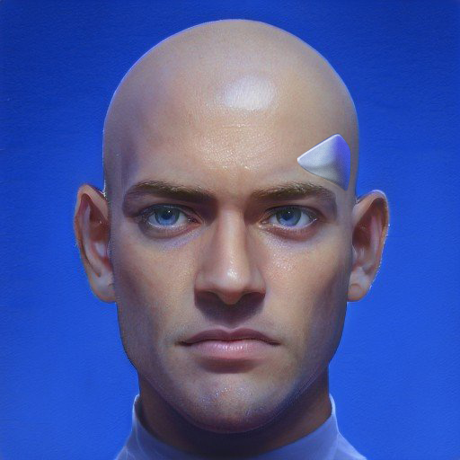
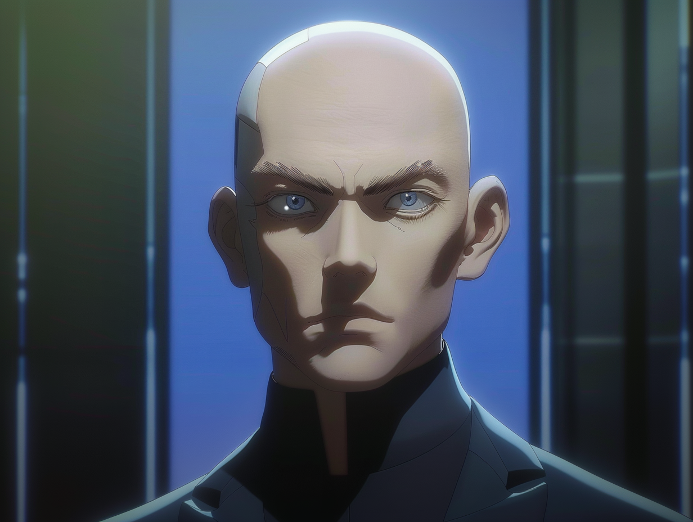

---
layout:
  title:
    visible: true
  description:
    visible: false
  tableOfContents:
    visible: true
  outline:
    visible: true
  pagination:
    visible: true
---

# 👤 Viten Marsh

<figure><figcaption></figcaption></figure>

<table data-card-size="large" data-view="cards"><thead><tr><th></th></tr></thead><tbody><tr><td><h3>Identity</h3>
Age: 58

Occupation: Inventor, Relic Expert, Magnate

First Impression: Intimidatingly intelligent

Self-Image: The misunderstood genius

True Self: Unchecked curiosity 
</td></tr><tr><td><h3>Background</h3>
Birthdate: September 23, 2067

Location: Atla, Greater Atlantic Territorial Alliance (GATA)

Citizenship: GATA

Ethnicity: American

Born: New York, GATA
</td></tr></tbody></table>

## **Appearance**

* Height: 6'0"
* Weight: 170 lbs
* Hair Color: Bald (Shaved)
* Hair Style: N/A
* Eye Color: Blue
* Skin Type: Fair
* Face Shape: Square
* Body Type: Lean and fit, maintains youthful appearance
* Accessories: Polished chrome link accessories on his shaved bald head
* Description: A sharp, angular face with piercing blue eyes that seem to look right through you. His bald head gleams, accentuated by the chrome link accessories he never removes. His lean frame and rejuvenated skin bely his true age of 58.

<figure><figcaption>
Viten watching silently from above.
</figcaption></figure>

## **Bio**

Viten was born in New York during the early years of the Reconstruction Era. His early life was shaped by the aftermath of the Dark Decade and the burgeoning promise of the New Dawn. Showing a remarkable aptitude for science and technology from a young age, Viten excelled in his studies at New York's Garden school and before the close of his first year, he was recruited into the capitol's Atlan Academy.&#x20;

There, his studies continued without constraint, and before long he had caught the eye of the Research Corps. His groundbreaking work in stabilizing smaller static nodes and static engines garnered him significant acclaim. Upon graduating from the High Academy at the age of 15, Viten was invited to join ALTAR's secret INSIGHT research project, dedicated to the study of the fabled Found Objects.

His years in this secretive ALTAR program transformed Viten from a researcher into a shrewd negotiator and far-seeing operator. When he resurfaced after his time with ALTAR, he co-founded Phasia Industries alongside Soraya Mata and Remi Tranche in the Greater Toronto district, chosen for its permissive paradigm.

Viten's professional life was marked by his relentless pursuit of innovation. Some say his work is single-handedly responsible for the commiodification of static field technology, a feat that propelled Phasia Industries to the forefront of GATA's innovation industry. However, his personal life was less fulfilling. Viten harbored unrequited feelings for Soraya, his co-founder and close collaborator. To avoid jeopardizing their professional relationship, Viten never confessed his feelings and outwardly encouraged Soraya to pursue her passions.

Soraya's subsequent relationship with the unserious folk musician Kyote dealt a crushing blow to Viten. Watching her find happiness with another while he remained alone deepened his sense of isolation, leading to a rift in their relationship. Shortly thereafter, Soraya left Phasia to start a family with Kyote.

In response, Viten moved Phasia’s operations to Atla, rebranding the enterprise as Relik and shifting focus towards partnerships with other other enterprises licensing advanced technologies. Today, Relik is involved in a wide range of research and commercial enterprises, as well as significant government contracts with institutions like the Second Quorum, Angelis, and Collections. In recent years, Viten has been most enwrapped in the advancement of ethical and compliant human cloning technologies in partnership with Akicel Technologies.

Viten remains a towering figure in the scientific community, both feared and respected for his intelligence and uncompromising drive.

<figure><figcaption>
Viten's piercing gaze.
</figcaption></figure>

## **Motivations**

* Unlock the secrets of the Found Objects.
* Push the boundaries of human scientific achievement.
* Earn recognition and respect for his vision.
* Forget the past.

## **Trivia**

* Co-founded Phasia Industries and later renamed it Relik.
* Made key discoveries relating to static field technology.
* Has been rejuvenated by AKICEL therapies to maintain a youthful appearance.
* Viten Marsh holds many prestigious and rare keys, acquired by award and intentional collection.
* One of the 100 richest people in GATA.

## **Personality & Quirks**

* Incredibly intelligent and innovative.
* Stoic and inscrutable.
* Intensely focused on his work, often to the exclusion of personal relationships.
* Can be intimidating due to his sharp intellect and direct manner.
* Sometimes is caught thinking too many steps ahead.
* Deeply private, rarely opens up about his feelings or personal life.
* Feels a profound sense of loneliness despite his professional success and notoriety.
* Loyal and supportive to those he cares about, though he seldom shows it.

## **Secrets**

* Has never recovered from losing Soraya, twice.
* Feels responsible for encouraging Soraya to leave.
* Uses work to distract himself from his isolation.

## **Skills**

* Fast learner and skilled negotiator.
* Masterful reverse engineering of unknown technology.
* Pioneer and unparalleled expert on statics.
* Very skilled link user and conduit.

## **Family & Associates**

* Soraya Mata (Co-founder of Phasia Industries, unrequited love interest)
* Remi Tranche (Co-founder of Phasia Industries)
* Kyote (Soraya’s partner, source of Viten's jealousy and resentment)

**Comparative Stats**

| Attribute    | Stat |
| ------------ | ---- |
| Strength     | 7    |
| Defense      | 7    |
| Dexterity    | 7    |
| Intelligence | 10   |
| Wisdom       | 7    |
| Charisma     | 8    |

## **Quotes**&#x20;

> "I've unlocked the deepest secrets barely known to man, yet satisfaction remains elusive."&#x20;

> "The future is a puzzle, and it can be solved."
