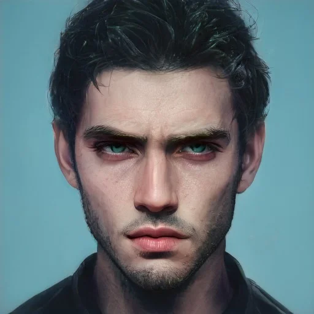

---
layout:
  title:
    visible: true
  description:
    visible: false
  tableOfContents:
    visible: true
  outline:
    visible: true
  pagination:
    visible: true
---

# 👤 Xavier Alves

<figure><figcaption></figcaption></figure>

Glued together from broken pieces. Colder every day, he's gained a significant foothold in the West End Gray Zone black market. His blind ambition outlines a man shaped by survival and cast in shadow.

## Chat



<table data-card-size="large" data-view="cards"><thead><tr><th></th></tr></thead><tbody><tr><td><h3>Identity</h3>
Age: 28

Occupation: Gang leader

First Impression: Human storm cloud

Self-Image: Deserves the life stolen from him

True Self: Pain, bitterness and ambition 
</td></tr><tr><td><h3>Background</h3>
Birthdate: March 1, 2095

Location: Greater Toronto

Citizenship: GATA

Ethnicity: European, Argentinian

Born: Greater Toronto
</td></tr></tbody></table>

* Height: 6'1"
* Weight: 180 lbs
* Hair Color: Slate gray color
* Hair style: Fade with long bangs
* Eye Color: Hazel color
* Skin Type: Limestone tone
* Face Shape: Square shape
* Body Type: Fit, multiple synth prosthetics
* Accessories: Link implant, crown antennae link extension on forehead, gold plated cheek plates, multiple armor rings
* Description: A shadowy dagger moving in the night. Cuts an intimidating shape, and makes his presence known at the moment of maximum impact.

<figure><figcaption>
Xavier receiving some bad news.
</figcaption></figure>

## Bio

Born in Greater Toronto during the final years of the Reconstruction era. His mother was a teacher at the Garden School, and his father worked for the Local Authority. Xavier was a gifted youth with a bright future, but he was prone to getting into fights, and was encouraged by his father who had grown up in the harsh aftermath of the Dark Decade.

After a particularly violent encounter with a group of older boys that was celebrated by his father, his parents had a pivotal argument. His mother announced she was leaving his father for good, and took young the Xavier with her to her friend's apartment. That night, Xavier's father drank heavily and took his own life. This tragedy shattered the young Xavier and his mother. As his mother receded into depression and addiction, Xavier spiraled into delinquency. He got swept up in dealing drugs at the age of 14, and began hanging around with a bad crowd, however continued to attend school and pass reasonably well without much effort.

When he got his link implanted at 16, he proved to be intuitively adept at recognizing traces of other users and other residual imprints, and this led to a nearly-successful string of major heists that landed him in the custody of the Local Authority. Without solid proof, and because of who his father was, he was released.&#x20;

On the way home, he was jumped by thugs representing the gang he had stolen from, and was left with life threatening injuries, dying in the street. A young girl named Lulu discovered him in the alley while walking from school and her intervention saved his life.

With his future in the higher academies forfeit and his body severely broken, an embittered Xavier decided he would take control of his future. With single-minded determination, and the care of Lulu, he set out to exact his meticulous revenge. Now, after years of struggle, the gang that had beaten him in the street are gone, and Xavier and his crew stand in their place. However, his rise came at the cost of his relationship with Lulu.

Xavier's gang works with Wallrunners who smuggle drugs, legacy tech and Old World paraphernalia through the West End Gray Zone. Xavier also permits a number of other activities on his territory, from pleasure houses, to an Astral dormitory, and more. His favorite pet establishment is the underground arcade Palaizir, mainly due to a secret, distorted fondness for Lulu, now a sync jockey, who he still watches over from a distance even after their split.

## Motivations

* Maintain his grip on the West End Gray Zone.
* Don’t lose influence to Hundred Hands.
* Keep a tight hold on Lulu.
* Exploit Lulu's brother, Fitz, for his talents.
* Find out who this Prince guy is.

<figure><figcaption>
Xavier delivering some bad news.
</figcaption></figure>

## Trivia

* Can't feel his hands due to nerve damage from his injuries.

## **Personality & Quirks**

* Single-minded.
* Has a twisted sense of justice.
* Keeps his communication terse, and pointed.
* Never forgets a grudge.
* Almost impossible to read.
* Really good at lying.
* Manipulative without remorse.
* Believes the ends always justify the means.
* Believes its a dog-eat-dog world.
* He's educated but he speaks like the street boss that he is.
* Not very patient.
* Doesn't suffer fools.
* When he's laughing, it's usually bad news for someone.

## Secrets

* He knows The Hundred Hands have started looking for something recently.

## Skills

*

## Family & Associates

Lulu (On-and-off Girlfriend)

Fitz (Lulu's brother)

## Comparative Stats

| Attribute    | Stat |
| ------------ | ---- |
| Strength     | 7    |
| Defense      | 7    |
| Dexterity    | 8    |
| Intelligence | 5    |
| Wisdom       | 9    |
| Charisma     | 7    |

## Quotes

> "You’ll bring it to me. You’ll bring it to me because you love him, and how he’s all one piece.” - Xavier

> "Brave. Pointless, but brave." - Xavier

> "You're going to regret that, little bird." - Xavier

> "I'm not the bad guy. I'm the guy still standing." - Xavier

## Meta Self-Description

This world is a rotten apple, so what if I'm the worm? I had nothing, and even that was taken from me, but I came back. I got my revenge on the gang that left me for dead. I took over. Now, I'm the boss. The docks belong to me now. And all I need is something big. Something big enough to get me leverage over the Hundred Hands before they push me out. I know I'm clever enough to take them on, and I'll do whatever I have to to win. Or die trying.
