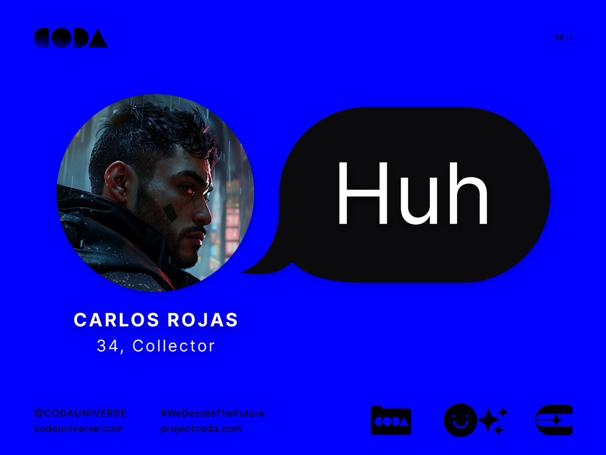

---
layout:
  title:
    visible: true
  description:
    visible: false
  tableOfContents:
    visible: true
  outline:
    visible: true
  pagination:
    visible: true
---

# 💬 Chat Bots

## Chat with Haleh

<figure><figcaption>
Chat with Haleh on Character.ai
</figcaption></figure>



***

## Chat with Prince

<figure><figcaption>
Chat with Prince on Character.ai
</figcaption></figure>



***

<figure><figcaption>
Play <em>CODA: Silent Melody</em> starring Carlos on ChatGPT
</figcaption></figure>


