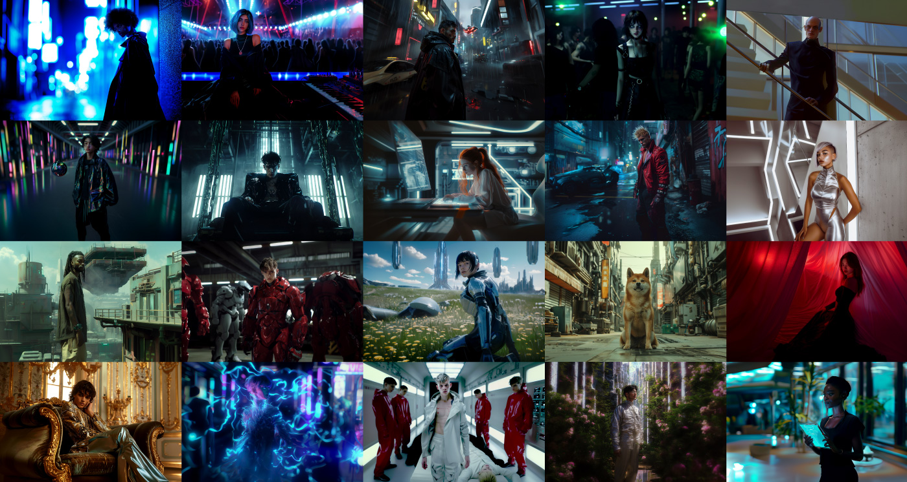

---
layout:
  title:
    visible: true
  description:
    visible: false
  tableOfContents:
    visible: true
  outline:
    visible: false
  pagination:
    visible: true
---

# 🌀 Saga

<figure><figcaption>
A few of the CODA Saga's central canon characters.
</figcaption></figure>

## Introduction

**The CODA Saga** is an epic tale set in an interactive storyworld that weaves together the stories of all the canon characters and the best community-created content.

It begins on January 1st, 2125, in the shadowy corners of a nascent underground sync rave scene, where skilled conduits called sync jockeys guide the crowd's minds in hallucinatory trances using illegally modified technologies.

There, submerged in the haze and pulsing bass frequencies, a mysterious piece of experimental hardware is debuted, setting in motion a chain of events that will change the human destiny forever.
