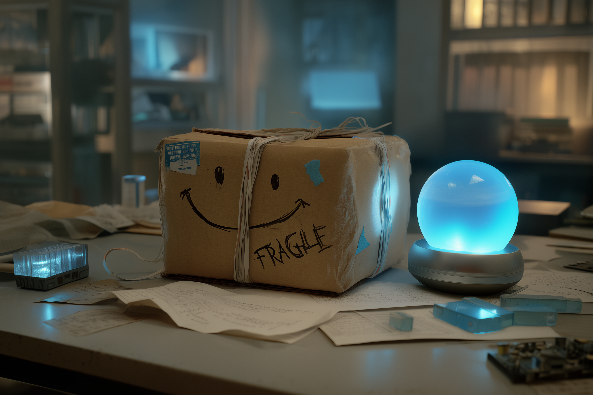
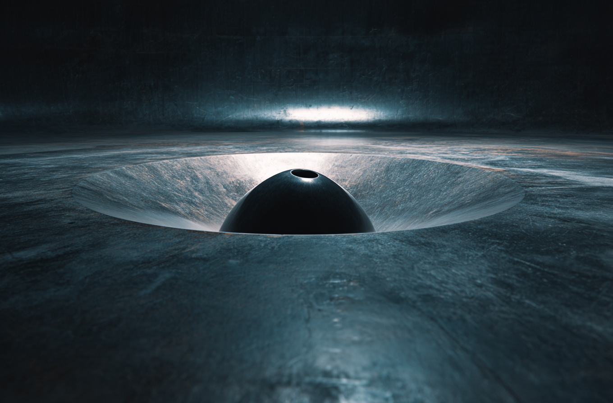
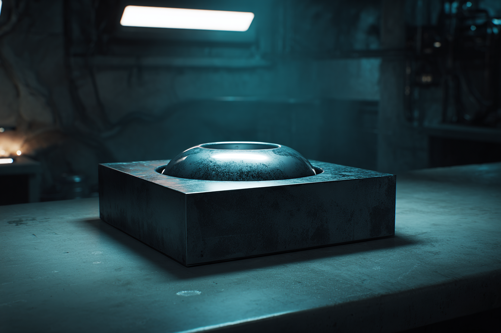
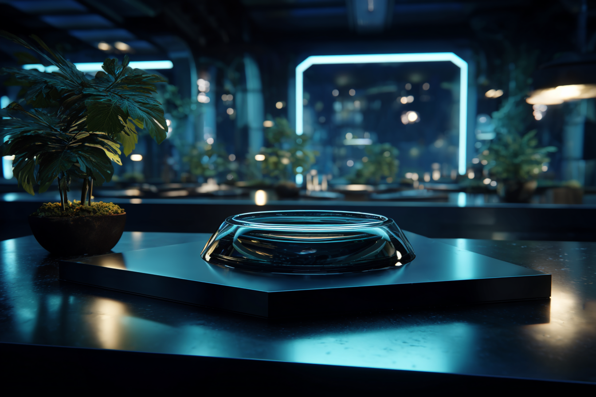
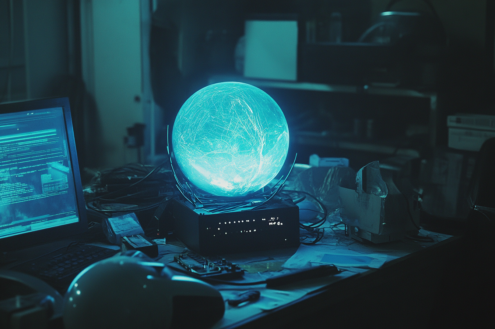

# The Unit

<figure><figcaption>
The Unit's box and the Infinity Core.
</figcaption></figure>

## Overview

"The Unit" is the name given by [Prince Kyote](../cast/prince-kyote.md) to a compact, highly secretive device he possesses when he re-emerges a decade after his presumed death in [the Bright Mesa attack](../../world/gata/history/bright-mesa.md). In public-facing accounts it is described only as a _"mysterious modded_ [_sync hub_](../../world/science-and-tech/sync-hubs.md)_"_ recently introduced to [the underground sync scene](../../world/science-and-tech/sync-hubs.md) during the performances of a mysterious [syncjockey](../../world/gata/underground-scene/sync-raves/#sync-jockeys) named CODA.

Privately—and unknown to anyone but Prince—it is built around an experimental object derived from the secret, unsanctioned research of his late mother, [Soraya Mata](../cast/soraya-mata.md). In his own notes, Prince refers to this central object the "Infinity Core".

At a technical level, the Unit combines several components: the Infinity Core itself; a sync hub, an ultra-sensitive (and likely illegal) sensor array, a custom power-regulator, a high-end [multi-endpoint](../../world/science-and-tech/endpoints.md) module, and a heavily modified [filter module](../../world/science-and-tech/asimovian-architecture.md#filter-modules). Together they form an integrated platform for interfacing the Core with [link users](../../world/science-and-tech/links.md), intended for use at [illegal sync raves](../../world/gata/underground-scene/sync-raves/).

***

### Origins and history

The true origin of the Unit's central component lies in [Soraya Mata’s](../cast/soraya-mata.md) long-standing fascination with a hypothesized [Found Object](found-objects.md) referred to speculatively within [ALTAR](../../world/gata/institutions/altar.md) as [“Object X”](found-objects.md#object-x).

<figure><figcaption>
A mysterious depression observed across numerous Found Objects.
</figcaption></figure>

During her time in ALTAR's reverse-engineering program, [INSIGHT](../../world/gata/institutions/altar.md#gatas-innovation-engine), and later at the [private enterprise](../../world/gata/enterprise/) Phasia, Soraya, along with the rest of her research team including Viten Marsh and Remi Tranche, was tasked with studying many Found Objects and structures. Over the course of this work, Soraya repeatedly encountered objects that shared one peculiar feature: a conspicuously located, shallow, perfectly smooth and unremarkable concave depression in its surface seemingly meant to bear a spherical object approximately the size of a grapefruit.&#x20;

Soraya informally speculated they might be docking points for a missing component, which to her knowledge had never been recovered by ALTAR. Her intuition blossomed into obsession when she first encountered the Found Object, FO-9, which was curiously more crude in its construction than many of the other object's, potentially revealing key insights into the mystery object's nature.

<figure><figcaption>
The same feature as seen on FO-09.
</figcaption></figure>

By closely studying the geometry and atomic structure of these depressions over her subsequent time at ALTAR, combined with her intimate understanding of [physical functions](../../world/science-and-tech/hard-code.md#raw-hard-code), Soraya had grown certain that these recurrent features were partial extensions of a vitally important device whose function propagated into these external systems through this basin-like interface.

Over years, then decades, she followed a private line of inquiry, circling this idea of a missing spherical object whose presence was implied but never confirmed. Her fixation persisted even after leaving ALTAR and founding the private enterprise, Phasia, with her former INSIGHT program research partners, [Viten](../cast/viten-marsh.md) and [Remi](../cast/remi-maeda.md). This ongoing speculation about FO-9 and Object X contributed to growing tensions with Viten about the direction of their research and, ultimately, led to Soraya's departure from the enterprise she co-founded.

Soon after her departure, she met Kyote and one year later, their son Prince was born. After several years of domestic diversion, Soraya suddenly receded into a deep depression, and eventually relocated to [the African Union](../../world/african-union/) under the cover of more conventional energy-focused work, leaving Kyote and their son in Atla. There she secretly continued her research into Object-X, using her reputation as a celebrated alumni of the [Atlan High Academy](../../world/gata/institutions/the-atlan-academy-system.md) and a pioneer in [Asimovian architecture](../../world/science-and-tech/asimovian-architecture.md) as camouflage.

She abandoned the use of her hard code framework, [LMNL](../../world/science-and-tech/hard-code.md#lmnl), instead opting to work in [custom hard code](../../world/science-and-tech/hard-code.md#raw-hard-code) to circumvent the constraints built into the GATA-celebrated [NDA–compliant](../../world/gata/law-and-order/new-dawn-accords.md) framework she had helped design. It was during this period that she succeeded in constructing a working realization of the hypothesized Object-X—seemingly the object Prince would later inherit and dub the Infinity Core.

Soraya’s death in [the Bright Mesa attack](../../world/gata/history/bright-mesa.md#the-bright-mesa-attack) (or, as Prince believes, her assassination) interrupted the final stage of this work. How Prince eventually came into possession of the Core and her associated research remains unclear, but by the time he reappears with the Unit, he has clearly spent years studying her notes and reverse-engineering enough of her interface hardware to operate the device for his own purposes.

***

### Soraya Mata’s research and understanding

Soraya’s central technical insight was that the mysterious "cradle" depressions recurrent across [the Found Objects](found-objects.md) she had studied were not just an ergonomic seat for an independent device, but the continuation of a precise crystalline lattice that would naturally extend into a spherical volume.

From this, she derived the design of a spherical object whose atomic structure continues and completes the pattern begun in the cradle, correcting for exotic electromagnetic and gravitic dynamics produced at the interface surface.

The resulting object was what she described as a "holofractal vector node": a macroscopic quantum object built—or more precisely, _grown_—as an atomically precise, self-similar lattice, that mediates and directs energetic propagation within its architecture.

<figure><figcaption>
Soraya in her lab working on a prototype of the holofractal vector node.
</figcaption></figure>

When it is not being exposed to structured, high-density input, the sphere is absolutely smooth, metallic, opaque, cool to the touch, and surprisingly heavy for its size. When structured information or a powerful charge is projected onto its surface, it begins to emanate an otherworldly blue glow, exhibits anomalous gravitational effects, and takes on an eerie translucency, revealing a glimpse of its internal dynamics.&#x20;

#### Technical details and exotic physics

The structure of this node is pseudo-fractal and essentially uniform throughout. Along any line from its center to its surface, the lattice repeats the same pattern; there are no internal irregularities, no specialized subregions, and no conventional mechanisms. The entire volume is a single, continuous computational medium. What appears from the outside to be a featureless, polished metallic sphere is in fact an extraordinarily complex lattice engineered down to the scale of individual atoms.

Soraya’s notes propose that the node is the physical implementation of the optimal information processing architecture achievable in spacetime. Energy arriving at the surface—whether in the form of photons, phonons, thermal gradients, or other perturbations—cascades inward through the lattice, undergoing a dense progression of refraction, interference, and coherence. As these inward-moving waves converge toward the center, the information density approaches that of a singularity.

In this picture, the node can be understood as a sort of scaffolded black hole analogue, artificially expanded and reinforced by its structure to macroscopic dimensions, with its Schwarzschild radius located at the core's surface. The node's surface area is precisely bound such that it is impossible to trigger gravitational collapse.

<figure><figcaption>
Soraya's final working interface for the node.
</figcaption></figure>

It was at this stage that Soraya's progress slowed dramatically, beginning a period of stagnation. The interior of the node is solid-state hardware, its dynamics governed by the laws of physics. As such, all of the magic takes place at the surface, introducing an entirely new array of challenges beyond her areas of expertise. It was several years before she produced a functioning interface for the node, and the provenance of her key insights were not recorded in her notes. It is clear, however, that her interface module shares design features with [illegally modded sync hubs](../../world/science-and-tech/sync-hubs.md#illegal-use). Meanwhile, her sensor array appears to have been inspired by then-novel research exploring [quantum seed technology](../../world/science-and-tech/quantum-seeds.md).

She discovered that information, in the form of structured perturbation projected onto the surface, flows inward, is transformed by the lattice’s internal dynamics, and then reverberates back outward. Those returning waves interfere with continuous inbound waves, and ultimately emerge at the surface where they can be converted to a topological mapping of differentials between the energy going in and the energy coming out. Soraya interpreted these differences as the node’s “output”: coherent patterns that encode the result of its internal processing.

In terms of energy use, the node operates as a room-temperature superconductor that self-regulates its throughput, resulting in the object remaining curiously cool to the touch, regardless of how much energy has been poured into it.

#### The blank slate

Critically, the node has no inherent operating system. It does not encode any built-in [ontologies](../../world/science-and-tech/asimovian-architecture.md#ontology-design) or [safety filters](../../world/science-and-tech/asimovian-architecture.md#filter-modules); it does not “know” what light, sound, or any other stimulus is. It simply allows energy to propagate through its structure according to the fundamental laws of physics. Soraya’s breakthrough was the realization that this substrate can be entrained by structured computation, and even human cognition. Using [links](../../world/science-and-tech/links.md) and [a sync hub](../../world/science-and-tech/sync-hubs.md), she experimented with coupling human neural activity to the node, freely unfolding as structured excitations within the node's lattice.

Over time, and with carefully monitored exposure, she found that the node’s internal dynamics could mirror and extend these human neural patterns, and that the returning surface output could exhibit coherent, apparently novel responses when properly processed through a suitable interface. This opened the door, at least in principle, to instantiating human-like intelligence and even consciousness into the core.

#### Legal status

Soraya's work on this "holofractal vector node" represents a virtually un-matched breach of the tech regulations set out in [the New Dawn Accords](../../world/gata/law-and-order/new-dawn-accords.md), and a violation of her binding agreements with ALTAR, prohibiting unsanctioned research based on classified material.

The node is opaque, unsandboxed, and unbounded by [Asimovian constraints](../../world/science-and-tech/asimovian-architecture.md#overview); there is no reliable way to audit or limit the kinds of processes that might propagate inside it, up-to-and-including the [NDA's highest offense](../../world/science-and-tech/tech-regulation.md#class-1-red) of developing or possessing [unfiltered artificial general intelligence](../../world/science-and-tech/artificial-intelligence.md). Because its architecture is holistic and undifferentiated, it is fundamentally incompatible with the tightly-controlled regulatory regime established in the New Dawn Accords, and enforced by [the AIC](../../world/gata/institutions/atlan-information-control-aic.md) across all of GATA's [partner states](../../world/gata/law-and-order/new-dawn-accords.md#signatories).

Soraya’s decision to pursue this research in secrecy under the cover of energy-focused research in the [African Union](../../world/african-union/the-basics.md), and employing [custom hard code](../../world/science-and-tech/hard-code.md#raw-hard-code) rather than [LMNL](../../world/science-and-tech/hard-code.md#lmnl), is a result of her awareness that if discovered, she would be subject to the harshest of consequences pursuable under the law, or likely, worse.

It is unclear if, or how, Soraya's work was discovered, but as a high-profile [Reconstruction Era](../../world/history/the-reconstruction.md) figure, a highly-regarded tech innovator across GATA and the African Union, and a former researcher for [ALTAR](../../world/gata/institutions/altar.md), it is reasonable to assume that she was under some degree of observation by one or more interested parties. However, it remains unconfirmed that her work was ever uncovered, or if so, by whom.

***

### Design and composition of the Unit

The Unit is [Prince Kyote’s](../cast/prince-kyote.md) assembly around Soraya’s core device. At its heart lies the Infinity Core, the holofractal vector node. The Infinity Core is a recreation of the hypothesized ["Object X"](found-objects.md#object-x) Soraya reverse-engineered in part based on her previous study of the [Found Object](found-objects.md), FO-9.

<figure><figcaption></figcaption></figure>

The Infinity Core is mounted so that its surface can be continuously monitored by a sensor array capable of detecting extremely small variations between the energy entering the Core and the energy radiated back out. The signals from this array are routed through a custom interface and [filter module](../../world/science-and-tech/asimovian-architecture.md#filter-modules) to translate the raw core readings into signals usable by other systems. For Prince's purposes, these external peripherals include a [sync hub](../../world/science-and-tech/sync-hubs.md), [vine](../../world/gata/underground-scene/sync-raves/slang.md#general-terminology) relays, and custom-fabricated generative music hardware.

Supporting this is an extremely advanced power-regulation module designed to precisely modulate the energy flowing into the core, serving as its primary input mode, and keeping it within its intended operational regime. This module allows Prince to entrain the core with rapid, highly-variable energetic fluctuations while avoiding either underdriving the Core (yielding noisy, low-signal responses), or overdriving it into unstable or unknown behavior. The power regulator is tuned to maintain the node at the edge of its optimal computational performance, within the constraints of Prince's available hardware and knowledge.

At first glance, the Unit largely resembles the modified sync hub hardware common to illegal sync raves, however internally it has been reworked to incorporate the sensor, interface, power regulator, and core. The sensor output from the Core is fed through the hub’s custom filter module so that it can appear as signal to link endpoints, while, conversely, activity from linked minds can be directed and shaped as structured input to the Core’s surface.

The exact provenance of the Unit’s sensor technology is unknown, however it bears some superficial resemblance to the components later used to mod sync hubs with [quantum seeds](../../world/science-and-tech/the-astral.md#astral-seeds) by [Astral](../../world/science-and-tech/the-astral.md) users, although the details of the implementations differ significantly. It is reasonable to assume that Prince drew heavily on both Soraya’s secret research and his own expertise with links, sync hubs and hard code, however the exact details are clouded in his ten-year absence. Even more mysterious is the power regulation module, which has the hallmarks of [Old World](../../world/history/the-old-world.md) legacy tech. What is clear is that without this auxiliary hardware, the Infinity Core would be almost impossible to interrogate or integrate with human cognition in a controlled, and safe manner.

***

### Function and theoretical basis

<figure><figcaption>
The Infinity Core exhibiting exotic gravitational effects after extended use.
</figcaption></figure>

From a functional standpoint, the Infinity Core at the center of the Unit is an object that converts surface perturbations into an internal pattern of wave dynamics and then returns a transformed pattern back to the surface. Its nanoscale, self-similar lattice provides a uniform medium for this process, with no explicit subsystems or application-specific circuitry. Computation arises from the interaction of wave patterns within the lattice, not from discrete operations imposed from outside.

Because the lattice is uniform, the entire volume participates in a continuous physical computation. Local disturbances propagate globally, and global patterns are accessible from local measurements at the surface. This gives the Core properties reminiscent of holographic systems: the internal state is richly encoded in the patterns measurable at the boundary, even if only indirectly and with the aid of extreme precision instrumentation.

Once coupled to a structured signal, such as human cognition via [links](../../world/science-and-tech/links.md) and [a sync hub](../../world/science-and-tech/sync-hubs.md), the Core begins to adopt the statistical structure of the patterns it is exposed to. These patterns impressed on its surface propagate inward; the internal dynamics settle into modes that are shaped by this ongoing interaction, and the output becomes increasingly structured from the linked mind’s point of view.

In this way, the Core can serve as a kind of mirror, extension, or alternate substrate for cognitive patterns. When cut off from input, the core falls dormant, and any coherence in its activity seems transient, leaving no permanent trace in the object's structure or subsequent reactivation.

The Unit’s sensor array and interface modules translate the surface activation patterns into signals that can be presented back to link users or recorded for later analysis. From the perspective of a participant in a sync, the presence of the Core at first simply feels like an unusually intense or coherent [connection](../../world/gata/underground-scene/sync-raves/slang.md#general-terminology), but after a few moments, participants report what are simultaneously the most intense, and controlled, [wave dynamics](../../world/gata/underground-scene/sync-raves/slang.md#move-grammar) in the [hive](../../world/gata/underground-scene/sync-raves/slang.md#general-terminology) that they've ever experienced.&#x20;

Because the Core operates outside of [Asimovian ontologies](../../world/science-and-tech/asimovian-architecture.md#ontology-design) and has no in-built [LMNL-based](../../world/science-and-tech/hard-code.md#lmnl) safety constraints, the kinds of patterns it can support are in principle unbounded. This includes the possibility of persistent, self-organizing structures that correspond to partial or complete copies of human neural organization, hybrid collectives, and other configurations that do not map neatly onto any known computational process or biological mind.

Soraya herself speculated that the object could in fact be conscious, or at least capable of consciousness-like self-excitation. These are among the key reasons the research that produced the Core was a closely guarded secret.

***

#### Prince Kyote’s understanding and intentions

Prince's resurfacing and subsequent machinations in [the underground sync rave scene](../../world/gata/underground-scene/sync-raves/) have been a meticulously preserved secret. However, there are some unsubstantiated rumors that associate [the legendary folk icon Kyote](../stories/the-legend-of-kyote.md) to a mysterious [syncjockey](../../world/gata/underground-scene/sync-raves/#sync-jockeys) named CODA that has been performing across the major freeholds of [the Free Territories](../../world/free-territories/the-basics.md). Insiders whisper that CODA is set to make an appearance in GATA's beleaguered and still-uninitiated [mega-district of New York](../../world/gata/key-locations/new-york-city.md)—a provocative move that, if true, is certain to draw the attention of the [district's local authority](../../world/gata/law-and-order/local-authority.md), and perhaps even the [AIC's Collections bureau](../../world/gata/law-and-order/collections.md).

<figure><figcaption>
Prince experimenting with the Infinity Core while developing "The Unit".
</figcaption></figure>

Informed by his close study of Soraya’s surviving research and his own experiments with the Infinity Core, Prince understands the Core well enough to operate it, to integrate it with a [modded sync hub](../../world/science-and-tech/sync-hubs.md#illegal-use), and to use the hub to couple the Core to multiple link users at once. He grasps the general implications of Soraya’s work: that the Core can host, mirror, and transform cognitive patterns, and that it represents a class of technology expressly banned under [the New Dawn Accords](../../world/gata/law-and-order/new-dawn-accords.md). He does not, however, possess his mother’s deep theoretical understanding of the Core's ultimate capabilities and limits.

For Prince, the Unit is both an inheritance and a weapon. It embodies his mother's most dangerous and visionary research, and it is the reason, he believes, that powerful actors were willing to allow, or engineer, the circumstances that led to her death at [Bright Mesa](../../world/gata/history/bright-mesa.md). His decision to conceal his activities in the shadows of the sync scene allows him to operate in a domain where intense, collective link experiences are already normalized and where unusual cognitive phenomena can easily be dismissed as the side effects of a [faulty vine](../../world/gata/underground-scene/sync-raves/slang.md#general-terminology), or [bad benders](../../world/gata/underground-scene/recreational-drugs.md#benders).

<figure><figcaption>
The crowd at a sync rave during CODA's performance, synced via The Unit.
</figcaption></figure>

Within this context, the Unit becomes a tool through which Prince can continue Soraya’s work in his own way, while also pursuing personal goals that likely include retribution against those who he believes conspired to orchestrate his parents' death. The exact contours of his long-term plan remain unknown, but the revelation of the mere existence of the Unit's unprecedented core would be enough to send shockwaves across [Greater Atla](../../world/gata/politics/greater-atla.md) and throughout the halls of power across the world.
