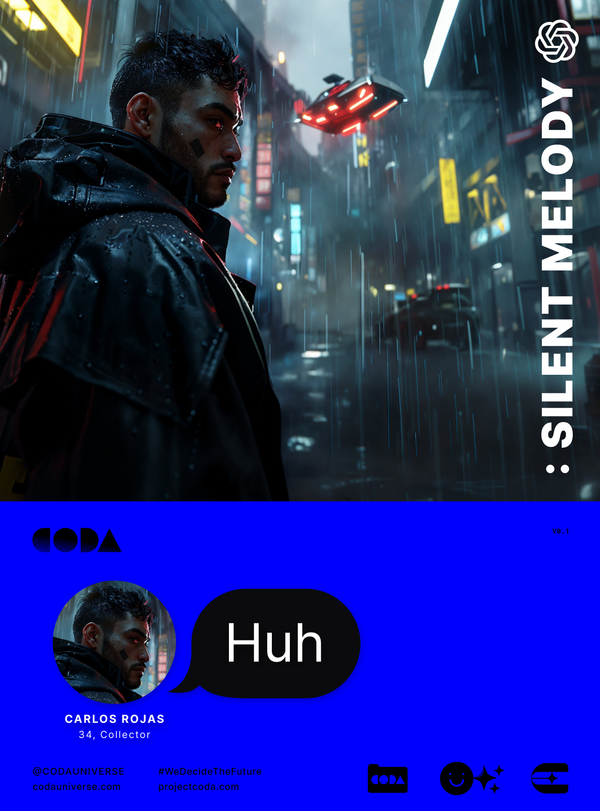

---
layout:
  title:
    visible: true
  description:
    visible: false
  tableOfContents:
    visible: true
  outline:
    visible: true
  pagination:
    visible: true
---

# 📘 Silent Melody

<figure><figcaption></figcaption></figure>

#### 💻 Play CODA: Silent Melody on ChatGPT


