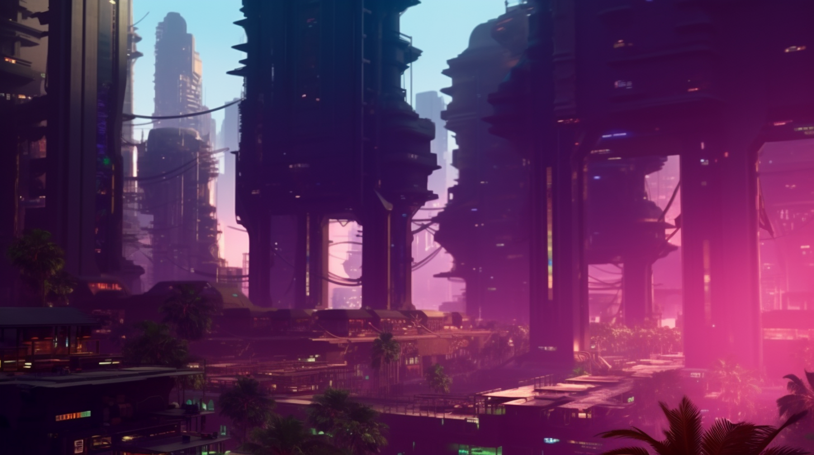

# 🔵 The Basics

<figure><figcaption></figcaption></figure>

### Overview

Centered in its planned capitol city, New City located at the intersection of the Brahmaputra and Teesta River. Renowned for its engineering and construction capabilities, as well as its tech industry's role in the development of static field technology. Benefits from its prodigious partnership with Atla during The Reconstruction. The Aryabat-built megastructures from that era still stand around the world, most as derelict monuments to that unprecedented undertaking. Aryabat enjoys a stable political order due to its rapid and widespread improvement in quality of life since officially transitioning to The System.

### Basic Info

* Founded: 2064
* Governance: Tripartite Consociational State
* Region(s): Pakistan, India, Tibet, Northern China
* Capitol: New City (intersection of the Brahmaputra and Teesta River)
* Population: 4,329,000,000

***

### Comparative Stats

* Freedom: 6 - With its large populations, there is freedom in obscurity
* Luxury: 6 - The vestiges of caste systems holds back some, while others live in opulence
* Military: 7 - While their terrestrial military is notable, their conduit pilots are world-class
* Education: 6 - Widespread trade instruction is emphasized over formal education
* Technology: 7 - Possesses some of the most advanced “interfaces” and skilled conduits
* Health: 6 - Access to advanced medicine is limited but their paradigm will expand

### Key Points

* An engineering hub on both terrestrial and extraterrestrial fronts.
* Has significant influence due to its partnerships with other states.
* The constant state of flux across Aryabat represents its spirit of innovation and change.
* Widespread student and ward exchanges unify cross-territorial interests.
* The most sophisticated fabricator technology.
* During the Reconstruction, benefited from technology exchange with GATA.
* Pushed the frontiers of static field technology both in terms of its applications in construction, as well as its control with advanced interfaces and conduit training.
* After GATA, has the most developed presence in space, working closely with Sol
