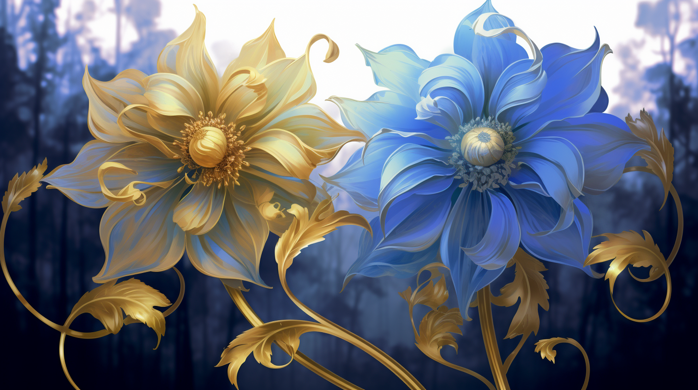

---
layout:
  title:
    visible: true
  description:
    visible: false
  tableOfContents:
    visible: true
  outline:
    visible: true
  pagination:
    visible: true
---

# The Manna Flower

<figure><figcaption>
Yellow and Blue Manna Flower specimens.
</figcaption></figure>

Engineered by Atlan scientists during the early years of the Dark Decade, the Manna flower is not just a marvel of genetic engineering, but also a symbol of hope. Seeded around the world during the Dark Decade through an extended campaign of atmospheric dispersal.

Designed to develop through three stages of maturity during which the plant can be induced to produce a myriad of compounds. These compounds formed the basis of medicines and materials that provided solace and healing to the people of the world throughout the challenging times of the Dark Decade and the subsequent Reconstruction era.

The Manna flower's significance extended beyond its medicinal attributes. As Atla's first real political emblem, it played a poignant role in uniting survivors. New ships wishing to join the growing Atlan fleet would fly a white flag as a sign of peace. Once accepted, these ships were given a Manna flower as a symbol of unity and were invited to adorn their flags with a blue depiction of the flower.

This tradition of the blue Manna flower on a white backdrop persists and has become the enduring flag of Atla. Of note, GATA’s first flag featured the reverse - a white Manna flower on a blue field, before the more abstracted redesign that seen today.

***

## **Variants and Uses**

By inciting specific epigenetic changes at the correct time in its development cycle, the Manna flower can metamorphose into several variants:

* White: Immature stage where chewing the leaves induces a mild euphoric sensation.
* Blue: Produces anti-inflammatory pain medicine, a rapid-healing paste, and has calming properties.
* Purple: Known for its anti-cancer therapy and as an immune system booster.
* Red: Can be converted into a powder that amplifies energy, strength, and concentration. Physically addictive with a rough comedown.
* Green: Develops into a fibrous stalk suitable for textiles like fabric and rope.
* Gold: Bears a protein and carb-rich fruit, its nutritional content reflecting the health of the soil in which it is grown.
* Mer or Silver: Cultivated underwater, it produces vines that, when processed, enhance visual and auditory senses, as well as improving metabolic efficiency and overall stamina. Psychologically addictive due to the general felt sense of health.

***

## **Development Cycle**

#### **Primordial Phase**

In this initial phase, the Manna flower's future characteristics are determined by the soil's composition (called “soil priming”). Once the seed’s hard shells softens, the proteins, minerals, and other compounds found in the soil induce various epigenetic changes, determining which variant the Manna flower will become.

#### **Growth Phase**

During this phase, the Manna flower's growth can be augmented by specific care techniques. The plant communicates its needs through subtle changes in posture, color, and in some variants, even bioluminescence. Skilled caretakers of the Manna flower study to interpret these signals to provide optimal conditions for growth. Across the world there are many traditions that detail intricate care rituals, which are part science, part custom.

#### **Harvest Phase**

The final phase before seed release. Different harvesting methods and precise timing can affect the harvest’s quality and quantity. Skilled caretakers know the precise signs for when to harvest. The harvesting method involves removing the flower’s ovary and separating it with the seed still enclosed, and dividing the harvest into petals and other soft tissues in one reservoir, and the fibrous parts such as the stem or stalk in another.

***

## **Modern Context**

While many still cherish the aesthetic variants of the Manna flower, its medical prominence has somewhat diminished in much of the world. Modern medical advances readily available across GATA and the other super-states have superseded most Manna-based treatments. As such, the Manna flower's role has receded into a more symbolic one.

For GATA-loyalists, the Manna flower is a symbol of national pride, while for the average citizen of GATA, it represents a simple, nostalgic idea of life. In other states, the Manna flower is generally regarded as a great gift, and its role in civilization's recovery has earned GATA a deep well of good will around the world.

However, the story is different in the Free Territories. There, the Manna flower remains indispensable in every day life. Due to challenges in maintaining stable infrastructure and mass-deploying safe, advanced medical solutions, many rely on the Manna flower for its medicinal and nutritional properties.

While open cultivation of the Manna flower is sometimes regarded as distasteful by more die hard Sovereigns and might even invite conflict, there's an unspoken understanding in even the most committed freeholds that most people use the Manna discreetly to produce necessary medicines and materials. On the other hand, adherents to the Eidetic ideology celebrate the Manna flower, and propagate the ahistorical belief that the Manna flower was a natural development gifted to humanity by Mother Earth to help them survive without technology.
