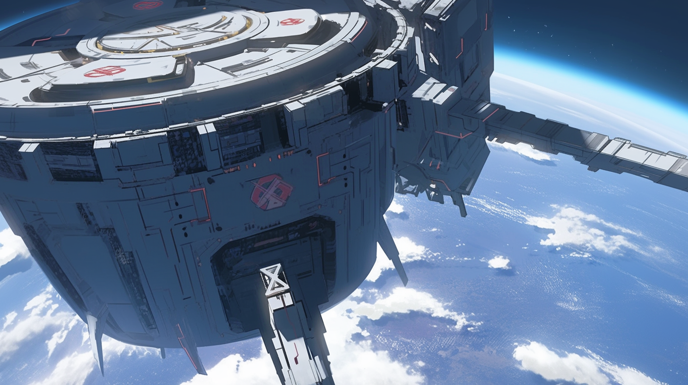

---
layout:
  title:
    visible: true
  description:
    visible: false
  tableOfContents:
    visible: true
  outline:
    visible: true
  pagination:
    visible: true
---

# Angelis

## Overview

Headquartered in Atla, and staffed by more than 10 million personnel stationed around the world and in orbit, Angelis is GATA’s largest enterprise. Angelis provides military and intelligence services for GATA and its partner states.

Angelis was founded at the close of The Reconstruction, as GATA fractured its national military into various dedicated branches, formalizing structures that had emerged naturally over its history.

***

<figure><figcaption>
Angelis Watcher overseeing the safety of Greater Atla.
</figcaption></figure>

## **Watchers**

Angelis strategy and intelligence. Watchers provide expert information gathering, border protection, personal protection, asset tracking, private communications, targeted downtime, and comprehensive strategic foresight. Having a Watcher on the line is an invaluable resource in a crisis.

### **Watchtowers**

Orbital stations and surveillance platforms where orbital Angelis personnel work. Watchtower staff includes Watchers and Guardians who work closely with their ground-based counterparts to ensure the security of Greater Atla.&#x20;

<figure><figcaption>
An Angelis Watchtower in Low Earth Orbit.
</figcaption></figure>

Watchtower staff provide direct monitoring of battlefields and Red Zones using a network of secure line-of-sight relays to tap into sensor arrays distributed around the Earth in geo-synchronous orbit.

Watchtowers are also where Mavericks and Angelis Rapid Response are garrisoned between deployments to an Overlook.

### **Overlooks**&#x20;

Small orbital habitats where Rapid Response and Mavericks are dispatched from. Overlooks are positioned across the Earth’s orbit, and are strategically distributed to reduce time to target. When Rapid Response or Maverick units are deployed on an operation, they drop from Overlooks in Aegis drop pods.

***

## **Aegis Drop Pods**

Armored drop pods that use Static Field technology to allow for accelerated descent and a decelerated hard-landing. The Aegis pod contains mission-relevant equipment, portable external compute, a break-away shield door, and various communication and jamming capabilities. To open an Aegis pod, the shield door must be pushed out from the inside, causing the Aegis’ panels to fan open, allowing the occupant to slowly increase their visibility while retaining protection.

***

## **Angelis Combat Gear**

<figure><figcaption>
Advanced Combat Gear designed for GATA's most elite operatives.
</figcaption></figure>

Angelis has the most advanced combat gear in the world. Angelis infantry uses more standard loadouts, but Guardians, Rapid Response, and MAVs are trained to use highly advanced gear that can be tailored to their talents and each mission’s requirements.

* **Guardians:** Blue Combat Gear / Large-to-mid-size / Heavy loadout
* **Rapid Response:** Red Combat Gear / Mid-size / Less-lethal loadout
* **MAVs:** White Combat Gear / Small / Form-Fitting / Minimal loadout
