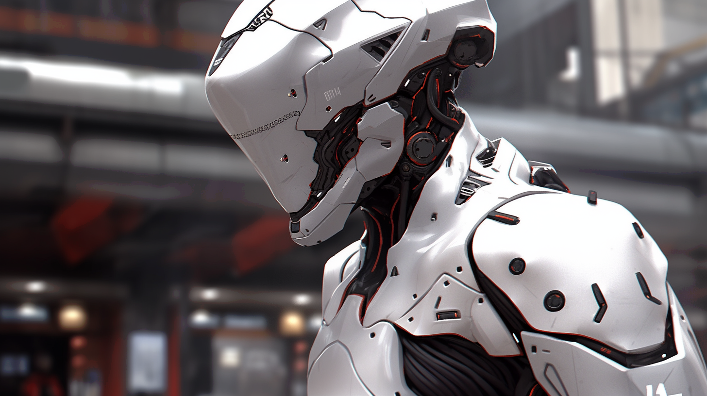
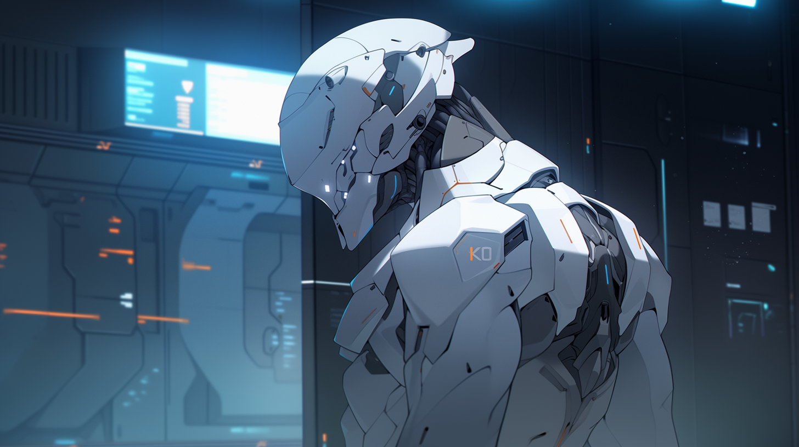
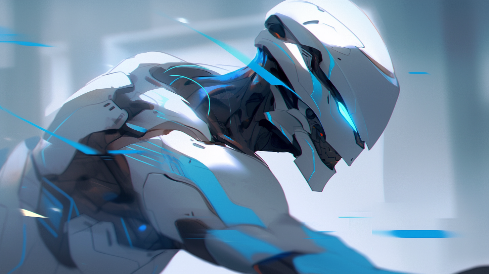

---
layout:
  title:
    visible: true
  description:
    visible: false
  tableOfContents:
    visible: true
  outline:
    visible: true
  pagination:
    visible: true
---

# MAVERICKS

<figure><figcaption>
Modern MAV Combat Gear.
</figcaption></figure>

## Overview

Mavericks, or MAVs, are the pinnacle of Angelis and GATA combat effectiveness. The best of the best, recruited from the ranks of the Guardians and Rapid Response.

The defining attribute of a successful MAV is their ability to operate independently, the basis for the UDA program that preceded them under the [Existence Doctrine](existence-doctrine.md). The key to making it into the ranks of the MAVs is a prospective asset’s ability to tolerate and synergize with their cog implant.

MAV cog implants are installed directly in the brainstem, allowing the cog to enhance their reflexes, pain tolerance, and tactical and strategic thinking. Their cog implants can be paired with portable external compute that the MAV can position strategically or carry with them throughout the engagement, even further improving their combat performance and situational awareness.

***

## **Origins**

In the crucible of the Reconstruction era, the desperate need to tame a chaotic world precipitated GATA’s "Existence Doctrine", an operational philosophy which permitted numerous secret programs to temporarily explore experimental technologies and methods with minimal oversight.

One such program sought to discover the limit of human ability in order to produce the ultimate tactical operative. At its heart was an experimental gene therapy called "Clear". Designed to enhance the physical and mental capabilities of GATA forces, this therapy drastically improved reflexes, speed of thought and learning, immunity, and healing capabilities.

However, it came at a cost: those who could endure the therapy experienced various side effects, required an abnormally high intake of calories and water, and were prone to overheating when sedentary.

Those who survived the transformation were termed "Unassisted Decisive Assets" (UDAs). Yet, with time they acquired a more colloquial title — the "Mavericks."&#x20;

Singularly potent, with GATA’s superior weaponry and equipment, a Maverick could replace an entire battalion, undertaking critical assignments, from asset retrieval or protection, to sabotage and assassinations.

While incredibly performant, the UDAs had one fatal flaw in the eyes of GATA leadership. They were human; unpredictable, diverse in their methods, and capable of disobeying commands.

It is believed that this very flaw was the reason that the original UDA development program was later redesigned from the ground up by Angelis when they assumed control of the program post-Existence Doctrine.

### **Clear Serum**

Classified. A series of experimental gene therapies developed to optimize effectiveness of GATA forces during Reconstruction, permitted under the Existence Doctrine.

The exact formulation of Clear was always in flux, tweaked based on data from a world-wide DNA catalog being collected from Atlan refugee camps.&#x20;

The Clear project was the result of a charter granted to a nascent ALTAR, and was helmed by the very team that had created the Manna flower, led by Dr. Valter Koenig.

While Clear was originally conceived by Dr. Koenig with the intention that it could lift up all of humanity, as its side effects became apparent its applications were narrowed to military and intelligence operations.

It is estimated that more than one hundred thousand Reconstruction veterans had received early Clear variants. Early clear was heavily derived from Silver Manna and a genetic modification based on classified research.

The the conclusion of the Existence Doctrine, the Clear program was folded into the purview of Angelis. The identities of the serum's recipients were heavily classified.

### An Obscured Past

When the Clear program and the original UDAs were dissolved, all related records were removed from the General Record, presumably by the AIC at the behest of ALTAR. Whispers persist that the UDA program was responsible for numerous infamous scandals during the Reconstruction Era.&#x20;

And darker rumors abound – some say ALTAR keeps retired UDAs in cryostasis, while others trade tales of renegade UDAs still operating in the shadows.

***

<figure><figcaption>
A MAV surveilling the situation.
</figcaption></figure>

## **MAVs: The Modern Guardians of GATA**

Under the aegis of Angelis, the First Quorum approved the formation of an official MAVERICK division shortly following the Bright Mesa attack.

The controversial history and mythic status of the original UDA program’s "Mavericks" was intentionally muddied by using the same name.

MAVs can be identified on the battlefield by their white Combat Gear.

### Angelis' MAV Development Program

Angelis refined the “asset development” process using a more modest therapeutic regime, and inducing natural epigenetic changes with sound baths.

Combined with cog implants in their brain stem to enhance their movement and external hard-coded compute platforms that power their enhanced abilities, these "reliable assets" can be remotely regulated by throttling their external compute.

While the cog’s LMNL architecture prevents remote manipulation, if the implant is damaged or somehow disabled the asset’s battlefield performance would drop precipitously. It is generally known that, while extremely effective, modern MAVs are not as singularly effective as the original UDAs.

The modern Mavericks, commonly referred to as MAVs, have become the bedrock of Angelis Rapid Response. Dropping from orbital “Watchtowers”, and using static tech to accelerate their descent and soften their landing, MAVs can be deployed anywhere around the world in a matter of minutes. Monitoring gates, overseeing shipping routes, and rushing to emergencies in GATA-allied territories and homesteads, the Mavericks symbolize Atla's formidable decisive might. Their reputation for precision, unwavering persistence and mission success makes them a deterrent few dare challenge.

### Operational Limitations

MAVs aren't without their limitations. They thrive in solitary operations. Their training has finely honed their predictive abilities, allowing them to seize control of any battlefield.

They aren't just reactive forces, knocking down challenges as they appear. Instead, they meticulously set up situations, dictating the flow of battles, creating and adjusting complex strategies on the fly.&#x20;

Friendlies on the battlefield heavily constrain their ability to assume “decisive supremacy” in the engagement. This applies even to other MAVs.

***

## **Mavericks of Note**

Known only among program administrators, personnel, and the elite soldiers themselves, some names rise above the rest as highly notable Mavericks.

Dante Newton, stands as a testament to the prowess of the original UDAs. With countless deployments to his name, he is best remembered by those in-the-know for facing an entire Free Territory militia in North Texas to complete his mission successfully at the cost of his own life.

Finneas Hughes of Angelis, one of the last of the UDA's, who died eliminating the infamous Butcher of Bright Mesa. His genetic blueprint forms the basis of Angelis' next-gen peacekeeper program.

<figure><figcaption>
PHOBOS unchained.
</figcaption></figure>

PHOBOS, known only by their call-sign, a much-mythologized Maverick, rumored to be the first current-generation MAV, successfully implanted with a COG relay in their brain stem.
