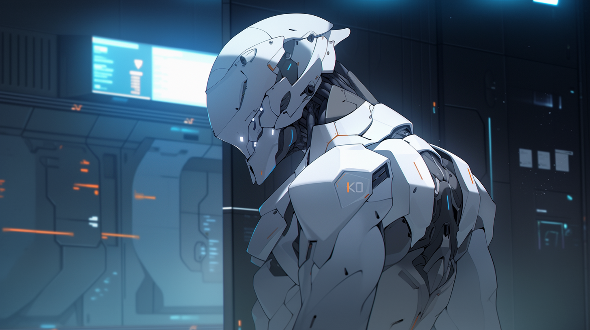

---
layout:
  title:
    visible: true
  description:
    visible: false
  tableOfContents:
    visible: true
  outline:
    visible: true
  pagination:
    visible: true
---

# MAVs

<figure><figcaption>
Modern MAV Combat Gear.
</figcaption></figure>

## Overview

MAVERICKS (MAVs) are the pinnacle of Angelis and GATA combat effectiveness. The best of the best, recruited from the ranks of the Guardians and Rapid Response.

The defining attribute of a successful MAV is their ability to operate independently, which was the basis for the [Unassisted Decisive Asset](mavs.md#origins) (UDA) program that preceded.

However, simply being recruited into the MAV program is not enough; recruits must be able to physically and mentally tolerate the battery of therapies and enhancements that separate MAVs from other Angelis assets.

Among other augmentations, modern MAV operatives have miniaturized cog implants installed directly in their brainstem, enhancing their reflexes, pain tolerance, and tactical and strategic thinking. These cog implants can be paired with portable external compute that the MAV can position strategically or carry with them throughout an engagement, even further magnifying their combat performance and situational awareness.

***

## **Origins**

In the crucible of the late Dark Decade, the desperate need to tame a chaotic world precipitated Atla's institution of the ["Existence Doctrine"](existence-doctrine.md), an operational philosophy which permitted numerous secret programs to temporarily explore experimental technologies and methods with minimal oversight.

### The Clear Serum Program

One Existence Doctrine program sought to discover the limit of individual human ability in order to produce the ultimate tactical operative. At its heart was an experimental gene therapy called ["Clear"](mavs.md#clear-serum).&#x20;

Designed to enhance the physical and mental capabilities of GATA forces, the therapy drastically improved reflexes, speed of thought and learning, immunity, and healing capabilities.&#x20;

However, it came at a cost; those who could endure the therapy experienced various side effects that required regular attending. One notable side effect was an extreme increase in metabolic rate, with subjects needing constant calories and hydration, and leaving them prone to overheating when sedentary.

The Clear Serum project was helmed by the very team that had created the Manna flower, led by Dr. Valter Koenig. While Clear was originally conceived by Dr. Koenig with the intention that it could lift up all of humanity, its side effects narrowed its viability to military and intelligence applications.

It is estimated that more than one hundred thousand Dark Decade and Reconstruction veterans had received some variant of the Clear Serum, most without their knowledge. Early Clear was heavily derived from Silver Manna and various genetic modifications based on classified research, however the exact formulation of Clear was always in flux, tweaked based on data from a world-wide DNA catalog being collected from Atlan refugee camps.

These early test subjects and their remarkable performance in the field inspired the creation of another Existence Doctrine Program; the Unassisted Decisive Asset program.

### Unassisted Decisive Assets

Those who survived the transformation were officially termed "Unassisted Decisive Assets" (UDAs). Singularly potent, and armed with GATA’s superior weaponry and equipment, a Maverick could replace an entire battalion, undertaking critical assignments, from asset retrieval or protection, to sabotage and assassinations. Over time, these much-mythologized one-person armies acquired a more colloquial title — the "Mavericks."&#x20;

While incredibly performant, the UDAs had one fatal flaw in the eyes of GATA's military leadership. They were human; unpredictable, diverse in their methods, and capable of disobeying commands.

It is believed that this very flaw was the reason that the original UDA development program was later redesigned from the ground up by Angelis when they assumed control of the program post-Existence Doctrine.

### End of the Existence Doctrine

When the Clear program and original UDA program were dissolved, all related records were scrubbed from the General Record by the AIC. Whispers persist that the UDA program was responsible for numerous infamous scandals during the Reconstruction Era, however these claims remain unsubstantiated.

And even darker rumors abound – some assert that ALTAR keeps retired UDAs in cryostasis, while others trade tales of renegade UDAs still operating in the shadows.

***

<figure><figcaption>
A MAV surveilling the situation.
</figcaption></figure>

## **MAVs: The Modern Super Soldier**

Under the aegis of Angelis, the First Quorum approved the formation of an official MAVERICK division shortly following the Bright Mesa attack. The controversial history and mythic status of the original UDA program and its "Mavericks" was intentionally muddied by using the same name.

MAVs can be identified on the battlefield by their white Combat Gear.

### The New MAV Development Program

Angelis refined the “asset development” process using a more modest therapeutic regime. They induce natural epigenetic changes with sound baths, and administer standard AKICEL rejuvenation therapies.

Combined with miniaturized cog implants in their brain stem to enhance their movement, and external hard-coded compute platforms that further extend their enhanced abilities, these more "reliable" assets can be remotely regulated by throttling their external cog's compute. In this way, modern MAVs can effectively be dialed up or down remotely by Angelis.

While the cog implant’s LMNL architecture prevents remote manipulation, if the implant is damaged or somehow disabled, the asset’s battlefield performance would drop precipitously. It is generally acknowledged that, while still extremely effective, modern MAVs are not as singularly effective as the original UDAs, partially due to their more conservative augmentations, and partially due to their reliance on cogs, making them not truly "unassisted" assets.

The modern Mavericks, commonly referred to as MAVs, are the ace up Angelis' sleeve. Dropping from orbital “Watchtowers” in Aegis pods, and using static tech to accelerate their descent and soften their landing, MAVs can be deployed anywhere around the world in a matter of minutes.

Monitoring gates, overseeing shipping routes, and rushing to emergencies in GATA-allied territories and homesteads, the Mavericks symbolize Atla's formidable might. Their reputation for precision, unwavering persistence and mission success makes them a deterrent few dare challenge.

### Operational Profile

MAVs aren't just reactive forces, knocking down challenges as they appear. Instead, they meticulously set up situations, dictating the flow of battles, creating and adjusting complex strategies on the fly. Their training and integration with their cogs, has finely honed their predictive abilities, allowing them to seize control of any battlefield.

However, MAVs aren't without their limitations. They thrive in solitary operations. Friendlies on the battlefield heavily constrain their ability to assume “decisive supremacy” in the engagement. This applies even to other MAVs.

***

## **Mavericks of Note**

Known only among program administrators, personnel, and the elite soldiers themselves, some names rise above the rest as highly notable Mavericks.

* Dante Newton, stands as a testament to the prowess of the original UDAs. With countless deployments to his name, he is best remembered by those in-the-know for facing an entire Free Territory militia in North Texas to complete his mission successfully at the cost of his own life.
* Finneas Hughes of Angelis, one of the last of the UDA's, who died eliminating the infamous Butcher of Bright Mesa. His genetic blueprint forms the basis of Angelis' next-gen peacekeeper program.

<figure><figcaption>
PHOBOS unchained.
</figcaption></figure>

* PHOBOS, known only by their call-sign, a much-mythologized Maverick, rumored to be the first current-generation MAV, successfully implanted with a COG relay in their brain stem.
