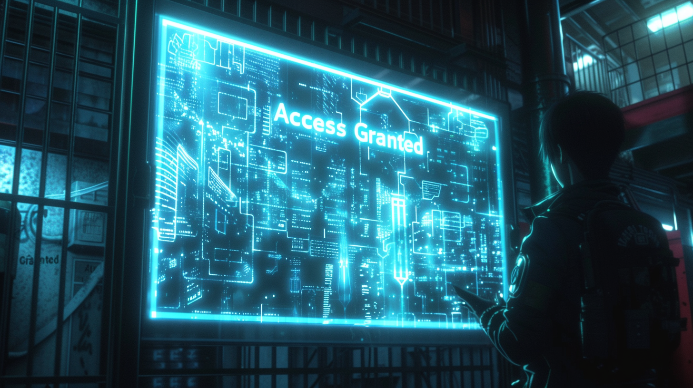

---
layout:
  title:
    visible: true
  description:
    visible: false
  tableOfContents:
    visible: true
  outline:
    visible: true
  pagination:
    visible: true
---

# Keys

<figure><figcaption>
A terminal requiring appropriate keys for access.
</figcaption></figure>

Keys are a fundamental component of The System and the New Dawn Accords. Keys are digital signatures that bestow specific privileges on their holder. Every key has its own rules, and while many keys can be bought, or traded, others can only be earned or assigned, and some can also be revoked.

Keys are an integral part of every-day life inside of districts, and to a wide but less ubiquitous extent, across Greater Atla and in NDA-compliant states. This is because life within the districts is built firmly on the autonomous, hard-coded infrastructure of The System. Keys are how you access your homes, your places of work, your networks and devices, and the districts themselves. Keys can grant you access to information and organizations, or to exclusive goods and services.

A key's cryptographic signature can be encoded in many different form-factors, whether it's in digital storage on data sticks, encrypted into media like art or music, embedded in the structure of physical objects, or stored in the mind and usable only by linking directly with systems.

When someone dies, any transferable keys they have pass according to their inheritance preferences. This will also occur if keys are not validated and remain dormant for ten years. If no inheritance is set, the keys will pass to their next of kin, and if none, they will pass to the System to be handled on a case by case basis. In GATA, these orphan keys go into the AIC's fully-transparent, long-term cold storage and can be claimed via an appeal to the AIC if there is a legitimate appeal.

### **Privileges**

When people seek to acquire keys, what they are really after are their associated privileges. The purpose of keys is to intelligently encapsulate specific privileges into discreet cryptographic objects that can be used by users of The System. By tying all privileges within The System to keys, GATA's decentralized government can operate efficiently and at a distance without having to micro-manage districts and enforce NDA-compliance and good governance directly.

Beyond GATA's keys, any enterprise, organization, or individual can instantiate their own keys in The System with whatever privileges they have to offer. Care is taken to ensure that keys and their associated privileges are thoughtfully composed to ensure that they don't lead to negative unforeseen consequences down the road, however mistakes are sometimes made.

***

## **Types of Keys**

### Citizenship Keys

Citizenship keys are bestowed to GATA citizens at birth. Citizenship cannot be revoked. All System activity is authenticated with Citizenship keys, meaning if you don’t have citizenship, you can’t use the System. These keys are biometrically validated once a year at System Terminals, but can be saved to digital storage in data sticks for every-day use. The Local Authority may request to authenticate citizenship keys, however citizens are not required by law to authenticate their citizenship keys to other citizens or enterprises.

Only citizenship keys that have been validated for the year can sign for other GATA privileges, like gate keys and System keys, or to collect their share of Yield.

### **Gate Keys**

Gate keys grant a citizen access to a particular district. Non-transferrable gate keys are assigned at birth to every GATA citizen born inside of a district. Transferrable gate keys can also be earned from or bestowed by private enterprises with an allocation of transferrable keys, or they can be traded on the market. However, in order to use a gate key, you must have the requisite citizenship keys.

### **System Keys**

### Testnet Keys

The most valuable (and illegal) keys are unrestricted System-level Testnet keys; illegal hard-coded keys that weren't destroyed during a district's transition from System Testnet. These keys can grant certain specific privileges, like access to sub-systems or granting exceptions to certain restrictions.

Every district is believed to have some, even Atla, however there have only been a handful of incidents of their use being discovered. In all cases, the transgressors were made examples, heightening the risk of trading in Testnet keys.

In the criminal underworld, myths persist of various unrecovered Testnet keys that can bestow extraordinary privileges, if only they can be found.

### **Private Keys**
