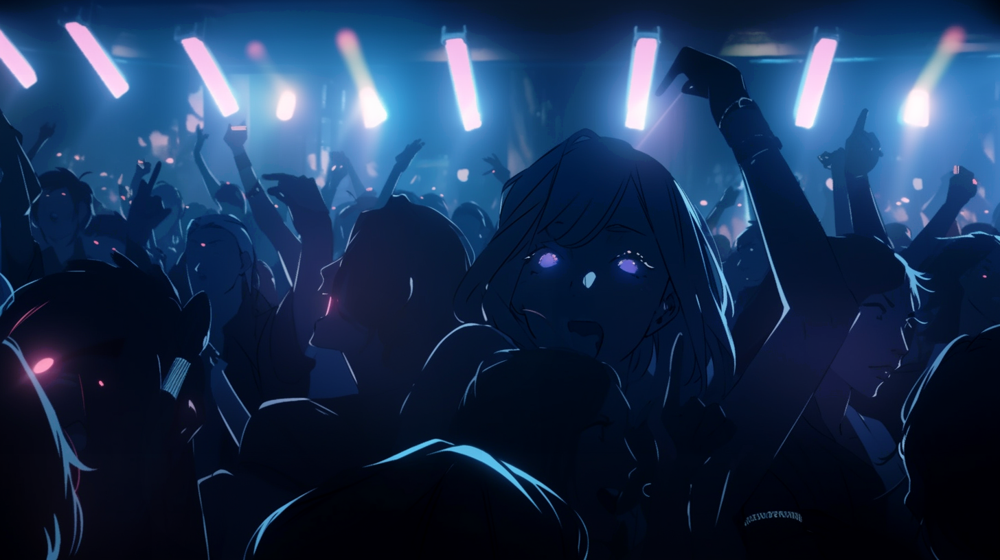

---
layout:
  title:
    visible: true
  description:
    visible: false
  tableOfContents:
    visible: true
  outline:
    visible: true
  pagination:
    visible: true
---

# Sync Raves

##

<figure><figcaption>
Ravers in the throws of the sync.
</figcaption></figure>

## &#x20;Overview

A new phenomenon growing in popularity among the disaffected younger generations in [GATA](../) and abroad: all-night parties where a blossoming art and music scene grows in the shadows. Sync Raves feature [sync jockeys](sync-raves.md#sync-jockeys), skilled [conduits](../../../overview/science-and-tech/links.md#conduits) who can connect to, and guide, and influence a crowds minds as a form of entertainment. Made possible by [links](../../../overview/science-and-tech/links.md) and modified [sync hubs](../../../overview/science-and-tech/sync-hubs.md). While synched, the mind of the conduit can dramatically influence the experience.&#x20;

***

## **Sync Rave Culture**

Sync raves are a response to GATA's [tight control and regulation](../politics/new-dawn-accords.md) enforced by the [AIC](../institutions/atlan-information-control-aic.md). In a world where people are constantly monitored and restricted, these underground raves offer an escape, an illicit world where the youth especially can feel free for the first time. The raves are a blend of old and new - the rediscovered music and instruments of the past, reinterpreted through modern technology and tastes, unleashed on the unstructured ecstasy of an eager scene.

The ambiance is ethereal; the sync hub creates a shared experience, a communal waking dream where individuals can release the normal world and sink into living experiences enhanced by music, light and color, touch, and [illicit substances](recreational-drugs.md). Vivid holograms puppeted by conduits dance in tandem with the music, shimmering in the haze, blending with the hallucinatory phantasms of someone else’s sensations.

### Sync Jockeys

Sync jockeys are highly skilled [conduits](../../../overview/science-and-tech/links.md#conduits) (people who can let information flow in/out of their link effortlessly), allowing them to connect a large number of people at once with the aid of a modified sync hub. While linked, the mind of the conduit can dramatically influence the experience.

Sync jockeys typically use performance or physical action to help synchronize such a large number of minds, but some can achieve strong effects with just a thought.

### Politics of Sync Raves

However, these raves are not just about entertainment or debauchery. They're a form of silent rebellion, a place where ideas that cut against [the System](../politics/the-system.md) are shared and disseminated. Though not explicitly political, they represent a fomenting expression of a generation's discontent with their lives under tightening, stifling control.

In GATA, these raves are absolutely taboo. Being caught participating in such an event would leave your fate at the discretion of local authorities. However, in the [Free Territories](../../free-territories/) and other regions, while they might not appreciated, they’re freely permitted and widely tolerated, often because local authorities might be partaking themselves.

### Origins

Sync raves originated at Arcadia in LA, from an experimental art and music scene that was far from the heart of GATA, where regulations restricting uncontrolled tech often went unenforced. One of its formative artists was a performer named Willow who was controversially apprehended and ultimately [exiled](../law-and-order/exile.md) from GATA.
