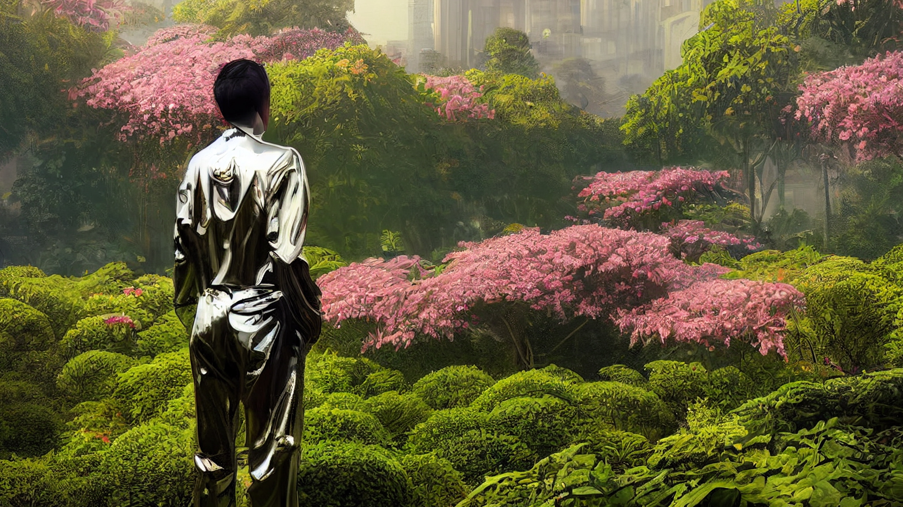

# The Walled Garden

###

<figure><figcaption>
A prisoner wandering the Walled Garden.
</figcaption></figure>

### Overview

With its strict border controls, and fairly restricted movement internally, Japan is sometimes referred to as 'The Walled Garden' by those on the outside. This moniker, however, has a double meaning inside of Japan, where it is used in direct reference to the Imperial Garden, an immense open-air prison for high-profile and highly-skilled prisoners of the state.

Prisoners in the Imperial Garden live under the perpetual gaze of the Imperial Court above, and are obligated to serve the state whenever called upon. Inmates in the garden wander its lush grounds for the rest of their days, and sometimes find their safety under threat from other inmates.
