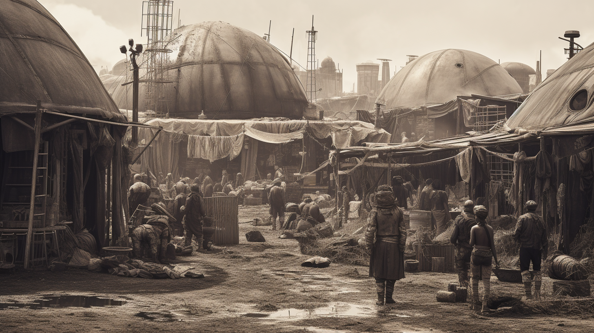

---
layout:
  title:
    visible: true
  description:
    visible: false
  tableOfContents:
    visible: true
  outline:
    visible: true
  pagination:
    visible: true
---

# The Dark Decade

<figure><figcaption>
An makeshift refugee camp during the Dark Decade.
</figcaption></figure>

The ten year period spanning from [The Crash](the-crash.md) in August 2052 until the [New Dawn Declaration](../../nations/gata/history/new-dawn-declaration.md) in November, 2062.

In The Crash, nearly every device on the planet with a general-purpose processor was irreparably corrupted, dealing an instant death blow to power, communications and the entire global supply chain, plunging the world into a brief, but perilous new dark age.

The Dark Decade was a global event that instantly dissolved the existing world order and resulted in famine, disease, violence, and mass migrations, punctuated with more localized atrocities and environmental hazards.

During the first 6 months of the Dark Decade, 1.2 billion people died, primarily due to famine and disease. Over the following 9 years, an additional estimated 4 billion people died due to causes attributed to the Dark Decade.

## Timeline of Events

* **August 2052, The Crash:** Sudden corruption of general-purpose processors globally, leading to the immediate collapse of power grids, communications, and supply chains.
* **Late 2052:** Rapid onset of famine and disease due to the breakdown of food distribution and healthcare systems, leading to widespread mortality.
* **Early 2053:** Emergence of localized warlords and factions vying for control over remaining resources, resulting in violence and further destabilization.
* **Late 2053:** Environmental disasters worsen as nuclear reactors, dams, and other critical infrastructure begin to fail, and ecological profiles shift without human influence, leading to additional catastrophic events.
* **2052-2056:** Mass migrations as people flee uninhabitable areas in search of food, water, and safety, exacerbating tensions in less affected regions.
* **2056:** The formal founding of Atla by the civilian and military population living in the JAC flotilla. Atla begins to establish stable refugee camps around the Atlantic Ocean region.
* **2056-2060:** Grassroots efforts to rebuild society begin to emerge, focusing on sustainable living and the re-establishment of local communities.
* **2061:** Atla implements the first build of The System, a new model for infrastructure design prioritizing resilience and decentralization to avoid past vulnerabilities.
* **November 2062:** New Dawn Accords are ratified by Atla, and GATA is formed. Considered by many historical scholars to be the end of the Dark Decade, and the beginning of the Reconstruction era.

***
