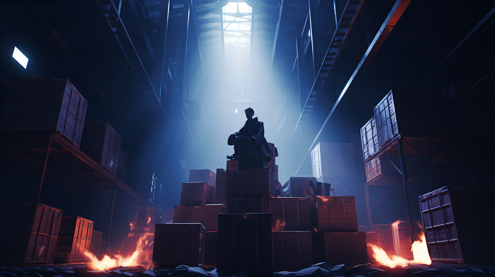

---
layout:
  title:
    visible: false
  description:
    visible: false
  tableOfContents:
    visible: true
  outline:
    visible: false
  pagination:
    visible: true
---

# 📖 Introduction

<figure><figcaption></figcaption></figure>

## Earth, 2125.

The [Greater Atlantic Territorial Alliance](../../nations/gata/) (GATA) stands as the indisputable world power, offering stability at the cost of strict regulation and control. Its influence radiates from its oceanic capitol, [Atla](../../nations/gata/key-locations/atla.md), a symbol of both progress and decadence. From its inception, GATA has drawn on an unlimited well of national pride and goodwill for its role in lifting the world from the [Dark Decade](../history/the-dark-decade.md). And all the while, its new order took form.

<figure><figcaption></figcaption></figure>

Today, A vast [hard-coded](../science-and-tech/hard-code.md) infrastructure called [The System](../../nations/gata/politics/the-system.md) governs GATA. Designed with ‘physical functions’, The System’s architecture is predictable and incorruptible, but it is also inflexible, and change can often be slow. While the masses wait for System updates, others simply game The System. In this world, "[keys](../../nations/gata/politics/keys.md)" are the ultimate commodity, gateways to power, permissions, and privilege.

<figure><figcaption></figcaption></figure>

Meanwhile, the scattered [Free Territories](../../nations/free-territories/) resist GATA's imposition, championing personal liberty while plagued by the remnants of [virus-riddled legacy technology](../science-and-tech/the-daemon-virus.md). The handful of [remaining super-states](../world-order.md) cautiously circle this tense dynamic, seeking to fulfill their own ambitions from under GATA's dominating shadow.

<figure><figcaption></figcaption></figure>

Across the world various cultural movements churn within the masses. The Eidetics eschew technology, seeing it as a channel for malevolent forces. The extremist group 'The CURE' takes this fear to its violent conclusion in their campaign to oppose technological advancement. Conversely, institutions like [ALTAR](../../nations/gata/institutions/altar.md), the Ministry of the Future, or the agents of [private enterprise](../../nations/gata/enterprise/), forever pull at the threads of innovation seeking some yet-unrealized satisfaction.

<figure><figcaption></figcaption></figure>

A cadre of influential political and [criminal syndicates](../../nations/gata/criminal-element/syndicates.md) weave themselves through this ideological tapestry, controlling territory, manipulating The System, trading in illicit tech and information, vying for any scraps of advantage and control.

<figure><figcaption></figcaption></figure>

Amidst these larger conflicts, pockets of subversion and escapism thrive. In [the burgeoning counterculture](../../nations/gata/underground-scene/), the youth use their intuitive understanding of The System to skirt its restrictions. They are a generation born into an authoritarian malaise, gifted abundance and ease in exchange for their agency. In the underground scene, hidden from GATA’s gaze, they futilely push on the boundaries of their lives.

<figure><figcaption></figcaption></figure>

But the human destiny has already been written in the inflexible physical functions of The System. The future has only one direction: outward from Atla. Peace. Abundance. Captivity for all.

***


[opening-crawl.md](opening-crawl.md)



[about.md](about.md)



[themes.md](themes.md)



[Broken link](broken-reference)

