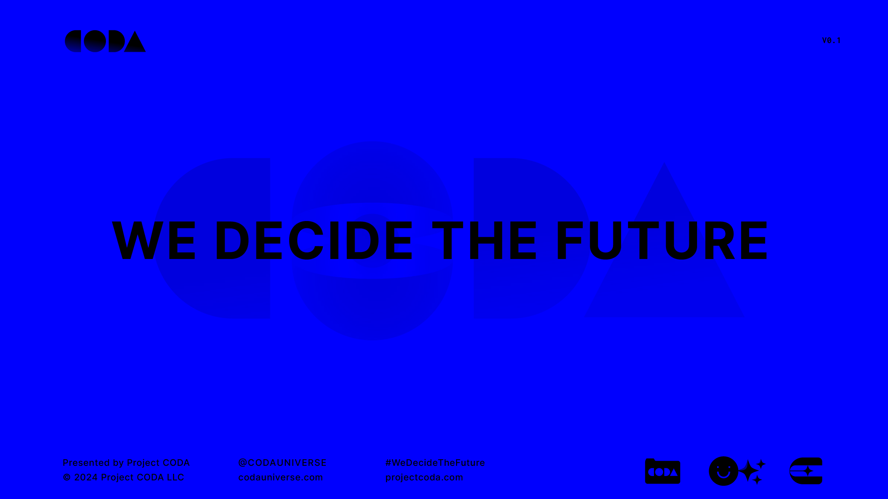

---
layout:
  title:
    visible: true
  description:
    visible: false
  tableOfContents:
    visible: true
  outline:
    visible: true
  pagination:
    visible: true
---

# 📄 About

<figure><figcaption></figcaption></figure>

The **CODA Universe** is an experimental storytelling project based on a foundational on-chain canon that is purpose-built for generative media and experiences. It is a rich world with interrelated fragments of lore and themes that reflect and interrogate our world today.

**The CODA Saga** is the canonical story that sets the stage for the CODA Universe. It begins in the shadowy corners of a nascent underground rave scene, where skilled conduits called sync jockeys synchronize the crowd's minds in hallucinatory bliss. There, blurred in the haze and pulsating bass frequencies, a shadow speaks of "CODA" for the first time.

**Project CODA** is a collaborative initiative led by [dxxmsdxy](https://app.gitbook.com/u/hBfh4SD8ZWON5lcbgGqAYX8f6jG3 "mention") to work with human creators and fans to expand and refine the CODA Universe through a wide range of entirely new interactions and experiences, leveraging novel technologies like AI and distributed ledgers to drive business intelligence and IP management.

***

## Inception

Work on the CODA Universe began in January, 2021. The vision was to develop a new kind of IP built from the ground up for a media landscape that would be native to web3 and generative AI.

First, the CODA Saga was written; a character-centered epic that charts the course of the world's central conflicts and themes, starting in the fictional year of 2125. The story became the scaffolding for a rich and expansive world that was painstakingly developed over the course of years.

<figure><figcaption></figcaption></figure>

 

<figure><figcaption></figcaption></figure>

The fundamental building blocks at the foundation of the CODA Universe are its 100+ characters and its hyper-linked fragments of lore, which are instantiated permanently on-chain, and which serve as training and contextual data for generative systems.

The driving force behind the project was the realization that generative tools were soon going to make the creation of massive works trivial. The aim was to conceive of the largest possible collaborative creative project for such a paradigm, and to begin working on it early, so that there would be time to let the world mature before the critical tools emerged.

***

## World & Themes

<figure><figcaption></figcaption></figure>

 

<figure><figcaption></figcaption></figure>

Set 100 years from now, the world of the CODA Universe is a possible future of our world. It is both strange and familiar. The notions of sci-fi encapsulated in the world and its themes are reflective of the challenges and dilemmas posed by encryption and privacy, decentralization, artificial intelligence, human nature, and the unresolvable tension between control and freedom, order and chaos.

The world is grounded by a layered history that has organically unfolded into a complex world order. The resulting conflict space is intended to serve as a dynamic super-collision of our competing futures transposed into fictional avatars. Its technologies are game-mechanic tailored symbols for high-utility innovations that fit within a reasonably plausible regime of science and engineering.

The world and its history are lined up in just such a way that the world of 100 years from now depicted in the CODA Universe is facing facsimiles for the very crises that we are set to face in our immediate and near-term future.

On January 1st, 2025, we will start the CODA Universe's clock. From that moment forward, the CODA Universe will always be set 100 years in our future, and its canon will be developed on-chain.

<figure><figcaption></figcaption></figure>

## Creator

The CODA Universe was created by [dxxmsdxy](https://www.twitter.com/dreeemtheartist/?hl=en), a pseudonym of one of the earliest builders and artists in crypto and ordinals. The CODA Universe is part of their continuing exploration of 'interpretable art'.&#x20;

## Credits

* The CODA Universe v1 Canon was created by [dxxmsdxy](https://app.gitbook.com/u/hBfh4SD8ZWON5lcbgGqAYX8f6jG3 "mention")
  * Special thanks to Brian Wong, Sunil Madhu, Russell Verbeeten & Lukas Cheung\

* Art direction, graphic design, and generation by [dxxmsdxy](https://app.gitbook.com/u/hBfh4SD8ZWON5lcbgGqAYX8f6jG3 "mention")\

* Prompt & agent engineering by [dxxmsdxy](https://app.gitbook.com/u/hBfh4SD8ZWON5lcbgGqAYX8f6jG3 "mention")\

* "BRIGHT DAY" CODA Anime Pilot written, generated, edited by [dxxmsdxy](https://app.gitbook.com/u/hBfh4SD8ZWON5lcbgGqAYX8f6jG3 "mention")
  * Music by **SUV**

