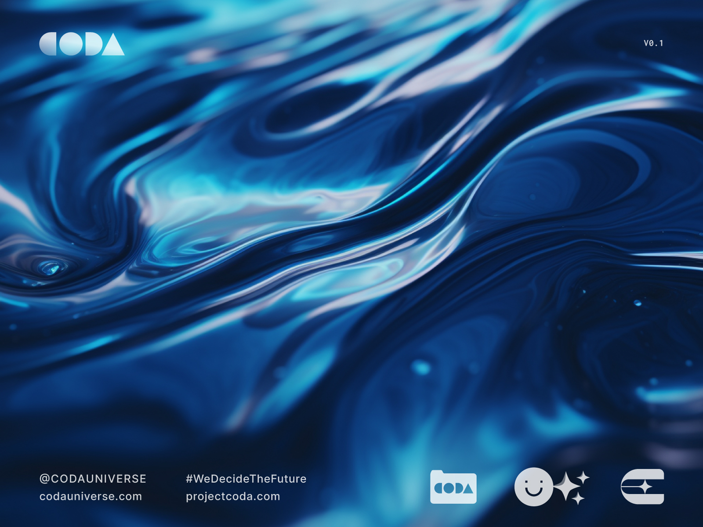

---
layout:
  title:
    visible: false
  description:
    visible: false
  tableOfContents:
    visible: true
  outline:
    visible: true
  pagination:
    visible: true
---

# 💭 Themes

<figure><figcaption></figcaption></figure>

Working within the CODA Universe is just as informed by the thematic undertones as it is by the canon.&#x20;

The CODA Universe refracts the complex spectrum of human experience through the moods, attitudes, and structural regimes that permeate and pool around its world.

This list of themes is not exhaustive; the themes of the CODA Universe are many, and subtle. Any story can be told in a way that resonates with the world; it may simply be a matter of solving for the who, where, or when.

Lore that becomes "canon" usually resonates or clashes with the existing themes in interesting and intentional ways.

## Major Themes

* True Connection
* Individual vs Collective
* Freedom vs Security
* The Role of the Artist
* Power & Privilege
* The Human Destiny
* The End of the World
* Secrets & Shadows

## Minor Themes

* Generational Legacy
* Love vs Duty
* The Nature of Consciousness
* The Wonder of Existence
* Time & Retro Causality
* The Phenomenon
