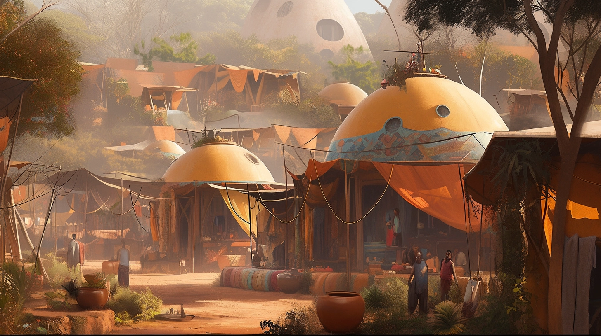
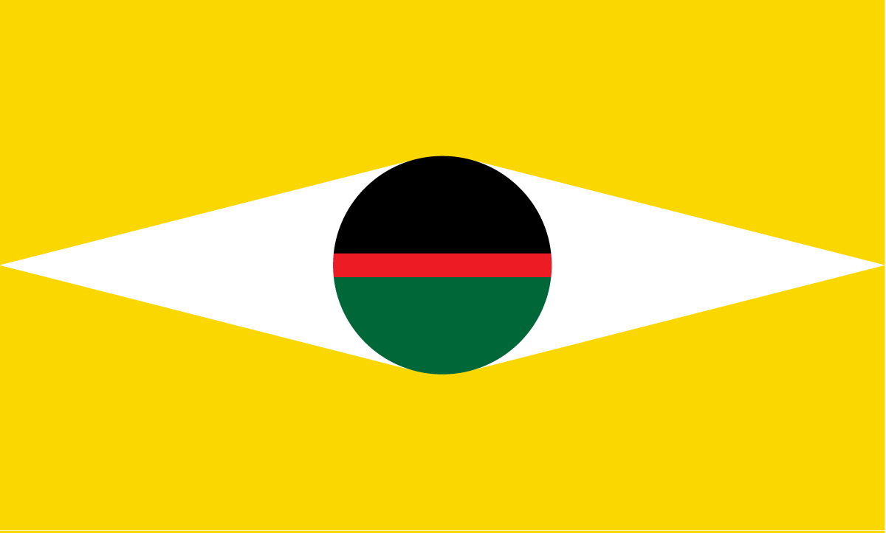

---
layout:
  title:
    visible: true
  description:
    visible: false
  tableOfContents:
    visible: true
  outline:
    visible: false
  pagination:
    visible: true
---

# 🔵 The Basics

<figure><figcaption></figcaption></figure>

## Basic Info

* Founded: 2038
* Government: Formal Anarchy
* Region(s) West Africa, East Africa, Central Africa, South Africa (contested)
* Population: 2,915,000,000

***

## Overview

Formed as a political block before the Dark Decade. The African Union managed to survive the Dark Decade relatively unscathed due to its distributed, secure, and sustainable infrastructure.&#x20;

Still influenced by their decentralized “kijiji” governance model that came to prominence during the Dark Decade. Follows the philosophy of radical reciprocity, responding to like with like.

The African Union exchanged land, resources, and labor for a military pact with the Technologically intimidating fleet that eventually would grow to become Atla.

Although the AU has no official capitol, a significant majority of its officiation and industry emanates from Nairobi.

<figure><figcaption>
The AU's flag.
</figcaption></figure>

***

## Comparative Stats

* **Freedom: 8** - The AU enjoys individual freedoms that are envied by all outside of GATA
* **Luxury: 8** - Abundance and reciprocity has spread comforts across the AU
* **Military: 3** - GATA’s support has freed the AU from maintaining a national military
* **Education: 8** - A long tradition of world-class science and tech education
* **Technology: 6** - Though high tech is available, most are conservative on tech use
* **Health: 8** - The AU enjoys the best of GATA’s medicine, and healthy lifestyles

***

## Key Points

* Created in response to the need for collective African representation in the 21st century.
* Early partnership with Atla during the Dark Decade helped cement its stature.
* Operates with a decentralized structure, emphasizing cooperation, honor, curiosity, and an ideological commitment to reciprocity.
* Faces a growing secessionist movement in South Africa
