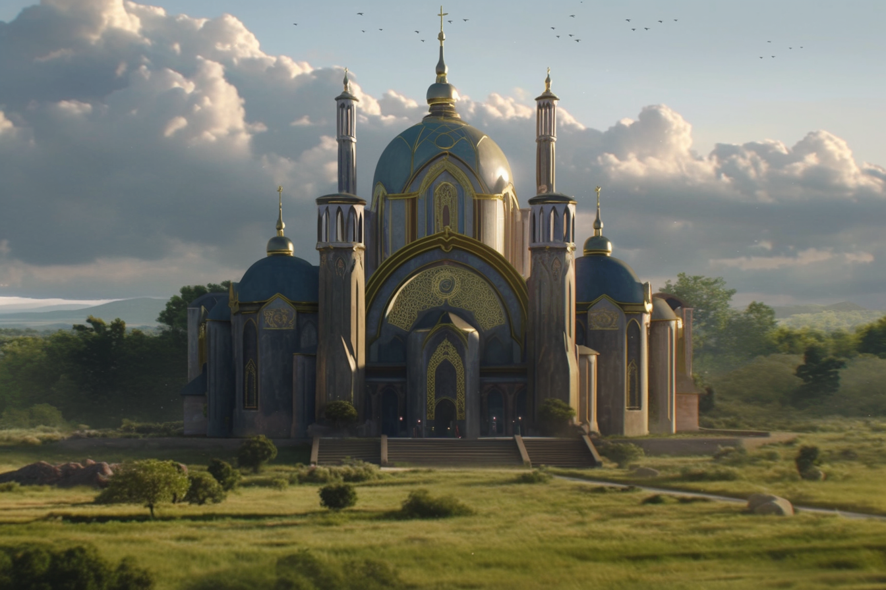

---
layout:
  title:
    visible: true
  description:
    visible: false
  tableOfContents:
    visible: true
  outline:
    visible: false
  pagination:
    visible: true
---

# Church of the Sky

<figure><figcaption>
A house of worship belonging to the Church of the Sky.
</figcaption></figure>

## Overview

With its inception during the hardships of the [Dark Decade](../../history/the-dark-decade.md), the Church of the Sky spearhead a spiritual movement that emerged from refugee populations taken in by indigenous tribes of North America. This multi-polar spiritual organization has evolved into a significant political voice in [the Free Territories](../), embodying for its followers the connection between the Creator and the Earth.

Combining indigenous re-articulations of Judeo-Christian ideas with naturalistic spiritual practices that encode hunting, harvest cycles, and mythology, their teachings offer powerful insights into survival and deeply-rooted humanistic values. The church freely incorporates religious symbols and teachings from all schools, attempting to translate concepts into the language of nature and its many spirits, the Earth, the sky, and the Heavens.

***

## **Historical Context**

Amid the chaos of the Dark Decade, people across North America fled population centers. Many either accidentally wandered into, or intentionally sought refuge in First Nations reserves. Those who went with peace and humility were often welcomed, and while the outside world fell into despair, they lived relatively well.

The tribes provided shelter, sustainable food production, and critical knowledge about the local ecological and seasonal concerns. Refugees were exposed to a dignified way of life that was compatible with the unforgiving reality of nature.

This pattern of desperate people seeking refuge among indigenous populations was common worldwide. As the Dark Decade continued, these indigenous tribes emerged as spiritual leaders, indispensable teachers, and deep wells of knowledge about the local land.

In South Dakota, a large population of Christian refugees had taken shelter with the Lakota. Beginning with a small group in this community of refugees, tribal teachings and rites were blended with Judeo-Christian concepts, and eventually came to be known as the "Teachings of the Sky". After several years, the notion of a pilgrimage to each First Nations community to proselytize this "new gospel" took form, and many small groups ventured off.

When these groups reached their destinations, they often found similar circumstances as with the Lakota, with the indigenous peoples teaching and sheltering large populations of displaced peoples. The accumulated gratitude and reverence for indigenous teachings by refugee populations living with the tribes was fertile soil for their message.

By the final years of the Dark Decade, missionaries professing the Teachings of the Sky had found their way to most of the First Nations reserves and Atlan refugee camps in North America. Their rapidly increasing numbers ultimately led to the formal establishment of the "Church of the Sky" during the Reconstruction, a loose religious organization with congregations led by indigenous teachers who incorporate Judeo-Christian beliefs and iconography into sermons based on their traditional beliefs.

***

## **Cultural and Spiritual Beliefs**

The Church of the Sky professes a deep respect for nature, viewing it as a sacred entity with two aspects: the Earth and the Heavens, with humanity existing in the space between them—the sky.&#x20;

In their teachings, the Sun is also of the sky, and is humanity's bridge to the sacred; the only knowable face of God. It is directly associated with Jesus Christ, symbolizing enlightenment, guidance, and the life-giving force of the Creator. The spirits that emerge from, and animate the elements of the Earth are interchangeably referred to as angels.

The moon, which governs the tides and illuminates the night, is the lover of the Earth. She represents the rhythm and order of the universe. The cycles of the moon give time to the Earth, and is the source of all change and growth, as well as the source of aging and mortality.

The stars are the souls of the righteous, both ancestors and descendants, watching over and guiding the living from the Heavens. When a star dies, a soul is born on the Earth, and when a human dies, a new star is born. For the church's adherent's, gazing at the night sky conjures a deep sense of hope, continuity, and the vast landscape of who we really are.

In general, their spiritual rituals and practices are heavily influenced by the cycles of nature—seasons, celestial movements, and the life cycles of flora and fauna, overlaid with Judeo-Christian motifs. They believe in living in harmony with the Earth, advocating for sustainable hunting and gathering practices that honor the spirit of the land and its creatures, and finding balance, or "lightness" within oneself.

Their deep convictions regarding the sanctity of nature occasionally place them at odds with the interests of [GATA](../../gata/the-basics.md), who actively modify the weather and engineered the invasive [Manna flower](../../science-and-tech/the-manna-flower.md), as well as other factions within the Free Territories who disregard the future of the land in pursuit of short-term exploitation.

Borrowing from numerous indigenous teachings, their mythology is rich with tales that are not only entertaining but also serve as allegories for survival, morality, and the human condition. These stories often feature characters and spirits from traditional lore, adapted to the teachings of the organization to guide followers in wisdom and ethics.

### Places of Worship

It is typical for a particular church to be dedicated to the Earth, the Sky, or the Heavens. The beliefs espoused in all of them are largely similar, however the emphasis of their sermons and the focus of their rituals and spiritual practices are heavily influenced by this alignment.

Generally speaking, a church dedicated to the Earth most resembles a traditional Abrahamic house of worship, whereas a church dedicated to the Sky is typically a larger, gold ornamented, semi-enclosed structure with an open roof, and modest wooden pews arrayed in a grass courtyard. A church dedicated to the Heavens is simply indicated by a golden pillar planted in an open field, or atop a mountain.

### Death

When a human dies at peace, a new star is born, and they return to the Heavens where they will watch over and guide humanity from outside of time, which is given to the Earth by the Moon. If a human should die with unfinished work, they do not return to the Heavens, but rather reincarnate as an animal, where they can see their work done.

The Church of the Sky teaches that there is no real Hell, and that it is a misunderstood concept. Hells exist only within the theatre of experience for a Self, which is an inherently personal and un-real place. In other words, a Hell is a place of one's own creation; a product of living in misalignment with the Creator and one's true Self. But with the gift of time bestowed on the Earth by the moon, all Hells can be escaped, and all balance can be restored.

The most common burial rite for devotees in the Church of the Sky is the funeral pyre, however graveyards remain common in many regions, and it is also very common for remains to be interred at the base of saplings.

***

## **Influence and Power**

Since its inception, the Church of the Sky have grown dramatically in size and influence, now recognized as a significant spiritual authority within the Free Territories and beyond. Adherents hold positions of power in numerous institutions and enterprises, advocating for modest lifestyles, ecological sustainability and respect for the Earth, Sky, and Heavens. Their influence is also cultural, affecting arts, music, and public life.

As a result of their far reaching influence, many organizations affiliated with the Church of the Sky have amassed fortune and favor. Evangelical preachers preside over congregations that number in the tens of thousands, and can bend the ear of very influential people.

Today, the Church of the Sky are at the forefront of ecological and spiritual education, teaching not only members of the Church, but anyone willing to learn about the importance of ecological balance and spiritual health. They contribute to ecological restoration projects, speak out against questionable geoengineering practices, and are pivotal in intercultural dialogue about sustainability and spirituality.

While many of the secular youth in the Free Territories today reject the theistic religious beliefs of the past, they are sympathetic to the teachings of the Church of the Sky. The Church of the Sky also finds common cause with many Eidetics, and some even contend that they are in league with the extremist militant group known as The Cure.

In reality, the Church of the Sky is not a singular unified organization, but rather many tribes each with their own interests and affiliations, from the [local governments](../../gata/politics/districts.md#local-government) of [districts](../../gata/politics/districts.md), to criminal syndicates, Sovereign militias, and more.
