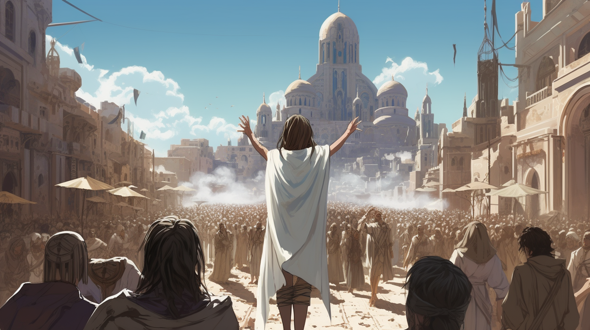

---
layout:
  title:
    visible: true
  description:
    visible: false
  tableOfContents:
    visible: true
  outline:
    visible: false
  pagination:
    visible: true
---

# Eidetics

<figure><figcaption>
An eidetic proselytizing to a crowd of people.
</figcaption></figure>

## Overview

Adherents to the Eidetic movement reject technology, viewing it as humanity's greatest transgression. They espouse a life intertwined with nature and spirituality, and see [the Crash](../../history/the-crash.md) and [Dark Decade](../../history/the-dark-decade.md) as a divine instruction for humanity to live humbly. Many sects revere the [Manna flower](../../science-and-tech/the-manna-flower.md) as a gift from above, denying its Scientific origin.

Thriving primarily among [Sovereign peoples](sovereigns.md) in [the Free Territories](../), the movement finds a terrible champion in [The Cure](../politics/the-cure.md), a leaderless terrorist organization merging the ideological zeal of the older generations with the capable support of an extremist, secular environmentalist cohort among Sovereign youth.

***

## Beliefs

Eidetics live by a simple creed: reject tech, embrace nature, and seek spiritual harmony. They view the innovation-hungry civilization embodied by [GATA](../../gata/the-basics.md) and the other major powers as profane, and a departure from humanity's purpose. They regard the Crash as a wake-up call or a second chance for humanity to reset and live correctly.

The most central symbols to Eideticism are [the Manna flower](../../science-and-tech/the-manna-flower.md), revered as a divine gift, and the white wraps that they wear on their arms or hands, symbolizing their refusal to touch technology. Wraps must be removed before using technology, and can only be re-applied by an eidetic elder or [Keeper](eidetics.md#keepers-of-eden).

Across the world, eidetic beliefs often fuse with local religious traditions. The Crash and the subsequent Dark Decade are interpreted through the religious lens, seen either as divine punishment for humanity's hubris or as an opportunity for a societal reset and return to a simpler, more harmonious way of life; the reassertion of the Garden of Eden on Earth.

This belief system is not monolithic but is rather a spectrum of related ideologies, encompassing believers from many spiritual traditions, and also attracts secular followers who share the movement's skepticism of technology's role in society. However, eidetic leaders often clash with many other religious organizations, like the [Church of the Sky](children-of-the-sky.md), who maintain a more pragmatic relationship with technology and the powers that be.

It is common for Eidetics to find themselves at odds with the world around them, whether they live within a district, [Greater Atla](../../gata/politics/greater-atla.md), and most other states where the prevailing attitudes range from exuberant innovation to resigned passivity. Even in the Free Territories, eidetics grate up against the Sovereign disdain for the Manna flower, which many see as the definitive symbol of [Atla](../../gata/key-locations/atla.md) and [GATA](../../gata/the-basics.md).&#x20;

### Keepers of Eden

Keepers are deeply versed in the narratives of the Dark Decade and the philosophies grounding their rejection of technology. They play a crucial role in maintaining the ethos of the Eidetic world view, ensuring its transmission across generations and fostering a deep connection with the environment and the wider community.

### Common Customs

* **Tech fasts:** Regular periods where any form of technology is avoided, allowing practitioners to be more present and in tune with their humanity.
* **Manna gatherings:** Seasonal events to plant, tend to, or celebrate the blooming of Manna flowers, symbolizing hope and rebirth.
* **Sermons of Eden:** Public recounting of The Crash and Dark Decade, reinforcing a shared mythology, lessons learned, and the importance of their creed.
* **Wrapping ceremonies:** Ritualistic wrapping of arms or hands to renew an adherents vows to abstain from the use of technology.
