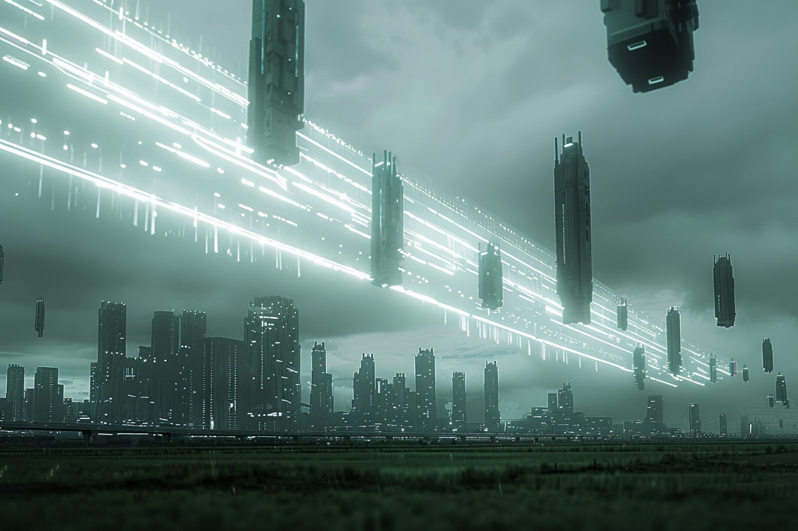

---
layout:
  title:
    visible: true
  description:
    visible: false
  tableOfContents:
    visible: true
  outline:
    visible: true
  pagination:
    visible: true
---

# Sentinels

<figure><figcaption>
Static sentinels defending the district field walls from incursions.
</figcaption></figure>

## Overview

Sentinels are [GATA's](../the-basics.md) autonomous border defenses found at the [field wall](field-walls.md) perimeter of many [districts](../politics/districts.md), particularly around more remote districts where [wallrunner](../criminal-element/wallrunners.md) and [Sovereign militia](../../free-territories/military-defense/sovereign-militias.md) activity is more prevalent. They're large airborne pillar-like structures that use [static technology](../../science-and-tech/statics.md) to move through the Earth's gravitational field.

Sentinels support [Gate Patrol](../law-and-order/gate-patrol.md) operations, and provide critical sensor information, and house air-to-ground weapon systems and other deterrents. They're controlled by onboard [cogs](../../science-and-tech/cogs.md), and each sentinel operates independently in compliance with GATA's [strict regulations](../politics/new-dawn-accords.md) restricting the use of [technology](../law-and-order/tech-regulation.md) and [data](../politics/whole-privacy-protection-wpp.md).

When incursions, threats, or other anomalies are detected beyond a district's perimeter, sentinels intelligently redistribute themselves along the border.
