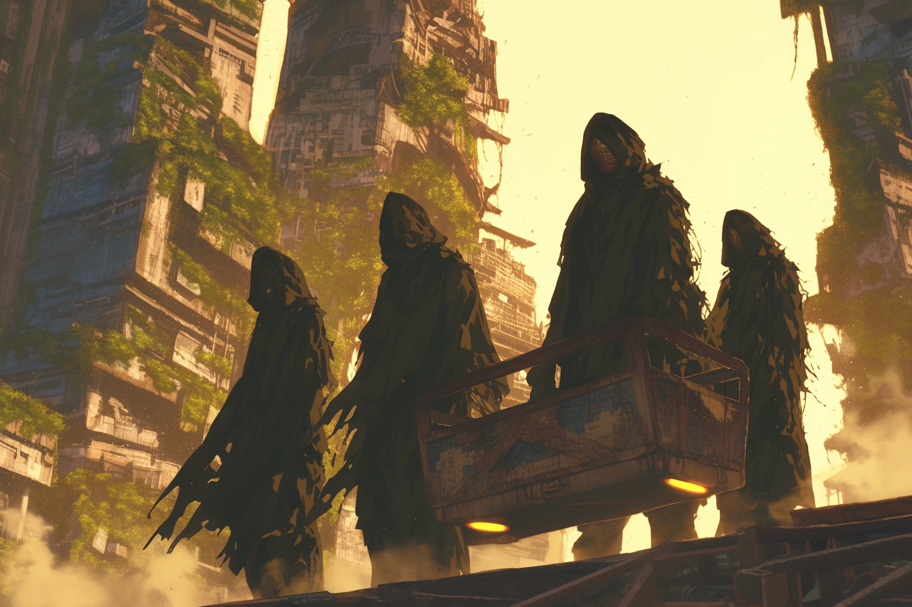

---
layout:
  title:
    visible: true
  description:
    visible: false
  tableOfContents:
    visible: true
  outline:
    visible: true
  pagination:
    visible: true
---

# Scavengers

<figure><figcaption>
A crew of scavengers venturing deep into a hostile Old World ruin.
</figcaption></figure>

## Overview

Scavengers play a crucial role in the unofficial economy of the world, navigating the remnants of [the Old World](../../history/the-old-world.md) to uncover valuable resources and artifacts. These individuals, driven by necessity, greed, or sheer curiosity, traverse dangerous and often lawless territories in search of long-forgotten relics that hold some value to someone, somewhere, in hopes to claim their reward.

***

## Historical Context

Scavenging began out of desperate necessity during [the Dark Decade](../../history/the-dark-decade.md), a period of widespread chaos and societal collapse. As humanity entered [the Reconstruction era](../../history/the-reconstruction.md), scavengers became essential for finding legacy technology, raw materials, and cultural artifacts needed for rebuilding, and piecing together the mysterious of the Old World's final days. This practice continues today, driven by the high demand for rare Old World treasures and overlooked secrets.

***

## Scavenger Operations

<figure><figcaption>
A band of well-outfitted scavengers hunt an artifact of value.
</figcaption></figure>

Scavengers operate in various environments, from sprawling, overgrown forest-cities, to abandoned industrial complexes, and eerie suburban wastelands. Their targets include raw materials, [legacy tech](../law-and-order/tech-regulation.md#overview), books, media, jewelry, and anything else that may catch their discerning eye. Their finds determine their alliances and risks.

Some scavengers work for [criminal syndicates](syndicates.md), retrieving high-value items for the black market. Others operate independently, alone or in teams, relying on their skills to survive and profit. There are also those hired as [dark operators](../enterprise/operators.md#dark-operators) by private clients to find specific items or information, often involving complex and dangerous missions.

***

## Relationship with Smugglers

Scavengers have a symbiotic relationship with [smugglers](smugglers.md) and [wallrunners](wallrunners.md) who help transport scavenged goods through dangerous territories, or across heavily guarded [district](../politics/districts.md) [field walls](../borders-and-travel/field-walls.md).

These goods are sold to clients or vendors, fetching high prices due to their rarity. Their dealings often bring scavengers into contact with dangerous criminal syndicates and their agents, or [Sovereign militias](../../free-territories/military-defense/sovereign-militias.md), requiring a certain amount of moral flexibility from scavengers. This black market trade ensures continuous flow of goods and profits for both parties.

***

## Legal and Social Implications

<figure><figcaption>
A scavenger overlooks an abandoned Old World city that has fallen to ruin.
</figcaption></figure>

While scavenging is not explicitly illegal, it is frowned upon by authorities, especially in the [Greater Atlantic Territorial Alliance (GATA)](../the-basics.md). Possession of illegal contraband carries [severe penalties](../law-and-order/tech-regulation.md). In [the Free Territories](../../free-territories/the-basics.md), scavenging is more openly practiced but comes with risks, including rival scavengers, hostile factions, and environmental hazards.

GATA is known to deploy [sentinels](../borders-and-travel/sentinels.md) to guard hazardous ruins, deterring scavengers. The black market value of legacy tech makes scavenging lucrative but perilous. The younger generations are drawn to scavenging for the thrill and the mysteries of [the Old World](../../history/the-old-world.md).

***

## Cultural Impact

<figure><figcaption>
A crate of refurbished Old World music gear.
</figcaption></figure>

Scavengers are seen as both outlaws and pioneers, risking everything to reclaim lost fragments of human civilization's fading past. Their stories and discoveries inspire many, linking the past to the future.

In the underground [sync rave scene](../underground-scene/sync-raves.md), scavenged musical equipment and media have become particularly popular in recent years, blending the old and new in a celebration of rebellion and creativity. These raves symbolize the youth's growing air of defiance against GATA's control and their yearning for a freedom and self-expression that they associate with that forgotten age.
