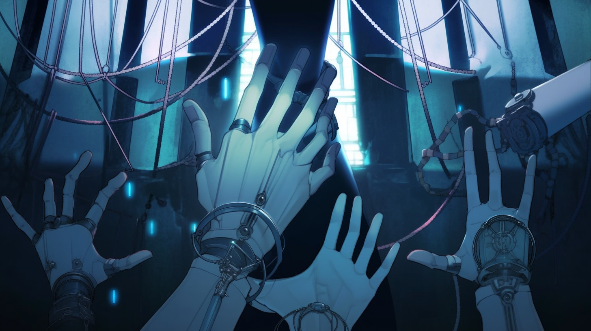
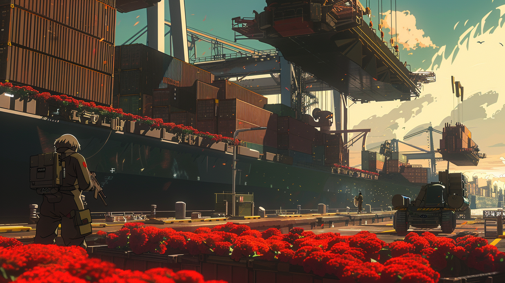

---
layout:
  title:
    visible: true
  description:
    visible: false
  tableOfContents:
    visible: true
  outline:
    visible: true
  pagination:
    visible: true
---

# Syndicates

## Hundred Hands

<figure><figcaption></figcaption></figure>

The largest criminal syndicate in the world. Known to operate in all corners, the Hundred Hands are a network of secretive illegal enterprises and shot callers united in one goal; to circumvent all walls, pick all locks, and "take all that can be taken".

The Hundred Hands is a decentralized organization, made up of Eyes, Heads, and Hands. The Eyes are always watching, informing for the organization through clandestine communication channels. The Heads decide what the key threats and opportunities are, and the Hands execute the will of the Heads.

Feared by independent gangs and upstart crime bosses, because once you reach a certain size you are faced with a simple choice; either pay your dues to the Hundred Hands, or prepare for war. A handful of newer syndicates have fought bloody wars to earn an equilibrium with the Hands, however the vast majority who challenge them are either wiped out or consumed. Their mere mention sends shivers down the spine of even the most hardened street boss.

The Hundred Hands are a largely apolitical organization with no clear allegiance or core values aside from its own conglomeration of power. While their operations in the Free Territories are larger and more industrious, permeating entire Free Cities, their presence is most domineering in the Gray Zones within districts where they are seldom seen, but always felt.

### Eyes

For every Hand, there are more than a thousand Eyes. Eyes are gang members, debtors, opportunists, and spies, all feeding the Heads with information. Eyes have infiltrated numerous enterprises, institutions and criminal organizations, and where there are no Eyes, the Heads will send a Hand to create one by turning people though bribery or coercion.

### Heads

The Heads are some of the most powerful criminal bosses around the world. Renowned for their ruthless tactics and cunning strategies. With their identities shrouded in mystery, the Heads are an invisible adversary. More mysterious than their identities, however, are their intentions.

It is speculated by self-appointed scholars of the criminal underworld that the first Heads were former heads of state and other governors from the Old World who formalized the syndicate after secret meetings at the Morning Light Summit.

### Hands

Hands are the avatars of the organization; when you are visited by a Hand, you are already under their finger. Hands are elevated from the Hundred Hands' vast network of operators and bosses. They possess extensive experience or expertise in critical domains and are in possession of rare keys, contacts, and ["invisible" technologies](../law-and-order/tech-regulation.md#invisible-tech), making them a haunting specter in the criminal underworld.

***

## The River Syndicate

<figure><figcaption></figcaption></figure>

The River syndicate controls the Mississippi River and much of the North American interior, and operates more like a collective of well-equipped and organized militias. They're the only known supplier of Crimson, a street drug produced from the difficult-to-cultivate Red Manna flower. Their source and production methods remain a well guarded secret.

Their network of distributors can be found around the world, and they have a tenuous but long-standing truce with the Hundred Hands, established after a long and bloody conflict between the two syndicates.
