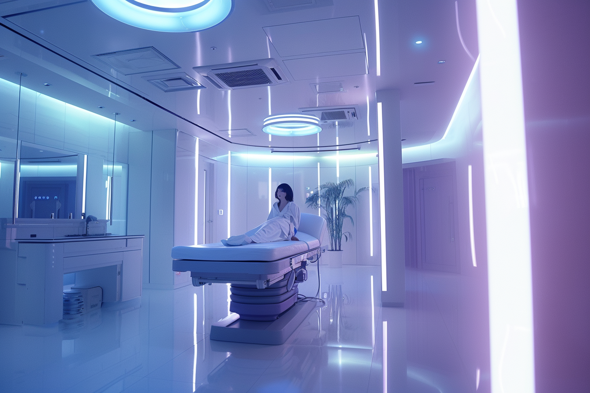
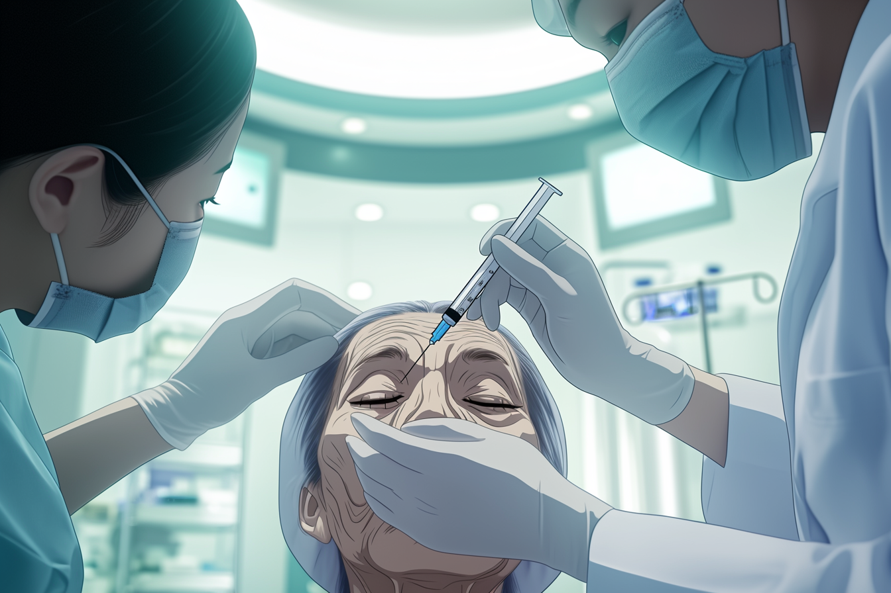

---
layout:
  title:
    visible: true
  description:
    visible: false
  tableOfContents:
    visible: true
  outline:
    visible: false
  pagination:
    visible: true
---

# Akicel Therapy

<figure><figcaption>
A patient waking from their Akicel rejuvenation treatment.
</figcaption></figure>

## Overview

Developed by [AKICEL](../enterprise/akicel.md), the Akicel Therapy is a well-known treatment for age-related damage in the human body. The key element of Akicel Therapy is the Akicel Serum. Applied in moderation, Akicel therapy significantly reduces all-cause mortality. Higher doses can have strong rejuvenate effects on superficial signs of aging, and can speed the body's healing process.

***

## Akicel Serum

The Akicel Serum is derived from the immortal cells of Aki Koenig, AKICEL's co-founder and namesake. Aki's cells demonstrate near perfect replication, bestowing upon her near perfect health and longevity. Akicel therapy introduces this plasmatic serum infused with modified copies of these cells into a patient's bloodstream.

The usual regimen for most patients is one Akicel serum treatment a year after the age of 16, and no more than one full treatment every two months. Akicel serum use at this rate reduces most individuals’ apparent rate of aging by 30-70%, and reduces health-related mortality by 90%.

Excessive Akicel therapy has been connected with numerous side effects, including [Rejection Syndrome](akicel-therapy.md#rejection-syndrome). The therapy should only be administered by a trained professional in controlled settings, and patients should be monitored for 12 hours following their treatment.

***

## **Rejuvenation**

<figure><figcaption>
An elderly patient undergoing a full Rejuvenation treatment.
</figcaption></figure>

AKICEL's Rejuvenation protocol is an intensive form of Akicel therapy only offered by AKICEL’s in-house team, requiring highly specialized equipment and a personally tailored formula that is likewise based on the Akicel Serum.

A single Rejuvenation treatment can reduce a patients apparent age by 3-10 years, and they can return for another course as soon as one year after their last treatment.

Rejuvenation is fairly hard on the body for the following months as the body undergoes continuous and rapid autophagy and hormone levels change. Bones, joints, and soft tissue may itch or ache to some degree.

At present, Rejuvenation is considerably expensive, which has made it politically controversial and largely inaccessible to the general public.

***

## **Rejection Syndrome**

Some individuals do not respond well to Akicel therapy and Rejuvenation treatments in particular. This is called "rejection syndrome", and the reaction can be severe and even deadly.&#x20;

Rejection syndrome symptoms are similar to an extremely aggressive cancer or flesh-eating disease. There is no known cure. Once someone with rejection syndrome falls ill, they rarely recover. This is not the cause of AKICEL’s therapy per say, but rather the individual’s immune system responding to the therapy.

Patients must be screened before AKICEL's therapies are administered to ensure that their cells are compatible.

Rejection syndrome is not common in GATA where regulations require proper sequencing and blood tests prior to treatment.
