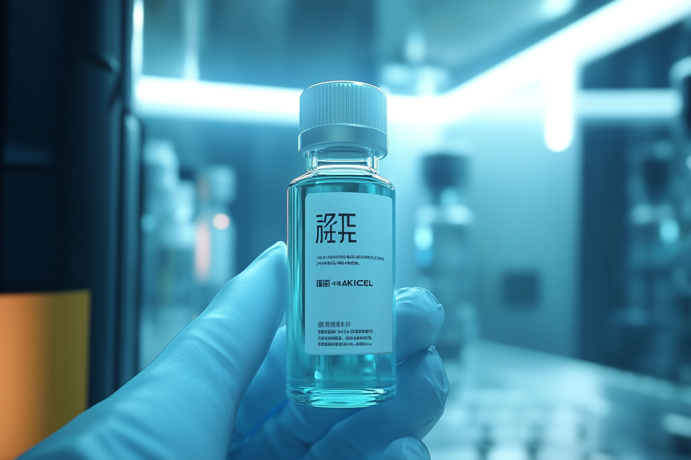
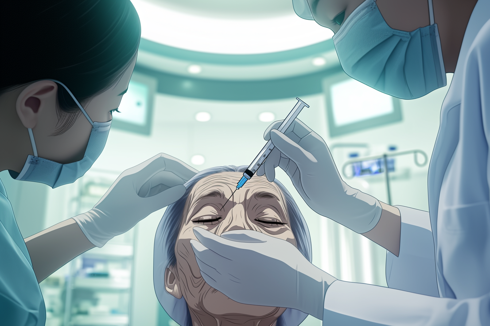

---
layout:
  width: default
  title:
    visible: true
  description:
    visible: false
  tableOfContents:
    visible: true
  outline:
    visible: false
  pagination:
    visible: true
  metadata:
    visible: true
  tags:
    visible: true
  actions:
    visible: true
---

# Akicel Therapy

<figure><figcaption>
A patient waking from their Akicel rejuvenation treatment.
</figcaption></figure>

## Overview

Developed by [AKICEL](../enterprise/akicel.md), the Akicel Therapy is a well-known treatment for age-related damage in the human body. The key element of Akicel Therapy is the Akicel Serum. Applied in moderation, Akicel therapy significantly reduces all-cause mortality. Higher doses can have strong rejuvenate effects on superficial signs of aging, and can speed the body's healing process.

***

## Akicel Serum

<figure><figcaption>
One full emergency dose of oral AKICEL serum.
</figcaption></figure>

The Akicel Serum is derived from the immortal cells of Aki Koenig, AKICEL's co-founder and namesake. Aki's cells demonstrate near perfect replication, bestowing upon her near perfect health and longevity. Akicel therapy introduces this plasmatic serum infused with modified copies of these cells into a patient's bloodstream.

The usual regimen for most patients is one Akicel serum treatment a year after the age of 16, and no more than one full treatment every two months. Akicel serum use at this rate reduces most individuals’ apparent rate of aging by 30-70%, and reduces health-related mortality by 90%.

Excessive Akicel therapy has been connected with numerous side effects, including [Rejection Syndrome](akicel-therapy.md#rejection-syndrome). The therapy should only be administered by a trained professional in controlled settings, and patients should be monitored for 12 hours following their treatment.

***

## **Rejuvenation**

<figure><figcaption>
An elderly patient undergoing a full Rejuvenation treatment.
</figcaption></figure>

AKICEL's Rejuvenation protocol is an intensive form of Akicel therapy only offered by AKICEL’s in-house team, requiring highly specialized equipment and a personally tailored formula that is likewise based on the Akicel Serum.

A single Rejuvenation treatment can reduce a patients apparent age by 3-10 years, and they can return for another course as soon as one year after their last treatment.

Rejuvenation is fairly hard on the body for the following months as the body undergoes continuous and rapid autophagy and hormone levels change. Bones, joints, and soft tissue may itch or ache to some degree.

At present, Rejuvenation is considerably expensive, which has made it politically controversial and largely inaccessible to the general public.

***

## **Rejection Syndrome**

Some individuals do not respond well to AKICEL therapy and Rejuvenation treatments in particular. This is called Rejection Syndrome, or simply "Rejection", and the reaction can be severe and even deadly.

Rejection syndrome is an extremely aggressive degenerative illness that affects the individual's neuronal cells, specifically triggering a deleterious cascade of disorder affecting the microtubules in their synapse.

As the disease progresses, the afflicted individual experiences symptoms similar to Alzheimer's or dementia, eventually losing motor control, and becoming "locked in" before the final stages of the disease when their autonomic nervous system completely fails.

There is no known cure. Once someone with rejection syndrome falls ill, they rarely recover. This is not the cause of AKICEL’s therapy per say, but rather a poorly understood interaction between the template cells and the individual’s immune system.

Rejection syndrome has been recorded in the literature since the Reconstruction Era, connected to early precursors to the AKICEL therapy tested by the [Research Corps](../../sol/institutions/the-research-corps.md) under [the Existence Doctrine](../military-and-defense/existence-doctrine.md). Patients must be screened before AKICEL's therapies are administered to ensure that their cells are compatible. Some believe the condition is intimately tied to the fundamental mechanisms behind consciousness.

Rejection Syndrome is not common in GATA where regulations require proper sequencing and blood tests prior to treatment.
