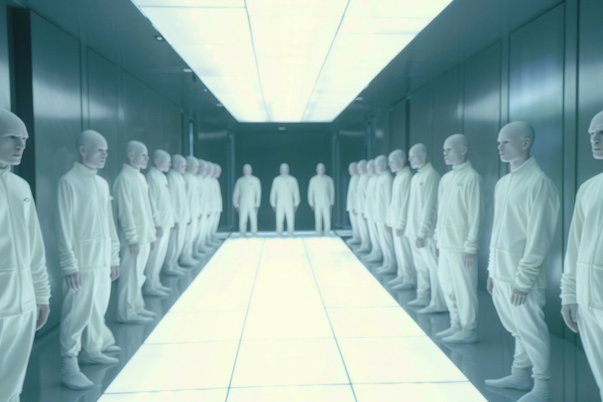

---
layout:
  title:
    visible: true
  description:
    visible: false
  tableOfContents:
    visible: true
  outline:
    visible: true
  pagination:
    visible: true
---

# Blanks

<figure><figcaption>
A room of identical blanks in an AKICEL cloning facility.
</figcaption></figure>

## Overview

Developed by [GATA's](../the-basics.md) leading biomed enterprise, [AKICEL](../enterprise/akicel.md). Blanks are cloned human bodies with near exact replicas of template brains, but provably without consciousness.

Blanks are envisioned as a safe and efficient alternative to robotics and artificially intelligent systems, and a potential source of cheap, reliable labor. There is significant interest to use blanks for research, medicine, military, resource extraction, and off-world applications. However, the prospect of blanks has raised significant controversy.

Blanks are currently in the process of being trialed by [Angelis](../military-and-defense/angelis.md) in a highly classified program, and have thus far proven to be remarkably safe and reliable according to the filtered reports produced by [the AIC's](../institutions/atlan-information-control-aic.md) dedicated working group assigned to its trial.

***

## Blank Production

<figure><figcaption>
A completed blank being lifted out of the nanofluid.
</figcaption></figure>

In order to create a blank, a deceased brain must be ‘flipped’, a process similar to embalming or injection molding, however using a nano-fluid that floods every feature of the brain and holds its state as a lattice for [AKICEL](../enterprise/akicel.md) cell cultures during the clone maturation process. The flipping process destroys the original brain.

Critically, the microtubule structures found in the neurons of a natural human brain are not preserved in the flipping process. These nano-scale structures are responsible for the quantum effects that produce the subjective experience known as human consciousness.&#x20;

When a blank brain is reconstructed around the lattice mold, small artificial nano-scale carbon filament structures are laid in place of the nanotubules, which function as electrical switches in the blank brain, simulating the function of the nanotubules, without the resulting subjective self.

While the lattice that gives structure to the blank's cells is derived from its template, the cells themselves are genetically engineered with modifications based on targeted sequences found in the Aki Koenig genome.

As per the AIC's developing regulations for blanks, blanks must be visually differentiated from natural humans; they are easily identifiably by their bright blue eyes, chalk-white skin, and blue blood.

***

## Understanding Blanks

Blanks are a contentious development, given that they are living human tissue, however a conversation with a blank often softens some of their strongest reservations; blanks are stoic, nearly motionless when at rest, and entirely without affect.

When asked directly if they are conscious, a blank would reply that they are not. Using [scanners](../../science-and-tech/scanners.md) calibrated to detect signals of consciousness confirm as much. They possess all of the knowledge and capabilities of their ‘template’, but they lack an inner experience, or any spark of intentionality, due to precise modifications of their brain's structure. These features of blanks raise significant philosophical questions about the nature of human free will.

A blank will follow any order their template would have followed, or answer any question about their life with savant-like capabilities, and they can also perform incredible calculations and mental feats that would have been beyond the capabilities of their originator. Their ability to learn or adapt is extremely limited.
