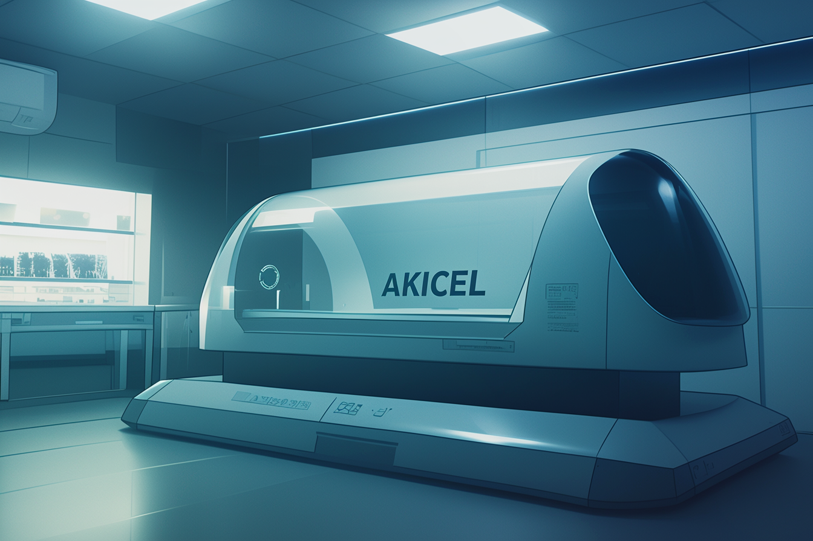

---
layout:
  title:
    visible: true
  description:
    visible: false
  tableOfContents:
    visible: true
  outline:
    visible: true
  pagination:
    visible: true
---

# Regenesis Pods

<figure><figcaption>
A Regenesis pod in a medical clinic.
</figcaption></figure>

## Overview

Developed by [AKICEL](../enterprise/akicel.md), Regenesis pods are single-occupant pods that can stabilize and rapidly heal its occupant, reviving them from near-death and restoring them to perfect health.

The pods quickly release a cooled gas that puts the occupant in a state of stasis where their bodily functions are slowed to a near stand-still. Then, a thick, viscous fluid containing a fast-acting variant of the [Akicel serum](akicel-therapy.md#overview) fills the chamber, infusing the occupant's wounds and tissues, and accelerating the healing process, healing them from without rather than leaving their own body to heal itself from within.
