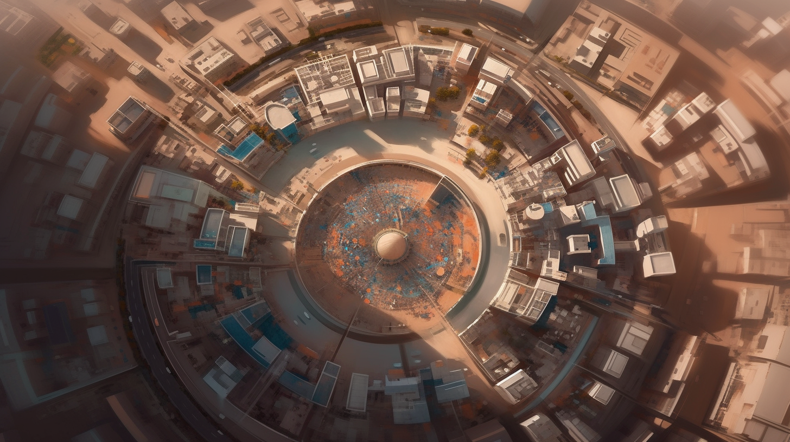
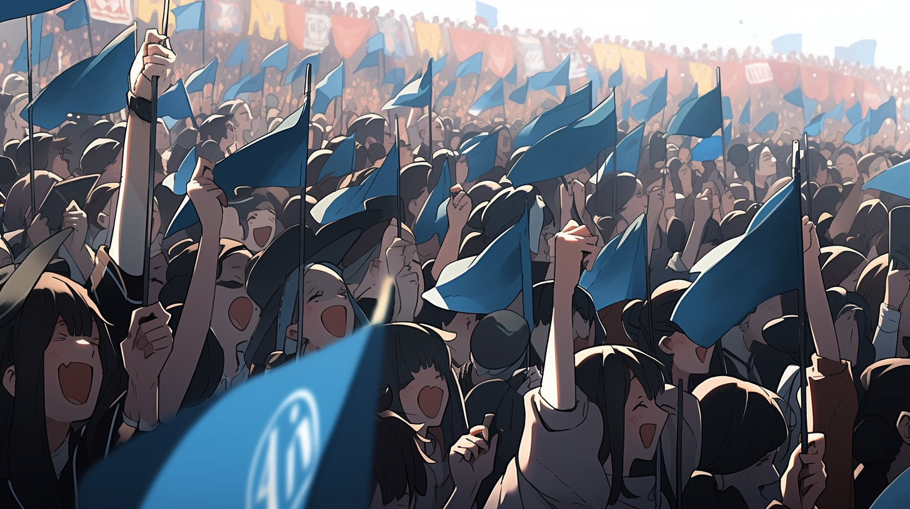
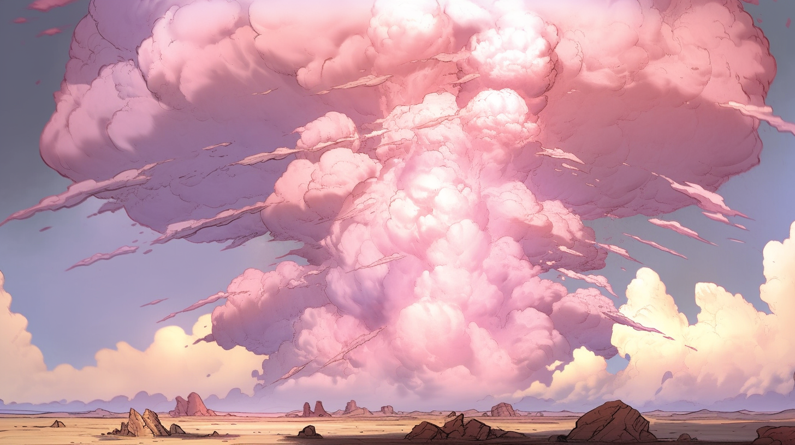

---
layout:
  title:
    visible: true
  description:
    visible: false
  tableOfContents:
    visible: true
  outline:
    visible: false
  pagination:
    visible: true
---

# Bright Mesa

<figure><figcaption>
A view of Bright Mesa, Nevada from a nearby ridge.
</figcaption></figure>

## Overview

Bright Mesa was a Free City located in the Nevada desert in what used to be the Neutral Zone between Atla-aligned territories to the West and the Texan Empire to the East.&#x20;

Founded during the earliest days of the Dark Decade, Bright was a pivotal cultural and political nexus in the region, and was seen by many as an exemplar for how to co-exist in the midst of the conflicting political attitudes felt far and wide as Free Peoples wrestled with the benefits and detriments of GATA districthood.

***

## History

Bright Mesa began as a refugee camp during the Dark Decade. Bright Mesa took its name both from the many striking mesas that surrounded the camp, and its iconic crisscrossing string-lights powered by solar in a time when most people hadn't seen electric light in months or years.

The founders of Bright were a community of former space and military engineers, and in the early months of the Dark Decade had transported a large stockpile of solar and fabricators. They went on to create their own micro-supply-chain and build up infrastructure in a secluded and fortified valley surrounded by mesas.

Several years into the Dark Decade, after its first wave of Manna Flower dispersals, Atla made contact with Bright and began providing logistical and material support to its denizens, establishing a bond that would define Bright Mesa in the region, and ultimately culminate in its demise.

In the years following its alignment with Atla, the encampment steadily grew until, by the time of The Reconstruction, its favelas had woven between and carved into the nearby mesas.

## Relations with GATA

Because it originated in the same spirit as Atla, and served as the primary Atla-supported refugee camp in the region during the Dark Decade, assistance from the nascent GATA had always been forthcoming. Bright Mesa’s government voluntarily enforced GATA’s New Dawn Accords, and ran their own (albeit pared down) build of The System. In many ways, Bright was very much a district, even though it officially remained independent.

<figure><figcaption>
An aerial view of Bright Mesa's entertainment quarter.
</figcaption></figure>

But with a steady stream of refugees from the South and East, by the close of The Reconstruction its culture had taken on a character that was much more sympathetic to the beliefs of the Freedom movement. Growing representation by Sovereigns and the neo-luddite Eidetics continued to influence the local politics until Bright held a referendum to decide its destiny at the end of 2114.

## Bright Mesa's Referendum

With tensions between GATA and the Free Territories having escalated in the region over the years, something had to give. The Texan Empire was accused of harboring organized crime syndicates that would target GATA homesteads and citizens when they enter the neutral territory outside of Bright.

<figure><figcaption>
GATA loyalists cheer on the arrival of GATA's diplomatic delegation.
</figcaption></figure>

There was a push from Atla to solidify their hold on Bright in response to this flagrant contravention of a standing agreement that Bright Mesa and its surrounding territory were to remain neutral. In truth, Bright Mesa was bound to GATA in too many ways to ever turn its back, but the leadership had to address the vocal dissent.

A referendum was held, and given the definitive choice between GATA and independence, the people of Bright Mesa chose GATA with a decisive 65% voting to sign the NDA, versus 22% for Independence (with 13% undecided). The people had spoken.

## The Bright Mesa Attack

After the certification of the vote, a team of Systema technicians and a Guardian battalion were dispatched by GATA to speed the assembly of Bright’s System Node, as well as its field wall emitters. When preparations were complete, a diplomatic delegation was sent to celebrate Bright’s districthood.

The diplomatic delegation arrived on the day of the Activation Ceremony, many prominent citizens of GATA with ties to Bright Mesa amongst them. A day of celebration ensued, featuring performances, speeches, games, and cheer.

However, as the day progressed, small pockets of protest and dissent steadily came to a boil as Activation neared. Angelis' renowned warning systems did not predict what followed.

<figure><figcaption>
Protests in Bright Mesa reach a fevered pitch shortly before the attack.
</figcaption></figure>

Immediately following Activation, nuclear explosions devastated Bright Mesa, killing many thousands instantly, including most of the Atlan delegation that was sent to oversee and celebrate Bright’s induction into GATA. Thousands more would perish in the days and weeks to follow.

<figure><figcaption>
A nuclear detonation in Bright Mesa's city center.
</figcaption></figure>

The terrorist organization The CURE claimed responsibility for the attack. Confidence in GATA’s protection in the region was shaken and the profile of the CURE reached a global scope.

<figure><figcaption>
A terrible mushroom cloud rising above Bright Mesa.
</figcaption></figure>

## Notable Victims

* GATA Minister of the Arts
* GATA Minister of Agriculture
* Kyote (Public Figure)
* Soraya Kyote-Mata (Technologist)
* Finneas Hughes (Angelis Rapid Response)
