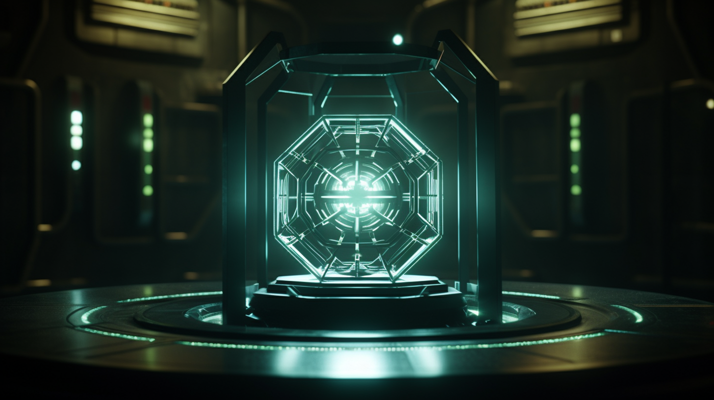

---
layout:
  title:
    visible: true
  description:
    visible: false
  tableOfContents:
    visible: true
  outline:
    visible: true
  pagination:
    visible: true
---

# Found Objects

<figure><figcaption>
A Found Object in a containment module, deep in the vaults of ALTAR
</figcaption></figure>

## Overview

The Found Objects, aptly named, are an assemblage of mysterious objects of unknown origin. Over thousands of years of human history, these objects have been discovered and collected by various groups, governments and individuals.

In the [Old World](../../history/the-old-world.md), the existence of the Found Objects had remained officially unconfirmed, though conspiracy theories and periodic reports about such artifacts had grown to be relatively mainstream.

It is believed that, if the Found Objects do indeed exist, that they are being held by [ALTAR](../institutions/altar.md) in its deep-sea complex, far below [Atla](../key-locations/atla.md).

***

<figure><figcaption>
A depiction of a sighting associated with The Phenomenon.
</figcaption></figure>

## Connection with the Phenomenon

The Found Objects are theorized (by those so inclined) to be related to "the Phenomenon"; a vague notion derived from scattered sightings of anomalous trans-medium phenomena that have persisted throughout human history, and were particularly common throughout [the Dark Decade](../../history/the-dark-decade.md).&#x20;

A connection between the Found Objects and the Phenomenon remains wholly unsubstantiated, as no concrete evidence of the existence of the Phenomenon has ever been officially produced. Proponents of the phenomenon's existence argue that this is simply its very nature, always receding away from our apprehension.

***

## History

During the Dark Decade, one of the [Joint Atlantic Command's](the-joint-atlantic-command-jac.md) first mission-based initiatives was the retrieval of sensitive human, material and military assets from around the world. Once the existence of the Found Objects was disclosed among the upper ranks, the objects were quickly identified as high-value targets for these missions.

As more high-ranking Secret Access Program personnel were brought into the fleet, these forays were increasingly able to successfully retrieve and catalog more and more of these exotic assets. When Atla was founded, these missions were compartmentalized according to [the Existence Doctrine](../military-and-defense/existence-doctrine.md) rules.

### Current Attitudes

Officially, the existence of the Found Objects is denied by [GATA](broken-reference). Any mention of the Found Objects or related research has long since been scrubbed from [the General Record](../politics/the-general-record.md).

Despite many first-hand and historical accounts in citizen publications claiming that multiple Found Objects were visibly seen by thousands of Atla’s citizens, and that ALTAR was ostensibly created to safeguard them, many of GATA's citizens either dismiss the existence of Found Objects as myth, or shrug in indifference.

The existence of the Found Objects is particularly hard to believe for those who did not see the way Atla, and later, GATA, operated during the Existence Doctrine days, when they openly used extremely advanced, experimental systems in the field.

<figure><figcaption>
A static-powered personal transport ship.
</figcaption></figure>

Today, citizens of GATA, and people around the world have grown accustomed to the advancements claimed to have been reverse-engineered from the Found Objects, like [static tech](../../science-and-tech/statics.md), [parallel energy](../../science-and-tech/parallel-energy.md), the UniMaPr, and [quantum seeds](../../science-and-tech/quantum-seeds.md).

***

## **Found Object Research**

It is believed that over the course of [the Dark Decade](../../history/the-dark-decade.md) and [Reconstruction](../../history/the-reconstruction.md), 124 Found Objects were collected by Atla.

Some of these Found Objects are small centimeter-sized fragments of larger objects, while the largest known Found Objects is as large as a football field.

Today, the Found Objects are in the possession of [ALTAR](../institutions/altar.md), their location kept secret–though, presumably, somewhere in the vast ALTAR complex that stretches across a huge expanse of the Atlantic Ocean floor.

In addition to the Objects, there are supposedly a number of classified Old World material samples and artifacts that are held in secret trust by ALTAR.

### **Doomsday Clock**

This object has been discovered to ‘tick’ at an irregular rate, similar to an atomic clock. Its tick rate has been observed to vary along with remote world events, leading researchers to the conclusion that it may measure entropy in the local universe, which earned it an ominous nickname; the Doomsday Clock.

ALTAR has used the tick rate of this Object to inform its advisory role with the [First Quorum](../politics/governance.md#the-first-quorum) on numerous occasions. Broadly speaking, increases to the Object’s tick rate are perceived as an increase in general risk, and actions that reduce the tick rate are considered favorable.

### **Object X**

No records exist for this object, however its existence can be inferred from the structure of several other Found Objects which seem to have a base or pedestal designed to hold it.

ALTAR researchers have speculated that it may represent a power source, storage unit, or processor, however this remains unknown.
