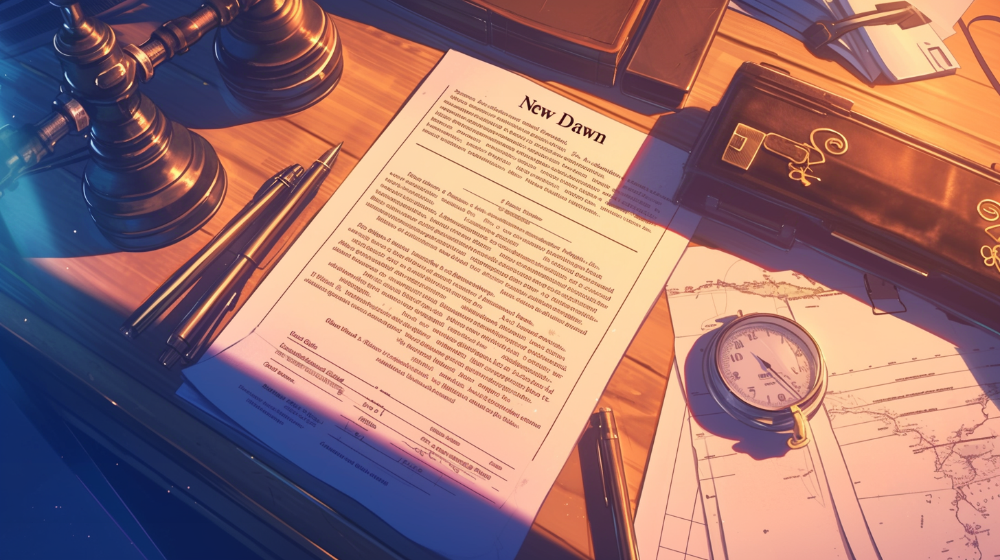

---
layout:
  title:
    visible: true
  description:
    visible: false
  tableOfContents:
    visible: true
  outline:
    visible: true
  pagination:
    visible: true
---

# New Dawn Declaration

<figure><figcaption>
A copy of the New Dawn Declaration circulated on the JAC flotilla just before Atla's founding.
</figcaption></figure>

## Overview

The New Dawn Declaration was a political and technological treatise on democracy, game theory, decentralization, regulation, compartmentalization, end-to-end encryption, and application-specific hardware, implicating each as critical threads in the weaving of a sound, secure, and prosperous global civilization. Its dissemination amongst the population of the Joint Atlantic Command flotilla directly precipitated the founding of Atla, and led to the development of The System.

The New Dawn Declaration sets out a vision for a system of government that aims to in some ways complete the vision of the Old World, while learning from their critical errors. It redefines government as not a singular political project, but a technology for which its optimal instrumental form is one that can underpin any political formulation, and evolve dynamically.

It imagines the New Dawn as a world of diverse political and technological paradigms that maintain ["incompatible interoperability"](../politics/paradigms.md), practice ["existential responsibility"](../military-and-defense/existence-doctrine.md), and enshrine a shared set of fundamental laws codified in a decentralized protocol that incentivizes adherence to the laws with a shared bounty. While its vision is oft criticized today as simplistic, it nonetheless galvanized a latent political energy that has changed the shape of the human destiny.

***

<figure><figcaption>
The day of the New Dawn Declaration as the JAC votes.
</figcaption></figure>

## History

Inspired by The Big Talk where Joint-Atlantic Command (JAC) leadership, under the Existence Doctrine, resolved to disclose a significant amount of classified information to JAC civilians. The revelations spurred an infectious spirit of hope that was ultimately crystalized into the New Dawn Declaration. The first draft was circulated among the JAC's civilian population on November 2, 2056.

While the document was a unique composite of political, legal and technological philosophy, it contained many ideas that had been widely supported by domain experts prior to The Crash, but which the old political order had failed to implement sufficiently to prevent catastrophe.

***

## Impact

Today, the New Dawn Declaration is considered by many to mark "the beginning of the end" of the Dark Decade. It marks the founding of Atla, GATA's future capitol, and, along with Asimovian architecture, catalyzed the creation of The System.

The document later went on to inspire the New Dawn Accords, an international agreement binding signatories to a set of principles, rules and restrictions. Where the New Dawn Declaration is the founding document of Atla, the New Dawn Accords are the founding document of the Greater Atlan Territorial Alliance (GATA).
