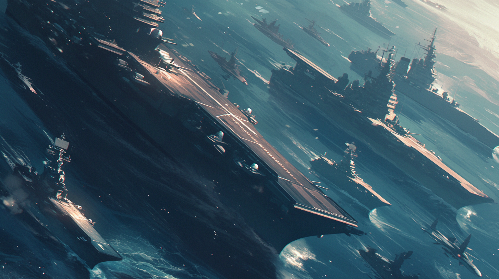
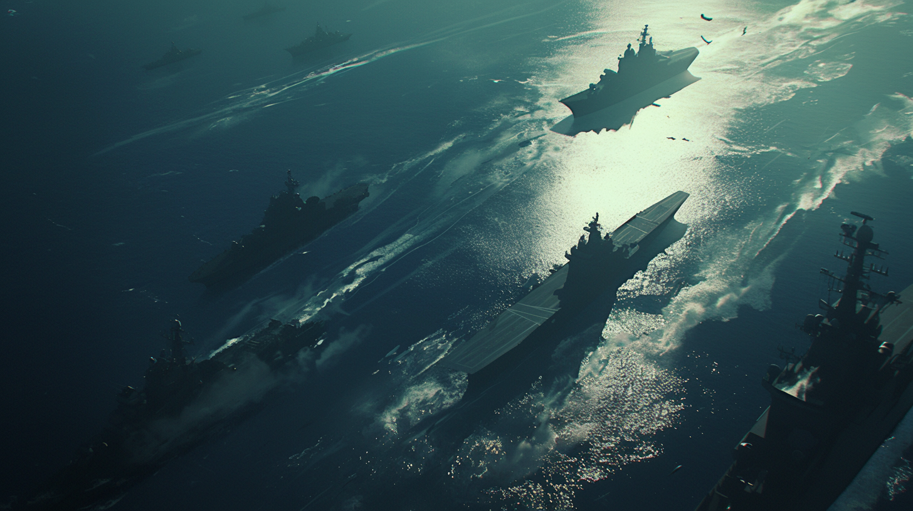
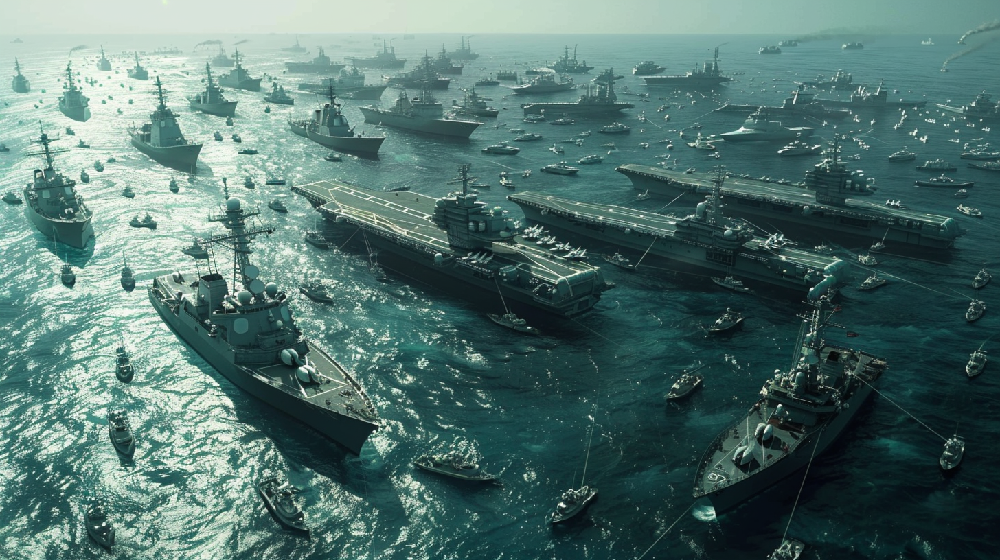
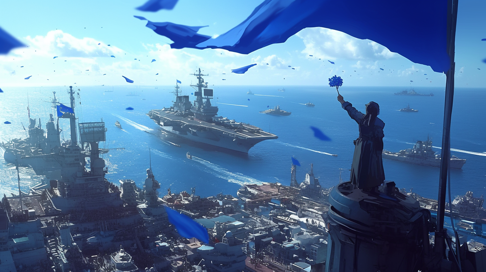

---
layout:
  title:
    visible: true
  description:
    visible: false
  tableOfContents:
    visible: true
  outline:
    visible: true
  pagination:
    visible: true
---

# The Joint Atlantic Command (JAC)

<figure><figcaption>
The naval flotilla that formed the Joint Atlantic Command.
</figcaption></figure>

## Overview

The Joint Atlantic command began as a flotilla of NATO ships and carriers that coalesced in the Atlantic Ocean during the first days and weeks of [the Dark Decade](../../history/the-dark-decade.md). These ships were largely spared from the [apparent cyberattack](../../science-and-tech/the-daemon-virus.md) that caused the Dark Decade thanks to their recently-updated military-grade networking infrastructure.

The Joint Atlantic Command would go on to accrue a large civilian population, and eventually would enshrine their emergent governance into [Atla](../key-locations/atla.md), a sea-bound city-state dedicated to rescuing humanity from the brink. In time, Atla would become the founding capitol of the [Greater Atlan Territorial Alliance (GATA)](../the-basics.md).

***

## Early JAC Initiatives

<figure><figcaption></figcaption></figure>

The Joint Atlantic Command went on to launch some of the first major strategic missions to secure key resources and assets, address critical threats like neutralizing nuclear power plants, securing key resources, and recovering political and academic VIPs in the first weeks and months of the Dark Decade.

In addition to on-the-ground missions, special research groups set to work to assess the developing global conditions, identifying and classifying threats and capabilities, and establishing a secure provisional infrastructure for ongoing strategic operations. These research groups would later fold into [the Research Corps](../../sol/institutions/the-research-corps.md) and [ALTAR](../institutions/altar.md) after the formation of Atla.

***

## Growth & Civilian Population

<figure><figcaption>
The JAC with a growing accumulation of commercial and civilian vessels.
</figcaption></figure>

Slowly, and trepidatiously over subsequent months and years, the flotilla grew into a sizeable patchwork fleet that included other surviving non-NATO military, research, and civilian vessels. By 2056, the JAC had become a quite sizeable presence in the Atlantic ocean, and its denizens had already taken to calling their home Atla, a nod to the lost city of Atlantis.

During this period, the JAC’s population grew from 40,000 to over 270,000 people, all living aboard naval ships and makeshift raft platforms in the middle of the East Atlantic.

### The Big Talk

During a customary community forum called The Big Talk, the existence of [the Found Objects](../../science-and-tech/found-objects.md) was revealed openly to the inhabitants of the JAC. This revelation spurred curiosity and debate. Leadership expressed the hope to use these objects in a bid to turn the tides of fate. They wished to inspire the population to join an ambitious project to discover a means to rescue human civilization before our collective knowledge was truly lost to time. This was the founding of Atla's [Research Corps](../../sol/institutions/the-research-corps.md) and the planting of the seed for [ALTAR](../institutions/altar.md).

***

## The Founding of Atla

<figure><figcaption>
The day of the New Dawn Declaration as the JAC votes.
</figcaption></figure>

In the years prior, the makeshift society of dignitaries, scientists, military, and civilians had forged a shared identity–despite some incidents–and soon after the revelations of the Found Objects, sought to formalize their governance. Over the course of a few months, a breakaway working group had snowballed into an atmosphere of revolutionary thinking. A new world with a new order. The floating city state of Atla was founded.
