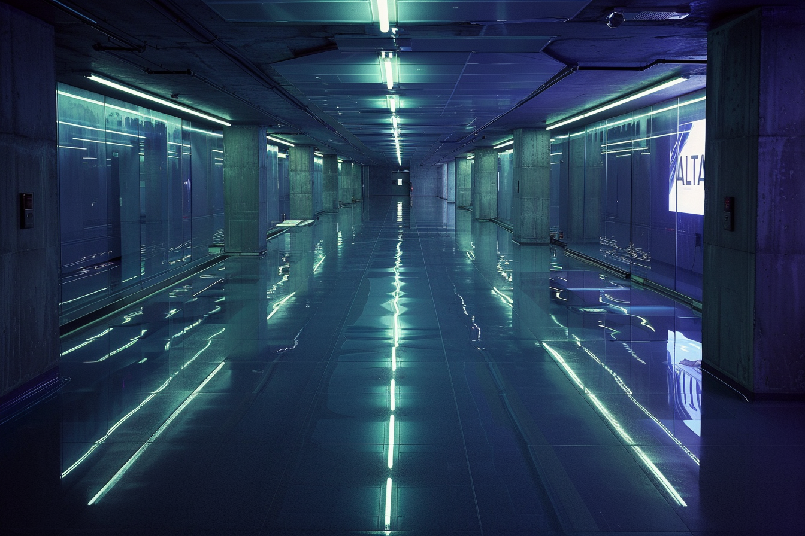

---
layout:
  title:
    visible: true
  description:
    visible: false
  tableOfContents:
    visible: true
  outline:
    visible: false
  pagination:
    visible: true
---

# ALTAR

<figure><figcaption>
A stark hallway in the upper levels of ALTAR's deep sea facility.
</figcaption></figure>

## Overview

Deep below the foundations of [Atla](../key-locations/atla.md), beneath the swirling currents of the Atlantic, lies the ALTAR complex – the beating heart of the most clandestine institution in [GATA](../the-basics.md).

By exploring a myriad of new techniques and scientific principles, ALTAR's groundbreaking work produces a diverse ecology of technologies.

This plurality of technological primitives helps the [AIC](atlan-information-control-aic.md) maintain the [NDA’s](../politics/new-dawn-accords.md) doctrine of 'mutual incompatibility', ensuring each district's technological paradigm is [distinct](../politics/districts.md).

In the world of Atla and GATA, while many secrets lurk beneath the surface, the influence of ALTAR remains unmistakable.

***

## **History**

Established concurrently with the founding of Atla as an extension of the [Research Corps](../../sol/institutions/the-research-corps.md), ALTAR's prime directive has always been the safeguarding and study of the mysterious ["Found Objects."](../../science-and-tech/found-objects.md)

Collected by the [Joint Atlantic Command (JAC)](../history/the-joint-atlantic-command-jac.md) in the tumultuous early days of [the Dark Decade](../../history/the-dark-decade.md), for most people around the world these anomalous objects remain shrouded in apocryphal myth.

The origins of these 67 objects, of which 21 are mere fragments, remain uncertain, though many speculate an extraterrestrial connection.

Spanning a diverse size range from a mere 3cm to an imposing 155m, they have, for millennia been secretly coveted by black budget operations, governments, empires, and religions.

***

## Deep Sea Complex

<figure><figcaption>
A cavernous corridor deep in ALTAR's lower levels.
</figcaption></figure>

***

## **GATA’s Innovation Engine**

<figure><figcaption>
One of ALTAR's countless labs experimenting with novel science and technology.
</figcaption></figure>

Boasting a recruitment roster that includes the most brilliant minds from not just GATA and Sol, but also from the recognized territories of [AU](../../african-union/politics/the-basics.md), [Aryabat](../../aryabat/the-basics.md), [New Imperial Japan](../../new-imperial-japan/the-basics.md), and [URSA](../../ursa/the-basics.md), ALTAR is a multi-national hive of innovation and, albeit indirect, collaboration.

Researchers, usually working solitarily or in compact teams, delve into the frontiers of the most top-secret research and unravel the mysteries of the Found Objects. While the primary motivation of their inquiries is ostensibly advancing scientific understanding, if a team's work produces new processes or technologies that are cleared by ALTAR and paradigmed by the AIC, the researchers are rewarded with [enterprise](../enterprise/) licenses, granting them the right to transform their discoveries into cutting-edge products or license them to qualifying legal enterprises.

***

## **Leadership**

<figure><figcaption>
ALTAR's secretive high council.
</figcaption></figure>

ALTAR is helmed by a small council of undisclosed scientists, industrialists and military leadership who serve 10-year terms bound within the confines of the deep-ocean ALTAR complex. Some confident speculation can be made about past and present appointments, however no official confirmation has ever been provided in its long history.

At any given time, ALTAR leadership has only one Speaker, a liason who is responsible for all communications between ALTAR and GATA leadership (generally only the [First Quorum](../politics/governance.md#the-first-quorum), with few exceptions). The Speaker does not participate in deliberations and has limited insight into ALTAR's operations in order to preserve the organization's tight compartmentalization. They never meet with the rest of the council in person.

Idle whispers and speculations about ALTAR's leadership permeate the corridors of Atla, and beyond. Its secretive nature is a legacy of compartmentalized programs predating the Dark Decade fueling numerous conspiracy theories, however, none have been substantiated.

### Interaction with Government

ALTAR leadership works "closely" with the First Quorum, following strict protocols in all such interactions so as to preserve dangerous secrets while also providing the First Quorum with actionable information, recommendations, and abstracted choices to permit oversight.

In the event that dangerous secret information must be revealed to the First Quorum in order to facilitate a decision, one Quorum member will be required to go to the ALTAR complex in person where they will meet with the Speaker, learn the information, make a decision on behalf of the First Quorum in-situ, and in most cases, will then remain quarantined within the ALTAR complex for a period, based on the sensitivity of the information.

The policy is that the First Quorum member considered most qualified for membership on ALTAR’s council would be asked to do this, creating a natural opportunity to freshen the First Quorum's ranks and begin the councilor's transition into a position at ALTAR.

\
