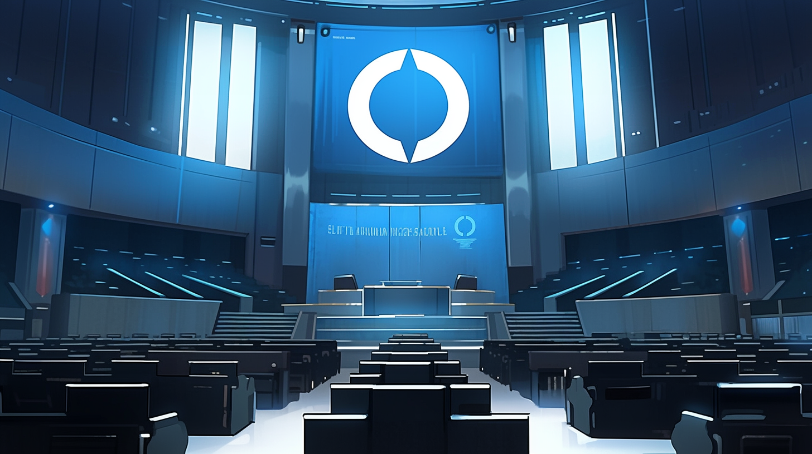

---
layout:
  title:
    visible: true
  description:
    visible: false
  tableOfContents:
    visible: true
  outline:
    visible: true
  pagination:
    visible: true
---

# Atlan Information Control

<figure><figcaption>
An empty lower court in the AIC Headquarters in Atla.
</figcaption></figure>

In the intricate complex of [GATA](../)’s [government](../politics/governance.md), the Atlan Information Control is the decisive voice regarding the dissemination of information and technology. Its formation was crucial upon GATA's inception, primarily to protect [Atla](../key-locations/atla.md) from the threat of infected [legacy technology](../law-and-order/tech-regulation.md) and potentially perilous novel innovations.

***

## **The Role of the AIC:**

1. **Legislation:** Interpreting the intricate maze of laws and regulations and ensuring the seamless and secure introduction of fresh technologies via ‘[paradigms](../politics/paradigms.md)’.
2. **Adjudication:** Final arbiter for what is “True” as far as Atla’s [General Record](../politics/the-general-record.md) is concerned.
3. **Enforcement:** A frontline network of operatives and investigators tirelessly combating the illicit production, trafficking, and utilization of illegal technologies.

The AIC's influence extends beyond GATA’s borders. The AIC's [Border Patrol](../law-and-order/gate-patrol.md) works closely with [Angelis intelligence](../military-and-defense/angelis.md#watchers), and the AIC’s Special Paradigm carve-outs for Angelis have been pivotal, especially during their recent strategic interventions in [the Free Territories](../../free-territories/).

***

## **Leadership and Governance:**

One of the “[Three Pillars](../politics/governance.md#the-three-pillars)” of GATA’s government. The AIC is overseen by a council of 12 esteemed members who are nominated and elected by the [Second Quorum](../politics/governance.md#the-second-quorum).&#x20;

While the title is lifelong, the specific key with the permissions to cast the vote can be passed on through the election process. It is the established norm that after about ten years, councilors will begin grooming their chosen replacement, typically from within the ranks of the Second Quorum.

When their service is done, council members formally nominate their replacement for approval by the Second Quorum. In the event that a nominee is rejected, or a chair is left vacant for any reason, any living former-councilors possess the [keys](../politics/keys.md) required to fill the position in the interim.

### AIC Chairperson

The AIC's deliberations and decisions are procedurally guided by a chairperson who is chosen by the rest of the council. The role of chairperson is fluid and can change with a majority decision at any time.

***

## **The AIC Courts**

The highest courts of GATA fall under the jurisdiction of the AIC. Only the AIC can establish with any finality what is true in [Greater Atla](../politics/greater-atla.md). Their judgements are matters of Truth that can even alter the [General Record](../politics/the-general-record.md), and serve as direct inputs into [The System](../politics/the-system.md), or can necessitate the design of entirely new System modules by [Systema](../enterprise/systema.md).

***

## **Whole Privacy Protection Act**

The Whole Privacy Protection Act (WPP) of 2064 was among the first pieces of major legislation drafted by the AIC and voted into law by the [First Quorum](../politics/governance.md#the-first-quorum). Jurisdictions that wanted to adopt the CRED currency had to comply with its restrictions, which makes it mandatory for all nations that sign the [New Dawn Accords](../politics/new-dawn-accords.md). It was based on legislation that had been drafted and promoted in the years prior to The Crash in recognition of the fact that threat of unfettered data collection and processing to social and political cohesion was greater than the benefits to commerce and law enforcement.

Under the WPP, sharing citizen data without consent is illegal. Data can be revoked by its owner. Combining disparate data into composite data sets for analysis or processing is heavily regulated. Wireless frequency bands are heavily policed. Transferring unfiltered sensor data is prohibited. Behavior modification is illegal (all algorithms must “serve their user’s interests”).

The regulatory friction in transmitting sensitive information combined with the presence of [criminal syndicates](../criminal-element/syndicates.md) hungry for valuable information has resulted in a shift toward massive, secure computational facilities that are completely local, and self-sufficient [automata](../../science-and-tech/automata.md) which can perform simple tasks autonomously without remote instruction.
